# ENTITY LIFECYCLES

## Pew Pew Assistant — Trợ lý Trí tuệ Nhân tạo Cá nhân Đa nền tảng

| Thuộc tính | Giá trị |
|---|---|
| Tên dự án | Pew Pew Assistant |
| Loại tài liệu | Entity Lifecycle Specification |
| Phiên bản | 1.0 |
| Trạng thái | Approved Lifecycle Baseline — Product Owner, 2026-07-28 (`DEC-009`) |
| Phạm vi ưu tiên | Windows-first MVP, Chromium Extension, Web Console, Android Companion, Home Assistant |
| Tài liệu liên quan | `PROJECT_VISION.md`, `PROJECT_SCOPE.md`, `BUSINESS_RULES.md` |
| Đối tượng sử dụng | Product Owner, Business Analyst, System Analyst, Architect, Developer, Security Engineer, QA và AI coding agents |

> **Một người dùng – Một trợ lý – Mọi thiết bị – Luôn trong tầm kiểm soát.**

---

## Mục lục

1. [Mục đích tài liệu](#1-mục-đích-tài-liệu)
2. [Phạm vi và mức ưu tiên entity](#2-phạm-vi-và-mức-ưu-tiên-entity)
3. [Quy ước mô hình hóa lifecycle](#3-quy-ước-mô-hình-hóa-lifecycle)
4. [Bản đồ quan hệ cấp cao](#4-bản-đồ-quan-hệ-cấp-cao)
5. [Identity và thiết bị](#5-identity-và-thiết-bị)
6. [Tương tác, suy luận và thực thi](#6-tương-tác-suy-luận-và-thực-thi)
7. [Quyền và xác nhận](#7-quyền-và-xác-nhận)
8. [Memory và đồng bộ](#8-memory-và-đồng-bộ)
9. [Routine và tự động hóa](#9-routine-và-tự-động-hóa)
10. [Skill, workflow và integration](#10-skill-workflow-và-integration)
11. [AI runtime, Home Assistant và tài nguyên](#11-ai-runtime-home-assistant-và-tài-nguyên)
12. [Secret, audit và security incident](#12-secret-audit-và-security-incident)
13. [Các hiệu ứng dây chuyền giữa entity](#13-các-hiệu-ứng-dây-chuyền-giữa-entity)
14. [Các luồng lifecycle end-to-end](#14-các-luồng-lifecycle-end-to-end)
15. [Mô hình lưu trữ và lịch sử chuyển trạng thái](#15-mô-hình-lưu-trữ-và-lịch-sử-chuyển-trạng-thái)
16. [Domain event đề xuất](#16-domain-event-đề-xuất)
17. [Quy tắc triển khai và kiểm thử](#17-quy-tắc-triển-khai-và-kiểm-thử)
18. [Definition of Done](#18-definition-of-done)

---

## 1. Mục đích tài liệu

Tài liệu này xác định vòng đời của các entity quan trọng trong Pew Pew Assistant để:

- Chuẩn hóa trạng thái và các chuyển trạng thái hợp lệ.
- Ngăn AI, UI, worker hoặc integration tự ý cập nhật trạng thái sai quy trình.
- Làm cơ sở thiết kế aggregate, database, API, domain event và state machine.
- Làm rõ thời điểm phải hỏi người dùng, xin xác nhận, kiểm tra permission hoặc dừng tác vụ.
- Đảm bảo các hành động nhạy cảm có thể truy vết, hủy, xác minh và phục hồi an toàn.
- Giữ thống nhất trạng thái giữa Desktop Agent, Mobile Companion, Web Console và cloud backend.
- Giúp Codex hoặc developer triển khai mà không phải tự suy đoán lifecycle.

Tài liệu mô tả **business lifecycle**, không thay thế cho:

- ERD vật lý.
- API contract.
- Threat Model.
- Database migration.
- Sequence diagram chi tiết cho từng use case.
- Chính sách retention pháp lý.
- Runbook vận hành production.

---

## 2. Phạm vi và mức ưu tiên entity

### 2.1. Entity P0 — bắt buộc cho MVP

| Entity | Aggregate/Module đề xuất | Vai trò |
|---|---|---|
| `UserAccount` | Identity | Chủ sở hữu trợ lý |
| `AssistantProfile` | Assistant Core | Trợ lý 1:1 của người dùng |
| `DeviceNode` | Device Management | Thiết bị tham gia hệ thống |
| `DeviceSession` | Identity/Session | Phiên xác thực của thiết bị |
| `VoiceWakeProfile` | Voice | Wake word và đặc trưng giọng nói |
| `InteractionSession` | Conversation/Orchestration | Phiên giao tiếp đang diễn ra |
| `ClarificationRequest` | Orchestration | Câu hỏi làm rõ phần thông tin còn thiếu |
| `ActionPlan` | Orchestration | Kế hoạch hành động do AI đề xuất |
| `ConfirmationRequest` | Policy | Xác nhận một lần cho hành động cụ thể |
| `ActionTask` | Execution | Đơn vị thực thi có trạng thái chuẩn |
| `PermissionGrant` | Authorization | Quyền có phạm vi và thời hạn |
| `MemoryRecord` | Memory | Thông tin trợ lý được phép ghi nhớ |
| `RoutineDefinition` | Automation | Workflow người dùng tạo hoặc phê duyệt |
| `RoutineRun` | Automation/Execution | Một lần chạy routine |
| `SkillPackage` | Skill Registry | Khả năng có contract và permission riêng |
| `TerminalWorkflowDefinition` | Terminal Automation | Workflow terminal có cấu trúc |
| `IntegrationConnection` | Integrations | Kết nối dịch vụ bên ngoài |
| `CredentialSecret` | Secret Management | Bí mật được quản lý trong vault |
| `AuditRecord` | Audit | Dấu vết bất biến của hành động quan trọng |

### 2.2. Entity P1 — hardening và mở rộng sớm

| Entity | Vai trò |
|---|---|
| `MemorySyncJob` | Đồng bộ memory và deletion giữa thiết bị |
| `AiProviderConfiguration` | Cấu hình AI local/cloud |
| `LocalModelRuntime` | Trạng thái tải và sử dụng model local |
| `WorkerProcess` | Tiến trình con thực thi task |
| `HomeAssistantEntityBinding` | Liên kết entity Home Assistant với policy |
| `SecurityIncident` | Điều tra và phục hồi sự cố bảo mật |
| `OutboundMessage` | Theo dõi message draft, send và delivery result |
| `UiTargetSnapshot` | Mục tiêu UI tạm thời dùng cho browser/screen automation |

---

## 3. Quy ước mô hình hóa lifecycle

### 3.1. Không dùng một cột `Status` cho mọi ý nghĩa

Một entity có thể có nhiều chiều trạng thái độc lập. Ví dụ `DeviceNode` cần tách:

| Chiều trạng thái | Ví dụ |
|---|---|
| Lifecycle/trust status | `unregistered`, `pairing_pending`, `trusted`, `suspended`, `rekey_required`, `revoked` |
| Connectivity status | `online`, `offline`, `degraded` |
| Agent runtime status | `stopped`, `idle`, `busy`, `safe_mode` |
| Sync status | `synced`, `pending`, `conflict` |

Không được gộp thành các giá trị khó kiểm soát như:

```text
trusted_online_busy_syncing
```

### 3.2. Quy tắc đặt tên

- Tên trạng thái lưu trong database/API dùng `snake_case`.
- Tên domain event dùng `PascalCase`, ví dụ `DevicePaired`.
- Tên transition command dùng động từ rõ nghĩa, ví dụ `RevokeDevice`.
- Thời gian dùng UTC.
- Mỗi entity có `Version` hoặc `RowVersion` để chống cập nhật đồng thời.
- Mỗi transition có `ReasonCode`, không chỉ có chuỗi mô tả tự do.

### 3.3. Quy tắc chuyển trạng thái chung

1. Chỉ domain service hoặc aggregate method được đổi lifecycle state.
2. UI, AI model, integration adapter và repository không được cập nhật trực tiếp cột trạng thái.
3. AI chỉ được **đề xuất** action hoặc transition; Policy Engine và domain rule quyết định.
4. Transition phải được validate từ `from_state` sang `to_state`.
5. Transition nhạy cảm phải ghi `AuditRecord`.
6. Transition và domain event phải được commit nguyên tử; ưu tiên transactional outbox.
7. Retry phải idempotent bằng `IdempotencyKey` hoặc `CorrelationId`.
8. Không được tự khôi phục Level 2 action sau crash nếu chưa xác minh kết quả.
9. `completed` chỉ được đặt khi có verification signal.
10. Trạng thái terminal không được mở lại, trừ entity có transition `reopened` được quy định rõ.
11. Hard delete không được dùng cho entity cần audit, sync deletion hoặc điều tra.
12. Emergency Stop không chỉ đổi UI; phải cố gắng dừng worker và process tree thực tế.

### 3.4. Trạng thái terminal và trạng thái tạm thời

| Loại | Ý nghĩa |
|---|---|
| Terminal success | Đã hoàn tất và không chuyển tiếp bình thường |
| Terminal failure | Đã thất bại, muốn chạy lại phải tạo execution mới |
| Terminal deletion | Đã xóa logic hoặc vật lý theo retention |
| Temporary waiting | Đang chờ user, network, resource hoặc external system |
| Recoverable operational | Có thể phục hồi bằng retry có kiểm soát |
| Frozen unknown | Kết quả chưa xác định; không tự retry action không idempotent |

### 3.5. Phân biệt clarification và confirmation

- `ClarificationRequest` dùng khi thiếu hoặc mơ hồ dữ liệu.
- `ConfirmationRequest` dùng khi đã hiểu đủ nhưng hành động cần sự đồng ý.
- Trả lời clarification **không đồng nghĩa** với xác nhận hành động.
- Confirmation phải gắn với đúng plan hash, target, payload và thời hạn.
- Khi plan thay đổi đáng kể, confirmation cũ phải bị `invalidated`.

---

## 4. Bản đồ quan hệ cấp cao

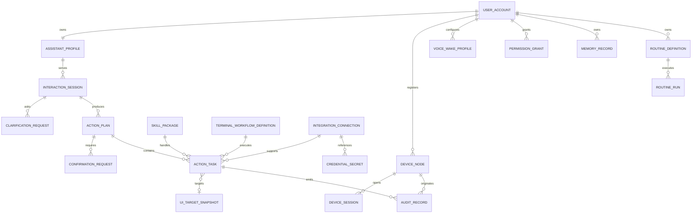
```mermaid
erDiagram
    USER_ACCOUNT ||--|| ASSISTANT_PROFILE : owns
    USER_ACCOUNT ||--o{ DEVICE_NODE : registers
    DEVICE_NODE ||--o{ DEVICE_SESSION : opens
    USER_ACCOUNT ||--o{ VOICE_WAKE_PROFILE : configures
    ASSISTANT_PROFILE ||--o{ INTERACTION_SESSION : serves
    INTERACTION_SESSION ||--o{ CLARIFICATION_REQUEST : asks
    INTERACTION_SESSION ||--o{ ACTION_PLAN : produces
    ACTION_PLAN ||--o{ CONFIRMATION_REQUEST : requires
    ACTION_PLAN ||--o{ ACTION_TASK : contains
        ACTION_TASK }o--o| UI_TARGET_SNAPSHOT : targets
    USER_ACCOUNT ||--o{ PERMISSION_GRANT : grants
    USER_ACCOUNT ||--o{ MEMORY_RECORD : owns
    USER_ACCOUNT ||--o{ ROUTINE_DEFINITION : owns
    ROUTINE_DEFINITION ||--o{ ROUTINE_RUN : executes
    SKILL_PACKAGE ||--o{ ACTION_TASK : handles
    TERMINAL_WORKFLOW_DEFINITION ||--o{ ACTION_TASK : executes
    INTEGRATION_CONNECTION ||--o{ ACTION_TASK : supports
    INTEGRATION_CONNECTION ||--o{ CREDENTIAL_SECRET : references
    ACTION_TASK ||--o{ AUDIT_RECORD : emits
    DEVICE_NODE ||--o{ AUDIT_RECORD : originates
```

---

## 5. Identity và thiết bị

### 5.1. User Account Lifecycle

**Entity:** `UserAccount`

**Mục đích:** Quản lý danh tính của Primary User, trạng thái truy cập hệ thống và yêu cầu xóa tài khoản.

#### Trạng thái

| Trạng thái | Ý nghĩa |
|---|---|
| `pending_activation` | Tài khoản đã tạo nhưng chưa hoàn tất xác minh hoặc onboarding tối thiểu. |
| `active` | Được phép đăng nhập và sử dụng các capability theo permission. |
| `locked` | Khóa tạm thời do rủi ro xác thực, nhiều lần đăng nhập sai hoặc chính sách. |
| `suspended` | Tạm ngừng ở cấp tài khoản do user, quản trị hoặc security policy. |
| `deletion_pending` | Đã yêu cầu xóa; đang trong thời gian grace period và cleanup. |
| `deleted` | Đã hoàn tất xóa theo retention; không thể đăng nhập lại bằng cùng identity generation. |

#### State diagram

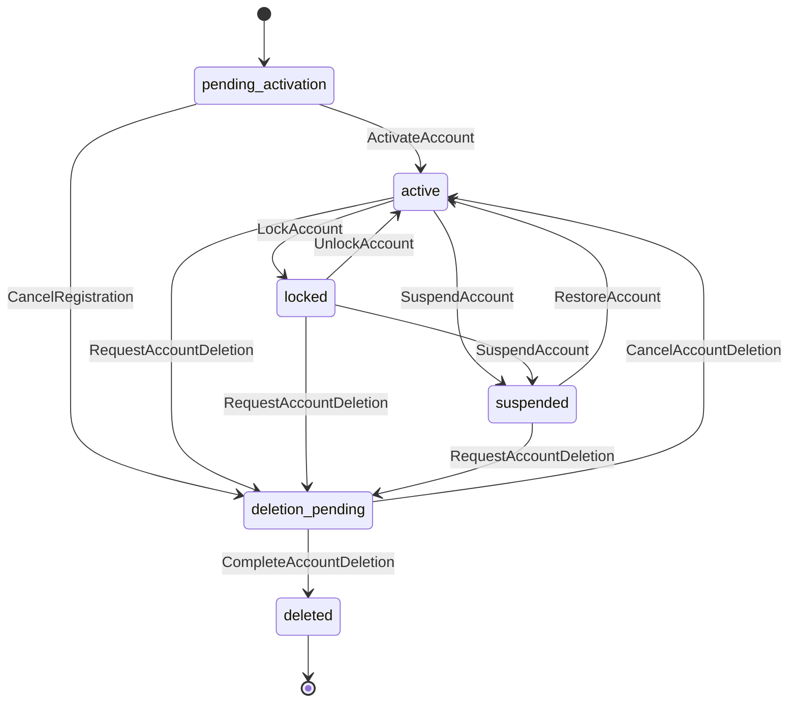
```mermaid
stateDiagram-v2
[*] --> pending_activation
pending_activation --> active: ActivateAccount
pending_activation --> deletion_pending: CancelRegistration
active --> locked: LockAccount
locked --> active: UnlockAccount
active --> suspended: SuspendAccount
locked --> suspended: SuspendAccount
suspended --> active: RestoreAccount
active --> deletion_pending: RequestAccountDeletion
locked --> deletion_pending: RequestAccountDeletion
suspended --> deletion_pending: RequestAccountDeletion
deletion_pending --> active: CancelAccountDeletion
deletion_pending --> deleted: CompleteAccountDeletion
deleted --> [*]
```

#### Transition chính

| Từ | Event/Command | Điều kiện chính | Đến | Side effect bắt buộc |
|---|---|---|---|---|
| `pending_activation` | `ActivateAccount` | Email/device verification hợp lệ | `active` | Tạo `AssistantProfile` nếu chưa có; ghi audit onboarding |
| `active` | `LockAccount` | Phát hiện auth anomaly hoặc vượt ngưỡng | `locked` | Có thể revoke session theo severity |
| `locked` | `UnlockAccount` | Strong re-auth hoặc security review thành công | `active` | Rotate session nếu cần |
| `active` | `SuspendAccount` | User yêu cầu hoặc security policy | `suspended` | Dừng write-action và remote command |
| `suspended` | `RestoreAccount` | Nguyên nhân suspension đã xử lý | `active` | Revalidate device, permission và integration |
| `active` | `RequestAccountDeletion` | Strong confirmation | `deletion_pending` | Revoke session mới, chặn sync mới, lập deletion job |
| `deletion_pending` | `CancelAccountDeletion` | Còn trong grace period và re-auth thành công | `active` | Hủy deletion job chưa thực thi |
| `deletion_pending` | `CompleteAccountDeletion` | Grace period kết thúc và cleanup hợp lệ | `deleted` | Thu hồi device, secret, integration; giữ audit theo retention |

#### Invariant bắt buộc

- `UserAccount` chỉ sở hữu tối đa một `AssistantProfile` hoạt động.
- `deleted` là terminal; phục hồi cần tạo account generation mới.
- Xóa tài khoản không được xóa tức thời audit/security record đang thuộc retention bắt buộc.
- Khi `locked` hoặc `suspended`, wake word có thể chỉ mở UI đăng nhập nhưng không được chạy write-action.

---

### 5.2. Assistant Profile Lifecycle

**Entity:** `AssistantProfile`

**Mục đích:** Quản lý trạng thái của trợ lý 1:1, gồm hoạt động bình thường, tạm dừng, Safe Mode và decommission.

#### Trạng thái

| Trạng thái | Ý nghĩa |
|---|---|
| `provisioning` | Đang tạo cấu hình mặc định, key, policy và local profile. |
| `active` | Trợ lý hoạt động theo chế độ local/cloud được chọn. |
| `paused` | Không chủ động nghe hoặc thực thi; user vẫn xem dữ liệu và cấu hình. |
| `safe_mode` | Chỉ cho phép read-only, revoke, recovery và diagnostic an toàn. |
| `decommissioning` | Đang thu hồi capability và xử lý dữ liệu trước khi xóa. |
| `decommissioned` | Trợ lý đã ngừng hoạt động vĩnh viễn cho account generation đó. |

#### State diagram

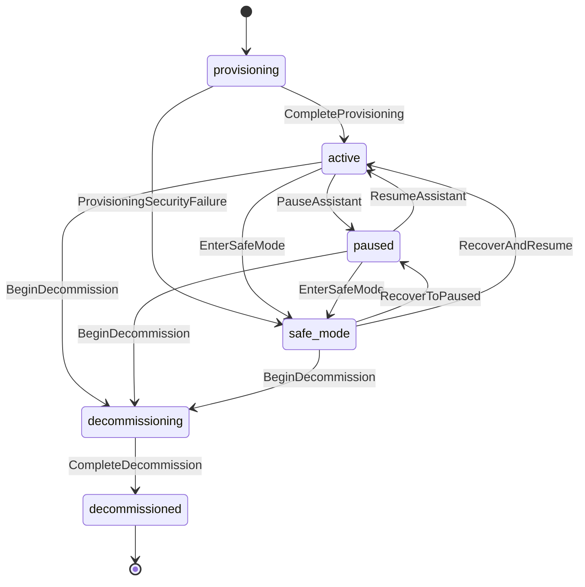
```mermaid
stateDiagram-v2
[*] --> provisioning
provisioning --> active: CompleteProvisioning
provisioning --> safe_mode: ProvisioningSecurityFailure
active --> paused: PauseAssistant
paused --> active: ResumeAssistant
active --> safe_mode: EnterSafeMode
paused --> safe_mode: EnterSafeMode
safe_mode --> paused: RecoverToPaused
safe_mode --> active: RecoverAndResume
active --> decommissioning: BeginDecommission
paused --> decommissioning: BeginDecommission
safe_mode --> decommissioning: BeginDecommission
decommissioning --> decommissioned: CompleteDecommission
decommissioned --> [*]
```

#### Transition chính

| Từ | Event/Command | Điều kiện chính | Đến | Side effect bắt buộc |
|---|---|---|---|---|
| `provisioning` | `CompleteProvisioning` | Core policy, vault và local profile sẵn sàng | `active` | Phát `AssistantProvisioned` |
| `active` | `PauseAssistant` | User yêu cầu | `paused` | Dừng listener và trigger tự động theo cấu hình |
| `paused` | `ResumeAssistant` | Account active và device hợp lệ | `active` | Khởi động capability được cho phép |
| `active` | `EnterSafeMode` | Security incident, integrity failure hoặc user emergency command | `safe_mode` | Chặn terminal, remote control và integration write |
| `safe_mode` | `RecoverAndResume` | Security check và revalidation thành công | `active` | Ghi recovery audit |
| `active` | `BeginDecommission` | Account deletion hoặc assistant reset | `decommissioning` | Hủy task mới, revoke trigger |
| `decommissioning` | `CompleteDecommission` | Cleanup hoàn tất | `decommissioned` | Giải phóng key và local runtime |

#### Invariant bắt buộc

- Safe Mode không được tự thoát chỉ vì ứng dụng khởi động lại.
- AI model không có quyền gọi `RecoverAndResume`.
- Khi `paused`, scheduled routine không được tự chạy trừ loại routine được user đánh dấu độc lập và policy cho phép.
- `decommissioned` là terminal.

---

### 5.3. Device Node Lifecycle

**Entity:** `DeviceNode`

**Mục đích:** Quản lý việc pairing, trust, rekey, revoke và loại bỏ một thiết bị khỏi hệ thống.

#### Trạng thái

| Trạng thái | Ý nghĩa |
|---|---|
| `unregistered` | Thiết bị chưa thuộc tài khoản; chỉ được onboarding/pairing. |
| `pairing_pending` | Đã tạo yêu cầu pairing và challenge đang còn hiệu lực. |
| `trusted` | Pairing hoàn tất, key hợp lệ và chưa bị thu hồi. |
| `suspended` | Tạm dừng quyền điều khiển/sync do user hoặc security policy. |
| `rekey_required` | Key cũ không còn đủ tin cậy hoặc đến hạn thay. |
| `revoked` | Trust đã bị thu hồi; không nhận lệnh, sync hoặc confirmation. |
| `removed` | Metadata thiết bị đã được dọn theo retention. |

#### State diagram

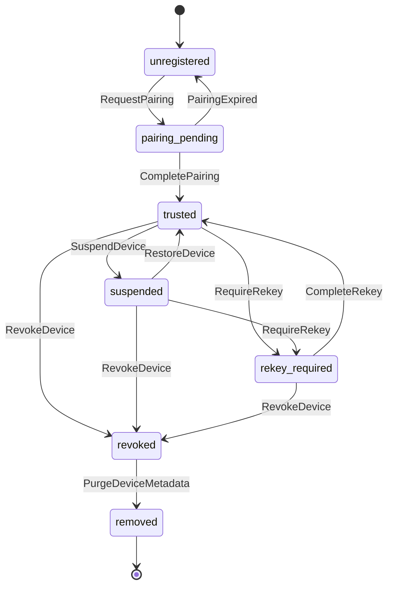
```mermaid
stateDiagram-v2
[*] --> unregistered
unregistered --> pairing_pending: RequestPairing
pairing_pending --> trusted: CompletePairing
pairing_pending --> unregistered: PairingExpired
trusted --> suspended: SuspendDevice
suspended --> trusted: RestoreDevice
trusted --> rekey_required: RequireRekey
suspended --> rekey_required: RequireRekey
rekey_required --> trusted: CompleteRekey
trusted --> revoked: RevokeDevice
suspended --> revoked: RevokeDevice
rekey_required --> revoked: RevokeDevice
revoked --> removed: PurgeDeviceMetadata
removed --> [*]
```

#### Transition chính

| Từ | Event/Command | Điều kiện chính | Đến | Side effect bắt buộc |
|---|---|---|---|---|
| `unregistered` | `RequestPairing` | User đã xác thực trên một trusted channel | `pairing_pending` | Tạo challenge có TTL và anti-replay |
| `pairing_pending` | `CompletePairing` | Challenge, device proof và user approval hợp lệ | `trusted` | Cấp device key; tạo permission tối thiểu |
| `pairing_pending` | `PairingExpired` | Challenge hết hạn hoặc bị hủy | `unregistered` | Xóa challenge và token tạm |
| `trusted` | `SuspendDevice` | User hoặc security engine yêu cầu | `suspended` | Chặn remote command và confirmation |
| `suspended` | `RestoreDevice` | Re-auth và security check thành công | `trusted` | Revalidate scoped permission |
| `trusted` | `RequireRekey` | Key aging, policy change hoặc nghi ngờ lộ key | `rekey_required` | Chặn command nhạy cảm |
| `rekey_required` | `CompleteRekey` | Key rotation thành công | `trusted` | Thu hồi key cũ |
| `trusted` | `RevokeDevice` | User revoke, mất thiết bị hoặc compromise | `revoked` | Revoke session, sync key và queued task nhạy cảm |
| `revoked` | `PurgeDeviceMetadata` | Hết retention | `removed` | Giữ tombstone chống replay nếu policy yêu cầu |

#### Invariant bắt buộc

- Re-pair một thiết bị đã `revoked` phải tạo `DeviceNodeId` hoặc key generation mới.
- Connectivity phải lưu riêng: `unknown`, `online`, `offline`, `degraded`.
- Agent runtime phải lưu riêng: `stopped`, `starting`, `idle`, `listening`, `busy`, `safe_mode`, `updating`, `crashed`.
- Thiết bị offline không được báo action local là `completed` khi chưa nhận bằng chứng.
- Permission trên thiết bị khác không tự động áp dụng cho thiết bị mới.

---

### 5.4. Device Session Lifecycle

**Entity:** `DeviceSession`

**Mục đích:** Quản lý phiên xác thực, refresh, timeout và revoke trên từng thiết bị.

#### Trạng thái

| Trạng thái | Ý nghĩa |
|---|---|
| `created` | Phiên vừa được cấp nhưng chưa hoàn tất handshake. |
| `active` | Phiên hợp lệ và có thể gọi API theo scope. |
| `idle` | Không hoạt động nhưng chưa hết hạn. |
| `reauth_required` | Phải xác thực lại trước action nhạy cảm hoặc refresh. |
| `expired` | Hết hạn theo thời gian. |
| `revoked` | Bị thu hồi do user, device hoặc security event. |
| `terminated` | Đóng bình thường khi logout. |

#### State diagram

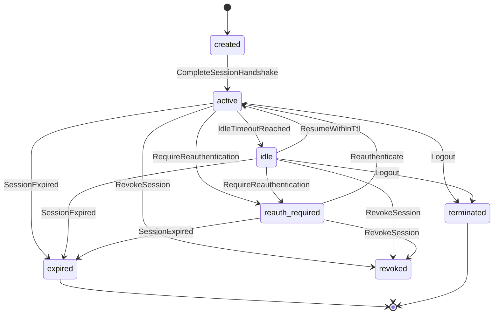
```mermaid
stateDiagram-v2
[*] --> created
created --> active: CompleteSessionHandshake
active --> idle: IdleTimeoutReached
idle --> active: ResumeWithinTtl
active --> reauth_required: RequireReauthentication
idle --> reauth_required: RequireReauthentication
reauth_required --> active: Reauthenticate
active --> expired: SessionExpired
idle --> expired: SessionExpired
reauth_required --> expired: SessionExpired
active --> revoked: RevokeSession
idle --> revoked: RevokeSession
reauth_required --> revoked: RevokeSession
active --> terminated: Logout
idle --> terminated: Logout
expired --> [*]
revoked --> [*]
terminated --> [*]
```

#### Transition chính

| Từ | Event/Command | Điều kiện chính | Đến | Side effect bắt buộc |
|---|---|---|---|---|
| `created` | `CompleteSessionHandshake` | Device trusted và proof hợp lệ | `active` | Bind session với account/device/key generation |
| `active` | `RequireReauthentication` | Risk tăng hoặc Level 3-like verification | `reauth_required` | Chặn action cần strong auth |
| `reauth_required` | `Reauthenticate` | Strong auth thành công | `active` | Rotate token nếu cần |
| `active` | `SessionExpired` | TTL kết thúc | `expired` | Xóa refresh capability |
| `active` | `RevokeSession` | Device revoke, account suspend hoặc user action | `revoked` | Từ chối mọi request tiếp theo |
| `active` | `Logout` | User chủ động | `terminated` | Thu hồi refresh token |

#### Invariant bắt buộc

- `expired`, `revoked`, `terminated` là terminal.
- Session không được chuyển sang thiết bị khác.
- Voice recognition không thay thế authentication session.
- Remote confirmation chỉ hợp lệ khi session và device đều còn trust.

---

### 5.5. Voice Wake Profile Lifecycle

**Entity:** `VoiceWakeProfile`

**Mục đích:** Quản lý wake phrase, mẫu giọng nói đã đồng ý lưu, quá trình training, validation và thu hồi consent.

#### Trạng thái

| Trạng thái | Ý nghĩa |
|---|---|
| `draft` | Đã tạo cấu hình wake phrase nhưng chưa thu mẫu. |
| `collecting_samples` | Đang thu mẫu có chỉ báo và consent. |
| `training` | Đang tạo feature/model cục bộ. |
| `validating` | Đang kiểm tra false accept/false reject. |
| `active` | Được dùng để phát hiện wake word. |
| `disabled` | Tạm ngừng sử dụng nhưng chưa xóa dữ liệu. |
| `retraining` | Đang cập nhật do thêm mẫu hoặc chất lượng giảm. |
| `revoked` | Consent bị thu hồi; không được dùng profile. |
| `deleted` | Feature và raw sample được xóa theo policy. |

#### State diagram

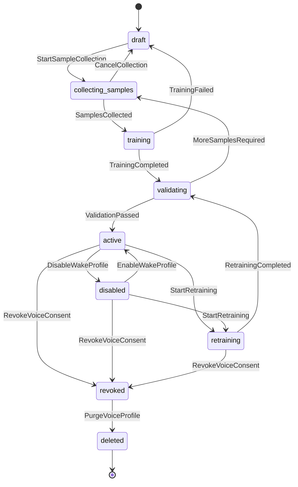
```mermaid
stateDiagram-v2
[*] --> draft
draft --> collecting_samples: StartSampleCollection
collecting_samples --> training: SamplesCollected
collecting_samples --> draft: CancelCollection
training --> validating: TrainingCompleted
training --> draft: TrainingFailed
validating --> active: ValidationPassed
validating --> collecting_samples: MoreSamplesRequired
active --> disabled: DisableWakeProfile
disabled --> active: EnableWakeProfile
active --> retraining: StartRetraining
disabled --> retraining: StartRetraining
retraining --> validating: RetrainingCompleted
active --> revoked: RevokeVoiceConsent
disabled --> revoked: RevokeVoiceConsent
retraining --> revoked: RevokeVoiceConsent
revoked --> deleted: PurgeVoiceProfile
deleted --> [*]
```

#### Transition chính

| Từ | Event/Command | Điều kiện chính | Đến | Side effect bắt buộc |
|---|---|---|---|---|
| `draft` | `StartSampleCollection` | Consent riêng đã được ghi nhận | `collecting_samples` | Bật indicator; đặt raw audio TTL ngắn |
| `collecting_samples` | `SamplesCollected` | Đủ số lượng/chất lượng mẫu | `training` | Không upload cloud nếu chưa opt-in |
| `training` | `TrainingCompleted` | Model/feature tạo thành công | `validating` | Ghi model version/hash |
| `validating` | `ValidationPassed` | Đạt ngưỡng chất lượng | `active` | Cho phép wake listener dùng profile |
| `validating` | `MoreSamplesRequired` | Chưa đạt ngưỡng | `collecting_samples` | Thông báo lý do |
| `active` | `DisableWakeProfile` | User yêu cầu | `disabled` | Wake phrase không kích hoạt |
| `active` | `StartRetraining` | User thêm cách gọi hoặc drift | `retraining` | Giữ profile cũ cho đến khi policy cho phép |
| `active` | `RevokeVoiceConsent` | User thu hồi consent | `revoked` | Ngừng dùng ngay và lập deletion job |
| `revoked` | `PurgeVoiceProfile` | Xóa feature/sample hoàn tất | `deleted` | Ghi audit không chứa dữ liệu giọng nói |

#### Invariant bắt buộc

- Wake word chỉ mở phiên nghe, không cấp quyền action.
- Raw audio không lưu dài hạn mặc định.
- Voice profile không được dùng làm bằng chứng duy nhất cho hành động nhạy cảm.
- Profile `revoked` không được dùng trong fallback.

---

## 6. Tương tác, suy luận và thực thi

### 6.1. Interaction Session Lifecycle

**Entity:** `InteractionSession`

**Mục đích:** Theo dõi một phiên giao tiếp từ lúc người dùng gọi trợ lý đến khi trả lời, hoàn tất, hủy hoặc hết hạn.

#### Trạng thái

| Trạng thái | Ý nghĩa |
|---|---|
| `created` | Phiên vừa được mở từ voice, text, shortcut hoặc UI trigger. |
| `capturing_input` | Đang nhận voice/text/selection. |
| `understanding` | Đang chuẩn hóa transcript, intent và context. |
| `waiting_clarification` | Thiếu dữ liệu tối thiểu hoặc có nhiều cách hiểu đáng kể. |
| `planning` | Đang tạo hoặc cập nhật Action Plan. |
| `waiting_confirmation` | Đã hiểu đủ nhưng đang chờ xác nhận action nhạy cảm. |
| `executing` | Một hoặc nhiều task đang chạy. |
| `responding` | Đang tổng hợp kết quả và phản hồi. |
| `completed` | Phiên kết thúc bình thường. |
| `cancelled` | Người dùng hoặc Emergency Stop đã hủy. |
| `failed` | Phiên không thể tiếp tục do lỗi hoặc policy. |
| `expired` | Context TTL kết thúc khi không có hoạt động. |

#### State diagram

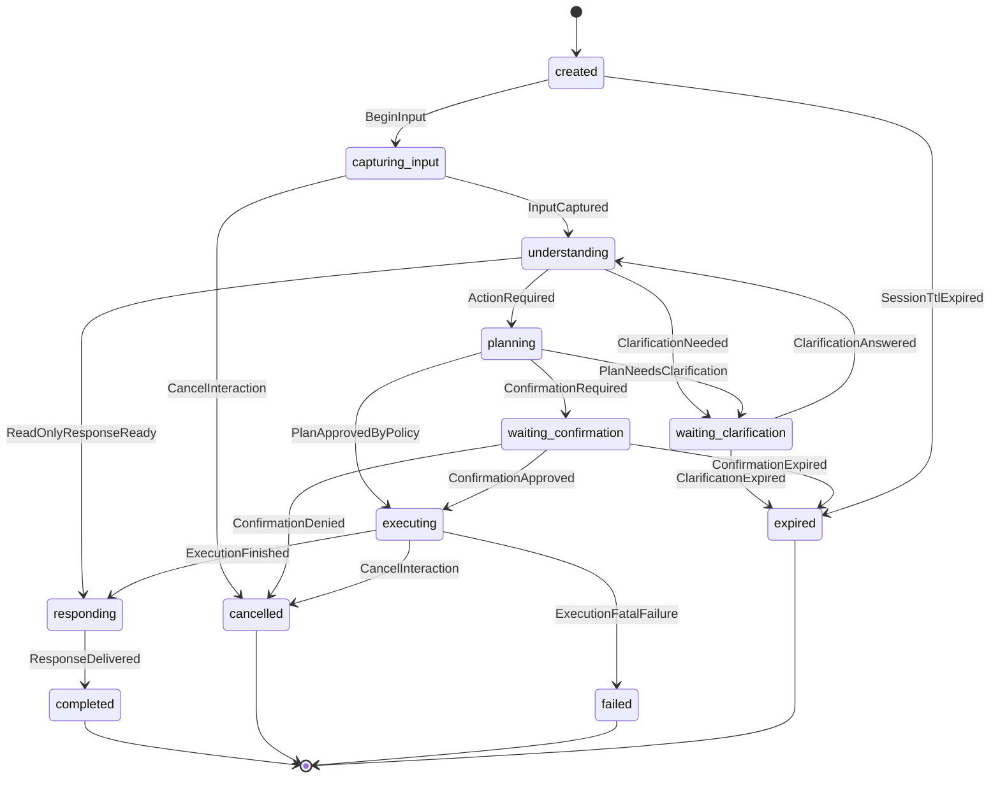
```mermaid
stateDiagram-v2
[*] --> created
created --> capturing_input: BeginInput
capturing_input --> understanding: InputCaptured
capturing_input --> cancelled: CancelInteraction
understanding --> waiting_clarification: ClarificationNeeded
waiting_clarification --> understanding: ClarificationAnswered
waiting_clarification --> expired: ClarificationExpired
understanding --> responding: ReadOnlyResponseReady
understanding --> planning: ActionRequired
planning --> waiting_clarification: PlanNeedsClarification
planning --> waiting_confirmation: ConfirmationRequired
planning --> executing: PlanApprovedByPolicy
waiting_confirmation --> executing: ConfirmationApproved
waiting_confirmation --> cancelled: ConfirmationDenied
waiting_confirmation --> expired: ConfirmationExpired
executing --> responding: ExecutionFinished
executing --> cancelled: CancelInteraction
executing --> failed: ExecutionFatalFailure
responding --> completed: ResponseDelivered
created --> expired: SessionTtlExpired
completed --> [*]
cancelled --> [*]
failed --> [*]
expired --> [*]
```

#### Transition chính

| Từ | Event/Command | Điều kiện chính | Đến | Side effect bắt buộc |
|---|---|---|---|---|
| `created` | `BeginInput` | Kênh tương tác hợp lệ | `capturing_input` | Hiển thị indicator nếu microphone/screen được dùng |
| `capturing_input` | `InputCaptured` | Có transcript/text hợp lệ | `understanding` | Tạo context snapshot có TTL |
| `understanding` | `ClarificationNeeded` | Target hoặc dữ liệu bắt buộc chưa rõ | `waiting_clarification` | Tạo `ClarificationRequest` tối thiểu |
| `waiting_clarification` | `ClarificationAnswered` | Câu trả lời hợp lệ | `understanding` | Merge câu trả lời, không làm mất yêu cầu cũ |
| `understanding` | `ActionRequired` | Intent cần tool/action | `planning` | Tạo `ActionPlan` draft |
| `planning` | `ConfirmationRequired` | Policy xác định cần confirm | `waiting_confirmation` | Tạo confirmation gắn plan hash |
| `planning` | `PlanApprovedByPolicy` | Không cần confirmation và permission hợp lệ | `executing` | Dispatch task |
| `executing` | `ExecutionFinished` | Tất cả task đã terminal hoặc plan dừng | `responding` | Tổng hợp evidence và lỗi |
| `responding` | `ResponseDelivered` | UI/TTS đã nhận phản hồi | `completed` | Đặt session TTL/cleanup |

#### Invariant bắt buộc

- Phiên phải giữ state khi hỏi clarification; user không phải lặp lại toàn bộ lệnh.
- Context cũ không được tiếp tục tham chiếu sau `expired`.
- Một interaction có thể có nhiều plan version nhưng chỉ một version active tại một thời điểm.
- UI phải thể hiện rõ trạng thái nghe, hiểu, chờ, chạy và lỗi.

---

### 6.2. Clarification Request Lifecycle

**Entity:** `ClarificationRequest`

**Mục đích:** Thu thập đúng phần thông tin tối thiểu còn thiếu trước khi tiếp tục hiểu hoặc lập kế hoạch.

#### Trạng thái

| Trạng thái | Ý nghĩa |
|---|---|
| `created` | Đã xác định cần hỏi thêm. |
| `presented` | Câu hỏi đã hiển thị hoặc đọc cho user. |
| `answered` | User đã cung cấp câu trả lời đủ dùng. |
| `unresolved` | User trả lời nhưng vẫn chưa đủ hoặc vẫn mơ hồ. |
| `expired` | Hết TTL. |
| `cancelled` | Phiên hoặc user hủy. |

#### State diagram

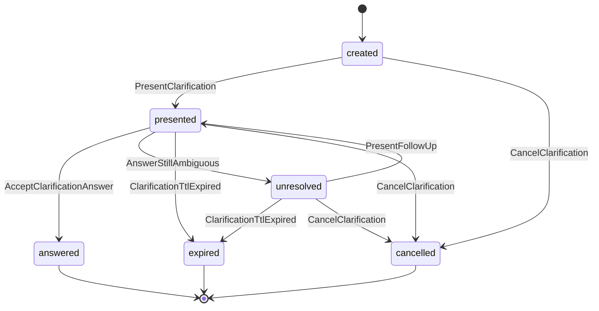
```mermaid
stateDiagram-v2
[*] --> created
created --> presented: PresentClarification
presented --> answered: AcceptClarificationAnswer
presented --> unresolved: AnswerStillAmbiguous
unresolved --> presented: PresentFollowUp
presented --> expired: ClarificationTtlExpired
unresolved --> expired: ClarificationTtlExpired
created --> cancelled: CancelClarification
presented --> cancelled: CancelClarification
unresolved --> cancelled: CancelClarification
answered --> [*]
expired --> [*]
cancelled --> [*]
```

#### Transition chính

| Từ | Event/Command | Điều kiện chính | Đến | Side effect bắt buộc |
|---|---|---|---|---|
| `created` | `PresentClarification` | Session còn hoạt động | `presented` | Lưu danh sách lựa chọn an toàn nếu có |
| `presented` | `AcceptClarificationAnswer` | Câu trả lời resolve đúng field/target | `answered` | Merge vào context và resume session |
| `presented` | `AnswerStillAmbiguous` | Câu trả lời chưa đủ | `unresolved` | Không tự chọn target nhạy cảm |
| `unresolved` | `PresentFollowUp` | Còn khả năng hỏi tối thiểu | `presented` | Chỉ hỏi phần còn thiếu |
| `presented` | `ClarificationTtlExpired` | TTL hết | `expired` | Session có thể chuyển `expired` |

#### Invariant bắt buộc

- `answered` không tạo permission và không phải confirmation.
- Không hỏi lại dữ liệu đã có trong context đáng tin cậy.
- Không dùng memory để tự chọn target cho Level 2 action nếu user intent hiện tại chưa đủ rõ.
- Mỗi request phải ghi field cần làm rõ, không chỉ lưu câu hỏi tự do.

---

### 6.3. Action Plan Lifecycle

**Entity:** `ActionPlan`

**Mục đích:** Biểu diễn kế hoạch có cấu trúc gồm target, step, tool, dữ liệu egress, risk và điểm cần confirmation.

#### Trạng thái

| Trạng thái | Ý nghĩa |
|---|---|
| `draft` | AI/orchestrator đang tạo plan. |
| `needs_clarification` | Plan chưa đủ dữ liệu để đánh giá hoặc chạy. |
| `policy_review` | Policy Engine đang đánh giá permission, risk và data egress. |
| `waiting_confirmation` | Đang chờ user xác nhận plan cụ thể. |
| `approved` | Plan version hiện tại đã được policy/user chấp thuận. |
| `executing` | Task của plan đang chạy. |
| `completed` | Tất cả step bắt buộc đã được xác minh thành công. |
| `partially_completed` | Một phần step thành công nhưng không đạt toàn bộ mục tiêu. |
| `failed` | Plan thất bại. |
| `rejected` | Bị policy từ chối trước thực thi. |
| `cancelled` | User hoặc hệ thống hủy. |
| `expired` | Plan/confirmation hết TTL trước khi chạy. |
| `superseded` | Đã bị thay bằng version mới. |

#### State diagram

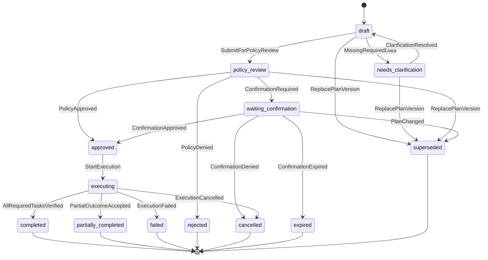
```mermaid
stateDiagram-v2
[*] --> draft
draft --> needs_clarification: MissingRequiredData
needs_clarification --> draft: ClarificationResolved
draft --> policy_review: SubmitForPolicyReview
policy_review --> rejected: PolicyDenied
policy_review --> waiting_confirmation: ConfirmationRequired
policy_review --> approved: PolicyApproved
waiting_confirmation --> approved: ConfirmationApproved
waiting_confirmation --> cancelled: ConfirmationDenied
waiting_confirmation --> expired: ConfirmationExpired
approved --> executing: StartExecution
draft --> superseded: ReplacePlanVersion
needs_clarification --> superseded: ReplacePlanVersion
policy_review --> superseded: ReplacePlanVersion
waiting_confirmation --> superseded: PlanChanged
executing --> completed: AllRequiredTasksVerified
executing --> partially_completed: PartialOutcomeAccepted
executing --> failed: ExecutionFailed
executing --> cancelled: ExecutionCancelled
completed --> [*]
partially_completed --> [*]
failed --> [*]
rejected --> [*]
cancelled --> [*]
expired --> [*]
superseded --> [*]
```

#### Transition chính

| Từ | Event/Command | Điều kiện chính | Đến | Side effect bắt buộc |
|---|---|---|---|---|
| `draft` | `SubmitForPolicyReview` | Schema hợp lệ, target đủ rõ | `policy_review` | Tính risk và permission requirement |
| `policy_review` | `PolicyDenied` | Policy hoặc behavior deny | `rejected` | Ghi lý do có thể giải thích |
| `policy_review` | `ConfirmationRequired` | Level 2 hoặc policy cụ thể | `waiting_confirmation` | Tạo confirmation gắn `PlanHash` |
| `waiting_confirmation` | `ConfirmationApproved` | Confirmation hợp lệ, chưa dùng, chưa hết hạn | `approved` | Đánh dấu approval scope |
| `waiting_confirmation` | `PlanChanged` | Target/payload/step quan trọng thay đổi | `superseded` | Invalidate confirmation cũ |
| `approved` | `StartExecution` | Permission được revalidate tại runtime | `executing` | Tạo `ActionTask` cho từng step |
| `executing` | `AllRequiredTasksVerified` | Mọi step bắt buộc completed với evidence | `completed` | Phát `ActionPlanCompleted` |
| `executing` | `PartialOutcomeAccepted` | Failure policy cho phép dừng một phần | `partially_completed` | Nêu rõ step chưa hoàn tất |

#### Invariant bắt buộc

- Mỗi plan version có immutable `PlanHash`.
- Sửa target, recipient, command, file, data egress hoặc risk tạo plan version mới.
- Không được báo `completed` chỉ vì task đã dispatch.
- Plan terminal muốn chạy lại phải tạo plan hoặc execution mới.
- Action Plan không được chứa secret thô.

---

### 6.4. Action Task Lifecycle

**Entity:** `ActionTask`

**Mục đích:** Đơn vị thực thi chuẩn dùng chung cho OS, browser, terminal, message, Home Assistant và integration.

#### Trạng thái

| Trạng thái | Ý nghĩa |
|---|---|
| `queued` | Đã tạo và chờ policy, confirmation, worker hoặc resource. |
| `waiting_confirmation` | Đang chờ confirmation hợp lệ. |
| `running` | Worker/tool đang thực thi hoặc đang verify. |
| `completed` | Đã có bằng chứng xác minh thành công. |
| `failed` | Không hoàn thành và có failure reason. |
| `cancelled` | Đã hủy và không được tự resume. |
| `unknown` | Không xác định được side effect đã xảy ra hay chưa. |

#### State diagram

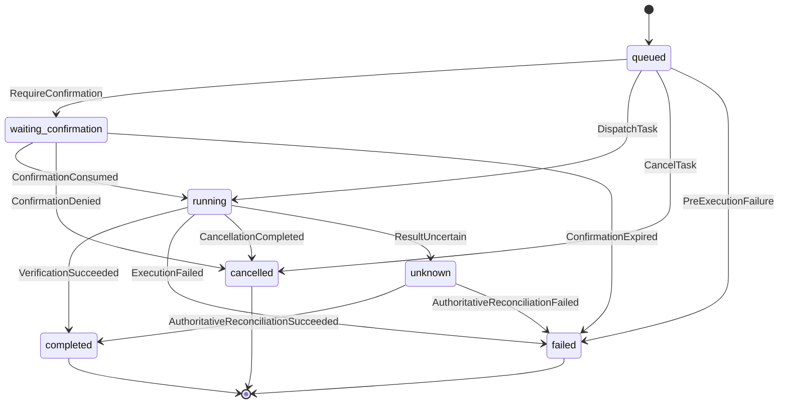
```mermaid
stateDiagram-v2
[*] --> queued
queued --> waiting_confirmation: RequireConfirmation
queued --> running: DispatchTask
queued --> cancelled: CancelTask
queued --> failed: PreExecutionFailure
waiting_confirmation --> running: ConfirmationConsumed
waiting_confirmation --> cancelled: ConfirmationDenied
waiting_confirmation --> failed: ConfirmationExpired
running --> completed: VerificationSucceeded
running --> failed: ExecutionFailed
running --> cancelled: CancellationCompleted
running --> unknown: ResultUncertain
unknown --> completed: AuthoritativeReconciliationSucceeded
unknown --> failed: AuthoritativeReconciliationFailed
completed --> [*]
failed --> [*]
cancelled --> [*]
```

#### Transition chính

| Từ | Event/Command | Điều kiện chính | Đến | Side effect bắt buộc |
|---|---|---|---|---|
| `queued` | `RequireConfirmation` | Policy yêu cầu confirmation | `waiting_confirmation` | Bind confirmation correlation |
| `queued` | `DispatchTask` | Permission hợp lệ và worker sẵn sàng | `running` | Tạo worker/process lease |
| `waiting_confirmation` | `ConfirmationConsumed` | Approval one-time khớp plan/task | `running` | Đánh dấu confirmation `consumed` |
| `running` | `VerificationSucceeded` | Có evidence authoritative | `completed` | Lưu evidence đã redaction |
| `running` | `ExecutionFailed` | Tool trả lỗi xác định | `failed` | Áp dụng failure/rollback policy |
| `running` | `CancellationCompleted` | Worker/process tree đã dừng trong phạm vi khả thi | `cancelled` | Không auto resume |
| `running` | `ResultUncertain` | Timeout/network/crash sau write request | `unknown` | Không auto retry action không idempotent |
| `unknown` | `AuthoritativeReconciliationSucceeded` | API/state/readback chứng minh side effect thành công | `completed` | Ghi nguồn reconciliation |
| `unknown` | `AuthoritativeReconciliationFailed` | Nguồn authoritative chứng minh không thành công | `failed` | Cho phép user tạo retry task mới |

#### Invariant bắt buộc

- Chỉ dùng các canonical status trên để đồng bộ đa thiết bị.
- Chi tiết nội bộ phải nằm ở `ExecutionPhase`: `policy_evaluation`, `dispatching`, `executing`, `verifying`, `rollback`, `cleanup`.
- `completed`, `failed`, `cancelled` là terminal.
- `unknown` là trạng thái frozen; không được tự retry Level 2 action.
- Retry nghiệp vụ tạo task mới có `RetryOfTaskId`; không đưa task terminal về `queued`.
- Task phải có owner, timeout và phương thức hủy khi worker hỗ trợ.

---

### 6.5. Outbound Message Lifecycle

**Entity:** `OutboundMessage`

**Mục đích:** Theo dõi nội dung soạn, recipient resolution, confirmation, gửi và trạng thái delivery của tin nhắn ra ngoài.

#### Trạng thái

| Trạng thái | Ý nghĩa |
|---|---|
| `draft` | Nội dung đang được soạn. |
| `recipient_ambiguous` | Có nhiều contact/channel phù hợp. |
| `ready_for_confirmation` | Recipient và payload đã rõ. |
| `sending` | Integration/UI automation đang gửi. |
| `sent` | Có bằng chứng gửi thành công. |
| `delivery_unknown` | Không biết tin đã được gửi hay chưa. |
| `failed` | Xác định gửi thất bại. |
| `cancelled` | User hủy trước hoặc trong khi gửi. |

#### State diagram

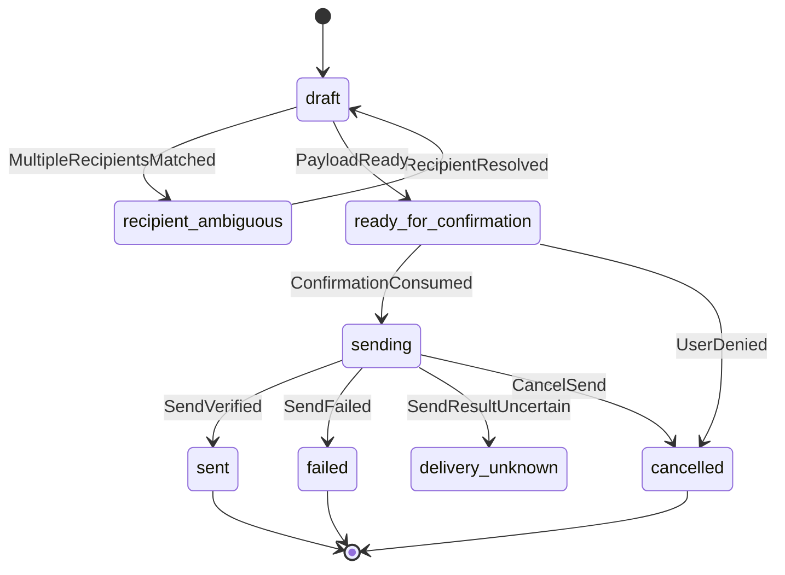
```mermaid
stateDiagram-v2
[*] --> draft
draft --> recipient_ambiguous: MultipleRecipientsMatched
recipient_ambiguous --> draft: RecipientResolved
draft --> ready_for_confirmation: PayloadReady
ready_for_confirmation --> sending: ConfirmationConsumed
ready_for_confirmation --> cancelled: UserDenied
sending --> sent: SendVerified
sending --> failed: SendFailed
sending --> delivery_unknown: SendResultUncertain
sending --> cancelled: CancelSend
sent --> [*]
failed --> [*]
cancelled --> [*]
```

#### Transition chính

| Từ | Event/Command | Điều kiện chính | Đến | Side effect bắt buộc |
|---|---|---|---|---|
| `draft` | `MultipleRecipientsMatched` | Nhiều Nguyễn Văn A/contact/channel | `recipient_ambiguous` | Tạo clarification tối thiểu |
| `recipient_ambiguous` | `RecipientResolved` | User chọn đúng contact/channel | `draft` | Bind immutable recipient reference |
| `draft` | `PayloadReady` | Recipient, channel và nội dung hoàn chỉnh | `ready_for_confirmation` | Tạo message hash |
| `ready_for_confirmation` | `ConfirmationConsumed` | Level 2 confirmation hợp lệ | `sending` | Tạo send task |
| `sending` | `SendVerified` | API receipt/UI state xác minh | `sent` | Lưu external message id nếu có |
| `sending` | `SendResultUncertain` | Timeout sau submit hoặc UI không rõ | `delivery_unknown` | Không tự gửi lại |

#### Invariant bắt buộc

- Clarification recipient không được xem là confirmation gửi.
- Payload thay đổi sau confirmation phải xác nhận lại.
- `delivery_unknown` không được tự chuyển `sent` bằng suy đoán.
- Không lưu token hoặc secret channel trong entity.

---

### 6.6. UI Target Snapshot Lifecycle

**Entity:** `UiTargetSnapshot`

**Mục đích:** Lưu tham chiếu tạm thời tới tab, DOM element, accessibility node hoặc vùng màn hình mà user cho phép trợ lý quan sát và tác động.

#### Trạng thái

| Trạng thái | Ý nghĩa |
|---|---|
| `captured` | Đã chụp metadata/context tối thiểu từ tab hoặc màn hình được phép. |
| `resolved` | Đã xác định một target cụ thể từ DOM, accessibility tree hoặc vision. |
| `verified` | Target vẫn tồn tại và khớp điều kiện ngay trước action. |
| `consumed` | Snapshot one-time đã được dùng cho action tương ứng. |
| `stale` | UI, tab, URL, window hoặc element đã thay đổi. |
| `invalidated` | Quyền, tab, device hoặc selection đã bị thu hồi/đóng. |
| `expired` | Hết TTL ngắn. |

#### State diagram

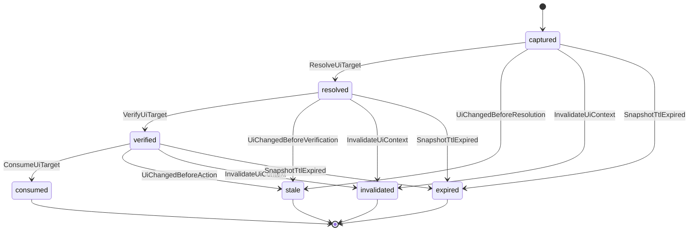
```mermaid
stateDiagram-v2
[*] --> captured
captured --> resolved: ResolveUiTarget
captured --> stale: UiChangedBeforeResolution
resolved --> verified: VerifyUiTarget
resolved --> stale: UiChangedBeforeVerification
verified --> consumed: ConsumeUiTarget
verified --> stale: UiChangedBeforeAction
captured --> invalidated: InvalidateUiContext
resolved --> invalidated: InvalidateUiContext
verified --> invalidated: InvalidateUiContext
captured --> expired: SnapshotTtlExpired
resolved --> expired: SnapshotTtlExpired
verified --> expired: SnapshotTtlExpired
consumed --> [*]
stale --> [*]
invalidated --> [*]
expired --> [*]
```

#### Transition chính

| Từ | Event/Command | Điều kiện chính | Đến | Side effect bắt buộc |
|---|---|---|---|---|
| `captured` | `ResolveUiTarget` | Có selector/accessibility/vision match đủ tin cậy | `resolved` | Bind tab/window/document generation |
| `resolved` | `VerifyUiTarget` | URL, element state và document generation chưa đổi | `verified` | Lưu verification timestamp ngắn |
| `verified` | `ConsumeUiTarget` | Action task, target và snapshot version khớp | `consumed` | Không reuse snapshot one-time |
| `captured` | `UiChangedBeforeResolution` | Navigation/layout/window thay đổi | `stale` | Yêu cầu capture/resolve lại |
| `resolved` | `UiChangedBeforeVerification` | Element detach hoặc document generation đổi | `stale` | Không click theo tọa độ cũ |
| `verified` | `UiChangedBeforeAction` | UI thay đổi sau verify | `stale` | Dừng action và resolve lại |
| `resolved` | `InvalidateUiContext` | Tab đóng, permission revoke hoặc user đổi selection | `invalidated` | Xóa dữ liệu tạm phù hợp |

#### Invariant bắt buộc

- Snapshot phải có TTL ngắn và không được dùng như memory dài hạn.
- Ưu tiên API, DOM và accessibility; tọa độ tuyệt đối chỉ là phương án cuối.
- Screenshot/raw frame phải được xóa sau xử lý trừ khi user opt-in rõ ràng.
- Không được dùng snapshot của tab/window khác target đã được user chia sẻ.
- Trước click, submit hoặc skip-ad, target phải ở `verified`.
- Sau navigation, DOM generation hoặc window handle thay đổi, snapshot cũ phải `stale`.
- `consumed`, `stale`, `invalidated`, `expired` là terminal; cần tạo snapshot mới.

---

## 7. Quyền và xác nhận

### 7.1. Confirmation Request Lifecycle

**Entity:** `ConfirmationRequest`

**Mục đích:** Đại diện cho sự đồng ý một lần, có TTL và gắn đúng action plan hoặc task.

#### Trạng thái

| Trạng thái | Ý nghĩa |
|---|---|
| `created` | Đã tạo nhưng chưa hiển thị. |
| `presented` | Đã hiển thị/đọc nội dung cần xác nhận. |
| `approved` | User đồng ý; chưa được sử dụng. |
| `consumed` | Approval đã dùng để bắt đầu đúng action. |
| `denied` | User từ chối. |
| `expired` | TTL kết thúc. |
| `cancelled` | Task/session bị hủy. |
| `invalidated` | Plan, payload, target hoặc policy đã thay đổi. |

#### State diagram

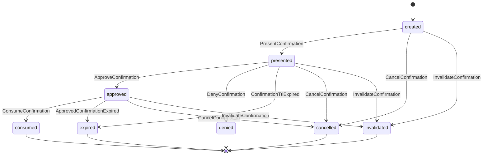
```mermaid
stateDiagram-v2
[*] --> created
created --> presented: PresentConfirmation
presented --> approved: ApproveConfirmation
presented --> denied: DenyConfirmation
presented --> expired: ConfirmationTtlExpired
approved --> consumed: ConsumeConfirmation
approved --> expired: ApprovedConfirmationExpired
created --> cancelled: CancelConfirmation
presented --> cancelled: CancelConfirmation
approved --> cancelled: CancelConfirmation
created --> invalidated: InvalidateConfirmation
presented --> invalidated: InvalidateConfirmation
approved --> invalidated: InvalidateConfirmation
consumed --> [*]
denied --> [*]
expired --> [*]
cancelled --> [*]
invalidated --> [*]
```

#### Transition chính

| Từ | Event/Command | Điều kiện chính | Đến | Side effect bắt buộc |
|---|---|---|---|---|
| `created` | `PresentConfirmation` | Session/device hợp lệ | `presented` | Hiển thị action, target, payload chính, device và hậu quả |
| `presented` | `ApproveConfirmation` | User identity/session phù hợp | `approved` | Lưu approved_at và approver |
| `approved` | `ConsumeConfirmation` | PlanHash, TaskId và parameters khớp | `consumed` | Đánh dấu dùng một lần |
| `presented` | `DenyConfirmation` | User từ chối | `denied` | Hủy action tương ứng |
| `presented` | `ConfirmationTtlExpired` | Hết TTL | `expired` | Task chuyển failed/cancelled theo policy |
| `approved` | `InvalidateConfirmation` | Plan hoặc policy thay đổi | `invalidated` | Không được reuse approval |

#### Invariant bắt buộc

- Im lặng hoặc timeout không phải đồng ý.
- Confirmation chỉ có hiệu lực cho đúng scope đã trình bày.
- Không được dùng confirmation của thiết bị/session đã revoke.
- `consumed`, `denied`, `expired`, `cancelled`, `invalidated` là terminal.

---

### 7.2. Permission Grant Lifecycle

**Entity:** `PermissionGrant`

**Mục đích:** Quản lý quyền theo user, device, skill, resource, action, risk, thời gian và local/remote scope.

#### Trạng thái

| Trạng thái | Ý nghĩa |
|---|---|
| `requested` | Có yêu cầu cấp quyền mới. |
| `pending_approval` | Đang chờ user hoặc policy owner phê duyệt. |
| `active` | Quyền hợp lệ trong đúng scope. |
| `revalidation_required` | Skill/version/policy/resource đã đổi; chưa được dùng cho action mới. |
| `suspended` | Tạm ngừng do incident, device hoặc account state. |
| `expired` | Hết thời hạn. |
| `revoked` | Bị thu hồi vĩnh viễn cho grant generation. |
| `denied` | Yêu cầu cấp quyền bị từ chối. |

#### State diagram

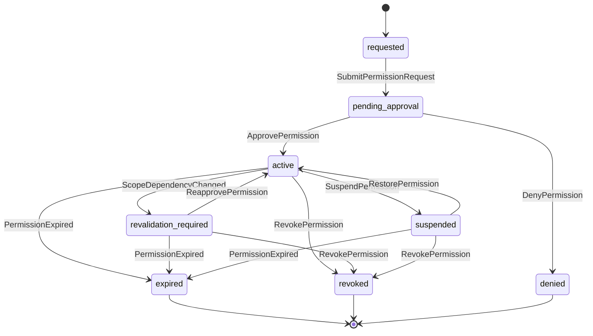
```mermaid
stateDiagram-v2
[*] --> requested
requested --> pending_approval: SubmitPermissionRequest
pending_approval --> active: ApprovePermission
pending_approval --> denied: DenyPermission
active --> revalidation_required: ScopeDependencyChanged
revalidation_required --> active: ReapprovePermission
active --> suspended: SuspendPermission
suspended --> active: RestorePermission
active --> expired: PermissionExpired
revalidation_required --> expired: PermissionExpired
suspended --> expired: PermissionExpired
active --> revoked: RevokePermission
revalidation_required --> revoked: RevokePermission
suspended --> revoked: RevokePermission
expired --> [*]
revoked --> [*]
denied --> [*]
```

#### Transition chính

| Từ | Event/Command | Điều kiện chính | Đến | Side effect bắt buộc |
|---|---|---|---|---|
| `requested` | `SubmitPermissionRequest` | Request có scope cụ thể | `pending_approval` | Hiển thị data egress và risk |
| `pending_approval` | `ApprovePermission` | User phê duyệt | `active` | Tạo immutable scope/version |
| `pending_approval` | `DenyPermission` | User từ chối | `denied` | Không cấp fallback rộng hơn |
| `active` | `ScopeDependencyChanged` | Skill hash, workflow version hoặc policy thay đổi | `revalidation_required` | Chặn action mới |
| `revalidation_required` | `ReapprovePermission` | User review scope mới | `active` | Tạo approval generation mới |
| `active` | `SuspendPermission` | Incident hoặc device/account suspended | `suspended` | Hủy/stop task theo risk |
| `active` | `RevokePermission` | User thu hồi | `revoked` | Revalidate routine và queued task |

#### Invariant bắt buộc

- Không có wildcard `allow_all` mặc định.
- Mở rộng scope phải tạo grant version mới, không sửa âm thầm grant active.
- Permission không được tạo bởi AI hoặc memory.
- Permission phải được kiểm tra lại ngay trước execution.
- `revoked`, `expired`, `denied` là terminal.

---

## 8. Memory và đồng bộ

### 8.1. Memory Record Lifecycle

**Entity:** `MemoryRecord`

**Mục đích:** Quản lý thông tin được ghi nhớ, nguồn gốc, độ tin cậy, sensitivity, scope, retention và deletion.

#### Trạng thái

| Trạng thái | Ý nghĩa |
|---|---|
| `candidate` | Thông tin mới được đề xuất, thường do AI inference hoặc observation. |
| `active` | Được phép retrieval trong đúng scope. |
| `stale` | Có dấu hiệu cũ, mâu thuẫn hoặc cần xác nhận lại. |
| `expired` | Hết retention; không được retrieval. |
| `revoked` | Consent/scope bị thu hồi hoặc source không còn hợp lệ. |
| `deletion_pending` | Đang truyền yêu cầu xóa tới local/cloud replicas. |
| `deleted` | Đã xóa hoặc chỉ còn tombstone tối thiểu. |

#### State diagram

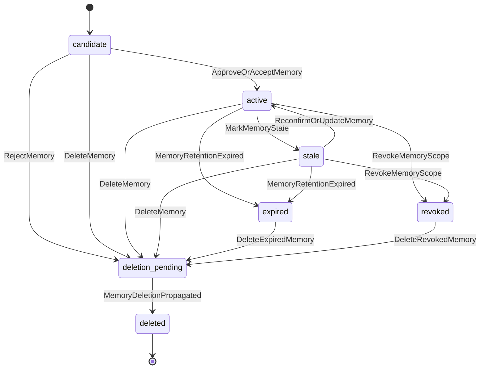
```mermaid
stateDiagram-v2
[*] --> candidate
candidate --> active: ApproveOrAcceptMemory
candidate --> deletion_pending: RejectMemory
active --> stale: MarkMemoryStale
stale --> active: ReconfirmOrUpdateMemory
active --> expired: MemoryRetentionExpired
stale --> expired: MemoryRetentionExpired
active --> revoked: RevokeMemoryScope
stale --> revoked: RevokeMemoryScope
candidate --> deletion_pending: DeleteMemory
active --> deletion_pending: DeleteMemory
stale --> deletion_pending: DeleteMemory
expired --> deletion_pending: DeleteExpiredMemory
revoked --> deletion_pending: DeleteRevokedMemory
deletion_pending --> deleted: MemoryDeletionPropagated
deleted --> [*]
```

#### Transition chính

| Từ | Event/Command | Điều kiện chính | Đến | Side effect bắt buộc |
|---|---|---|---|---|
| `candidate` | `ApproveOrAcceptMemory` | Policy cho phép; user-confirmed hoặc inferred được đánh dấu rõ | `active` | Lập index theo nhu cầu |
| `active` | `MarkMemoryStale` | Bị mâu thuẫn, cũ hoặc source invalid | `stale` | Loại khỏi sensitive target decision |
| `stale` | `ReconfirmOrUpdateMemory` | User xác nhận/chỉnh sửa | `active` | Ưu tiên user edit |
| `active` | `MemoryRetentionExpired` | Hết retention và không pinned | `expired` | Loại khỏi retrieval |
| `active` | `RevokeMemoryScope` | Consent hoặc sync scope bị thu hồi | `revoked` | Ngừng retrieval/sync ngay |
| `active` | `DeleteMemory` | User yêu cầu | `deletion_pending` | Tạo deletion sync job |
| `deletion_pending` | `MemoryDeletionPropagated` | Các replica đã xóa hoặc có tombstone | `deleted` | Ghi audit deletion |

#### Invariant bắt buộc

- `Pinned`, `VerificationStatus`, `Sensitivity`, `StorageScope` và `SyncStatus` là thuộc tính riêng, không phải lifecycle state.
- Memory không cấp permission và không tự tạo intent.
- Memory `stale`, `expired`, `revoked`, `deleted` không được dùng để quyết định action.
- Password, token, private key, OTP không được lưu trong `MemoryRecord`.
- Retrieval theo nhu cầu; không tải toàn bộ memory database vào RAM.
- Xóa user-edit phải ưu tiên hơn inference hoặc summary tự động.

---

### 8.2. Memory Sync Job Lifecycle

**Entity:** `MemorySyncJob`

**Mục đích:** Theo dõi đồng bộ create/update/delete memory giữa local device và cloud mà vẫn tôn trọng Private Mode.

#### Trạng thái

| Trạng thái | Ý nghĩa |
|---|---|
| `pending` | Đã xếp hàng chờ sync. |
| `blocked_private_mode` | Bị chặn do Private Mode hoặc policy egress. |
| `running` | Đang upload/download/reconcile. |
| `conflict` | Có version conflict cần rule hoặc user resolution. |
| `retry_wait` | Chờ retry có backoff. |
| `completed` | Sync hoặc deletion propagation đã hoàn tất. |
| `failed` | Hết retry hoặc lỗi không phục hồi. |
| `cancelled` | Job bị user/system hủy. |

#### State diagram

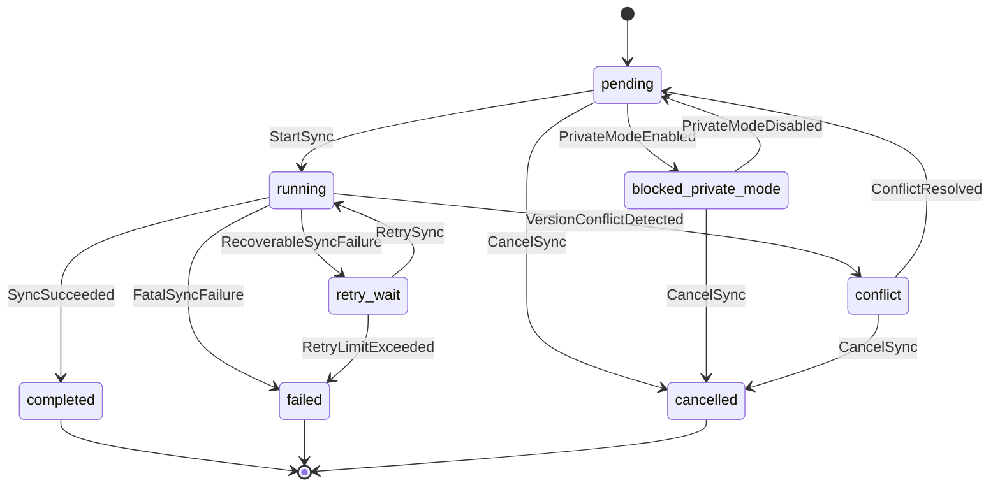
```mermaid
stateDiagram-v2
[*] --> pending
pending --> blocked_private_mode: PrivateModeEnabled
blocked_private_mode --> pending: PrivateModeDisabled
pending --> running: StartSync
running --> completed: SyncSucceeded
running --> conflict: VersionConflictDetected
conflict --> pending: ConflictResolved
running --> retry_wait: RecoverableSyncFailure
retry_wait --> running: RetrySync
running --> failed: FatalSyncFailure
retry_wait --> failed: RetryLimitExceeded
pending --> cancelled: CancelSync
blocked_private_mode --> cancelled: CancelSync
conflict --> cancelled: CancelSync
completed --> [*]
failed --> [*]
cancelled --> [*]
```

#### Transition chính

| Từ | Event/Command | Điều kiện chính | Đến | Side effect bắt buộc |
|---|---|---|---|---|
| `pending` | `PrivateModeEnabled` | Job cần cloud egress | `blocked_private_mode` | Không upload byte nào |
| `pending` | `StartSync` | Mode/policy/network hợp lệ | `running` | Bind source and target versions |
| `running` | `VersionConflictDetected` | Cùng record có thay đổi cạnh tranh | `conflict` | User edit thắng inference |
| `conflict` | `ConflictResolved` | Rule/user đã chọn version | `pending` | Tạo payload mới |
| `running` | `RecoverableSyncFailure` | Network/provider lỗi tạm thời | `retry_wait` | Backoff có giới hạn |
| `running` | `SyncSucceeded` | Server/device ack authoritative | `completed` | Cập nhật sync cursor |

#### Invariant bắt buộc

- Private Mode không được tự tắt để hoàn thành sync.
- Deletion job phải được ưu tiên hơn update cũ.
- Thiết bị offline phải xử lý tombstone khi online.
- Job `completed`, `failed`, `cancelled` là terminal; retry nghiệp vụ mới tạo job mới khi cần.

---

## 9. Routine và tự động hóa

### 9.1. Routine Definition Lifecycle

**Entity:** `RoutineDefinition`

**Mục đích:** Quản lý workflow được user tạo hoặc phê duyệt, có version, trigger, target, permission scope và failure policy.

#### Trạng thái

| Trạng thái | Ý nghĩa |
|---|---|
| `draft` | Đang soạn hoặc học từ hành vi lặp lại. |
| `validating` | Đang kiểm tra schema, dependency, loop và risk. |
| `awaiting_approval` | Đang chờ user preview/phê duyệt version. |
| `active` | Có thể chạy thủ công hoặc theo trigger. |
| `paused` | Tạm dừng trigger tự động; vẫn xem và chỉnh sửa được. |
| `disabled` | Không được chạy. |
| `superseded` | Version cũ đã được thay bằng version mới. |
| `archived` | Chỉ đọc, giữ lịch sử. |
| `deleted` | Đã xóa theo retention; còn tombstone/audit tối thiểu. |

#### State diagram

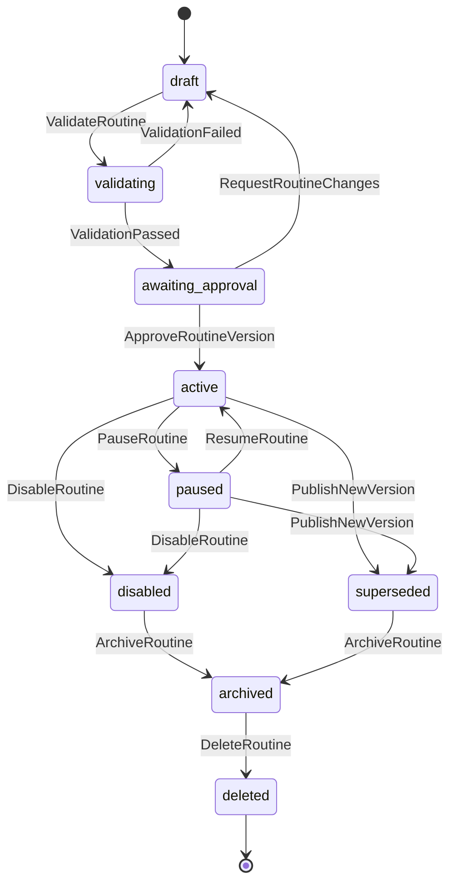
```mermaid
stateDiagram-v2
[*] --> draft
draft --> validating: ValidateRoutine
validating --> draft: ValidationFailed
validating --> awaiting_approval: ValidationPassed
awaiting_approval --> active: ApproveRoutineVersion
awaiting_approval --> draft: RequestRoutineChanges
active --> paused: PauseRoutine
paused --> active: ResumeRoutine
active --> disabled: DisableRoutine
paused --> disabled: DisableRoutine
active --> superseded: PublishNewVersion
paused --> superseded: PublishNewVersion
disabled --> archived: ArchiveRoutine
superseded --> archived: ArchiveRoutine
archived --> deleted: DeleteRoutine
deleted --> [*]
```

#### Transition chính

| Từ | Event/Command | Điều kiện chính | Đến | Side effect bắt buộc |
|---|---|---|---|---|
| `draft` | `ValidateRoutine` | Có trigger, steps, target, failure policy | `validating` | Kiểm tra permission và vòng lặp |
| `validating` | `ValidationPassed` | Schema và dependency hợp lệ | `awaiting_approval` | Tạo immutable version hash |
| `awaiting_approval` | `ApproveRoutineVersion` | User review từng step | `active` | Đặt trust status theo phạm vi |
| `active` | `PauseRoutine` | User hoặc mode policy | `paused` | Ngừng trigger mới |
| `paused` | `ResumeRoutine` | Dependency và permission còn hợp lệ | `active` | Revalidate trước khi bật trigger |
| `active` | `PublishNewVersion` | Step/target/parameter quan trọng đổi | `superseded` | Version mới bắt đầu từ draft |
| `disabled` | `ArchiveRoutine` | Không còn dùng | `archived` | Giữ lịch sử run |
| `archived` | `DeleteRoutine` | User yêu cầu và retention cho phép | `deleted` | Không xóa audit/run đang cần giữ |

#### Invariant bắt buộc

- Trust là chiều riêng: `untrusted`, `trusted`, `revalidation_required`, `revoked`.
- Sửa workflow không cập nhật tại chỗ version đã duyệt.
- Level 3 action không được đưa vào Trusted Routine thông thường trong MVP.
- Mỗi lần chạy phải revalidate permission, skill, integration và device.
- Routine không được lưu arbitrary shell, password, OTP hoặc secret field.
- Có rate limit và loop guard cho trigger.

---

### 9.2. Routine Run Lifecycle

**Entity:** `RoutineRun`

**Mục đích:** Theo dõi một lần chạy cụ thể của một routine version và trạng thái từng step.

#### Trạng thái

| Trạng thái | Ý nghĩa |
|---|---|
| `queued` | Đã nhận trigger, chờ policy/resource. |
| `waiting_confirmation` | Routine hoặc step cần xác nhận. |
| `running` | Đang chạy các step. |
| `completed` | Tất cả step bắt buộc được xác minh. |
| `failed` | Failure policy kết thúc run với lỗi. |
| `cancelled` | User, Emergency Stop hoặc policy hủy. |
| `unknown` | Không xác định được kết quả của ít nhất một write-step. |

#### State diagram

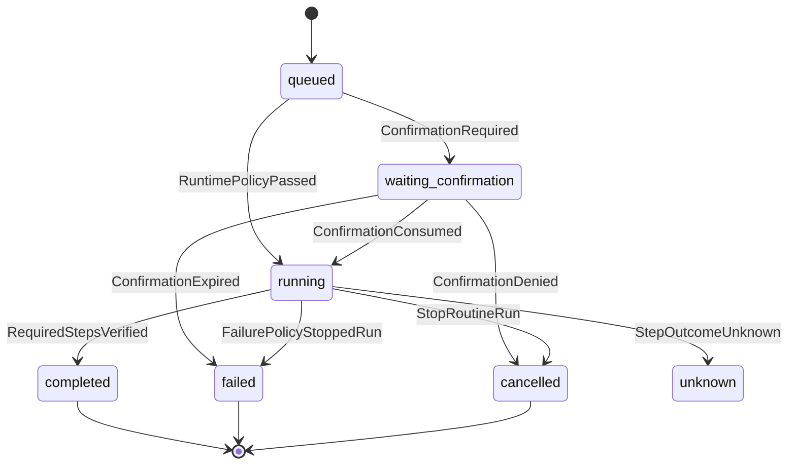
```mermaid
stateDiagram-v2
[*] --> queued
queued --> waiting_confirmation: ConfirmationRequired
queued --> running: RuntimePolicyPassed
waiting_confirmation --> running: ConfirmationConsumed
waiting_confirmation --> cancelled: ConfirmationDenied
waiting_confirmation --> failed: ConfirmationExpired
running --> completed: RequiredStepsVerified
running --> failed: FailurePolicyStoppedRun
running --> cancelled: StopRoutineRun
running --> unknown: StepOutcomeUnknown
completed --> [*]
failed --> [*]
cancelled --> [*]
```

#### Transition chính

| Từ | Event/Command | Điều kiện chính | Đến | Side effect bắt buộc |
|---|---|---|---|---|
| `queued` | `RuntimePolicyPassed` | Routine version active, trigger valid, permission/integration/device hợp lệ | `running` | Pin exact routine version |
| `queued` | `ConfirmationRequired` | Trust không đủ hoặc step nhạy cảm | `waiting_confirmation` | Tạo confirmation đúng scope |
| `running` | `RequiredStepsVerified` | Mọi required step completed | `completed` | Lưu step result đã redaction |
| `running` | `FailurePolicyStoppedRun` | Step failed và policy=stop | `failed` | Rollback khi khả thi |
| `running` | `StepOutcomeUnknown` | Write-step không rõ kết quả | `unknown` | Không rerun step tự động |
| `running` | `StopRoutineRun` | User/Emergency Stop | `cancelled` | Dừng worker/process tree |

#### Invariant bắt buộc

- Run luôn pin `RoutineVersionId`; thay đổi definition không đổi run đang chạy.
- Security revoke có thể dừng run ngay; chỉnh sửa không bảo mật thường chỉ áp dụng lần chạy sau.
- Emergency Stop không được auto resume.
- Step có trạng thái và evidence riêng.
- Concurrency policy phải là `reject`, `queue` hoặc `single_instance` theo routine.

---

## 10. Skill, workflow và integration

### 10.1. Skill Package Lifecycle

**Entity:** `SkillPackage`

**Mục đích:** Quản lý capability có manifest, contract, resource scope, signature, version và risk declaration.

#### Trạng thái

| Trạng thái | Ý nghĩa |
|---|---|
| `discovered` | Package được tìm thấy nhưng chưa kiểm tra. |
| `verifying` | Đang kiểm tra signature, manifest, hash và compatibility. |
| `installed_disabled` | Cài thành công nhưng chưa được phép chạy. |
| `enabled` | Được đăng ký trong Skill Registry và có thể nhận task. |
| `revalidation_required` | Update/policy/dependency đổi; tạm chặn task mới. |
| `quarantined` | Bị cô lập do integrity/security anomaly. |
| `disabled` | User hoặc policy tắt. |
| `rejected` | Verification thất bại; không được cài. |
| `uninstalled` | Package version đã bị gỡ. |

#### State diagram

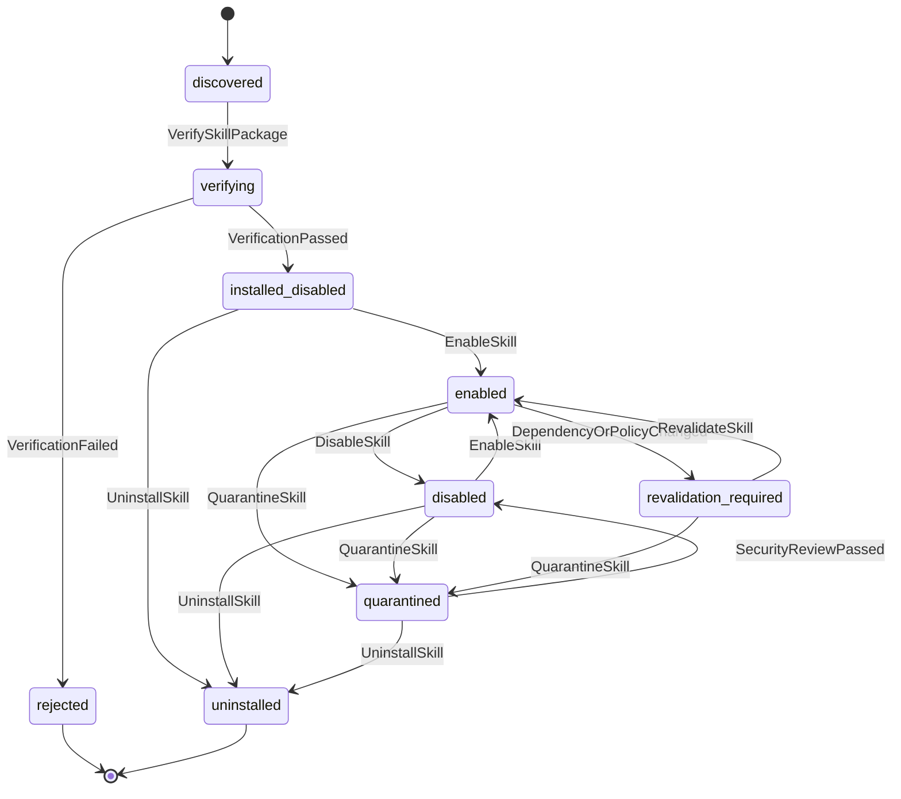
```mermaid
stateDiagram-v2
[*] --> discovered
discovered --> verifying: VerifySkillPackage
verifying --> installed_disabled: VerificationPassed
verifying --> rejected: VerificationFailed
installed_disabled --> enabled: EnableSkill
enabled --> disabled: DisableSkill
disabled --> enabled: EnableSkill
enabled --> revalidation_required: DependencyOrPolicyChanged
revalidation_required --> enabled: RevalidateSkill
enabled --> quarantined: QuarantineSkill
disabled --> quarantined: QuarantineSkill
revalidation_required --> quarantined: QuarantineSkill
quarantined --> disabled: SecurityReviewPassed
installed_disabled --> uninstalled: UninstallSkill
disabled --> uninstalled: UninstallSkill
quarantined --> uninstalled: UninstallSkill
rejected --> [*]
uninstalled --> [*]
```

#### Transition chính

| Từ | Event/Command | Điều kiện chính | Đến | Side effect bắt buộc |
|---|---|---|---|---|
| `discovered` | `VerifySkillPackage` | Package source hợp lệ | `verifying` | Kiểm tra signature/hash/manifest |
| `verifying` | `VerificationPassed` | Tất cả check đạt | `installed_disabled` | Không tự enable |
| `installed_disabled` | `EnableSkill` | User/policy duyệt capability và permission | `enabled` | Đăng ký tool contracts |
| `enabled` | `DependencyOrPolicyChanged` | Version/policy/resource scope đổi | `revalidation_required` | Invalidate dependent routine trust |
| `enabled` | `QuarantineSkill` | Integrity hoặc behavior anomaly | `quarantined` | Dừng task mới, cô lập worker |
| `quarantined` | `SecurityReviewPassed` | Đã khắc phục và verify lại | `disabled` | Cần user enable lại |
| `disabled` | `UninstallSkill` | Không có task active hoặc đã drain | `uninstalled` | Revoke dependent permission |

#### Invariant bắt buộc

- Skill không được chạy trong core process với quyền cao nếu chưa verify.
- AI không được tự enable, unquarantine hoặc cấp permission cho skill.
- Update là package/version mới; không thay binary âm thầm.
- Manifest phải khai báo data egress và risk.

---

### 10.2. Terminal Workflow Definition Lifecycle

**Entity:** `TerminalWorkflowDefinition`

**Mục đích:** Quản lý workflow terminal có cấu trúc, executable allowlist, working directory, timeout, resource quota và version hash.

#### Trạng thái

| Trạng thái | Ý nghĩa |
|---|---|
| `draft` | Workflow đang được khai báo. |
| `validating` | Đang kiểm tra command schema, executable, path và risk. |
| `awaiting_approval` | Chờ user review command/argument/resource scope. |
| `active` | Có thể được gọi bởi action hoặc routine. |
| `deprecated` | Không dùng cho cấu hình mới nhưng có thể còn reference lịch sử. |
| `disabled` | Không được thực thi. |
| `revoked` | Bị thu hồi do security issue. |
| `superseded` | Version cũ đã được thay thế. |
| `archived` | Chỉ đọc. |

#### State diagram

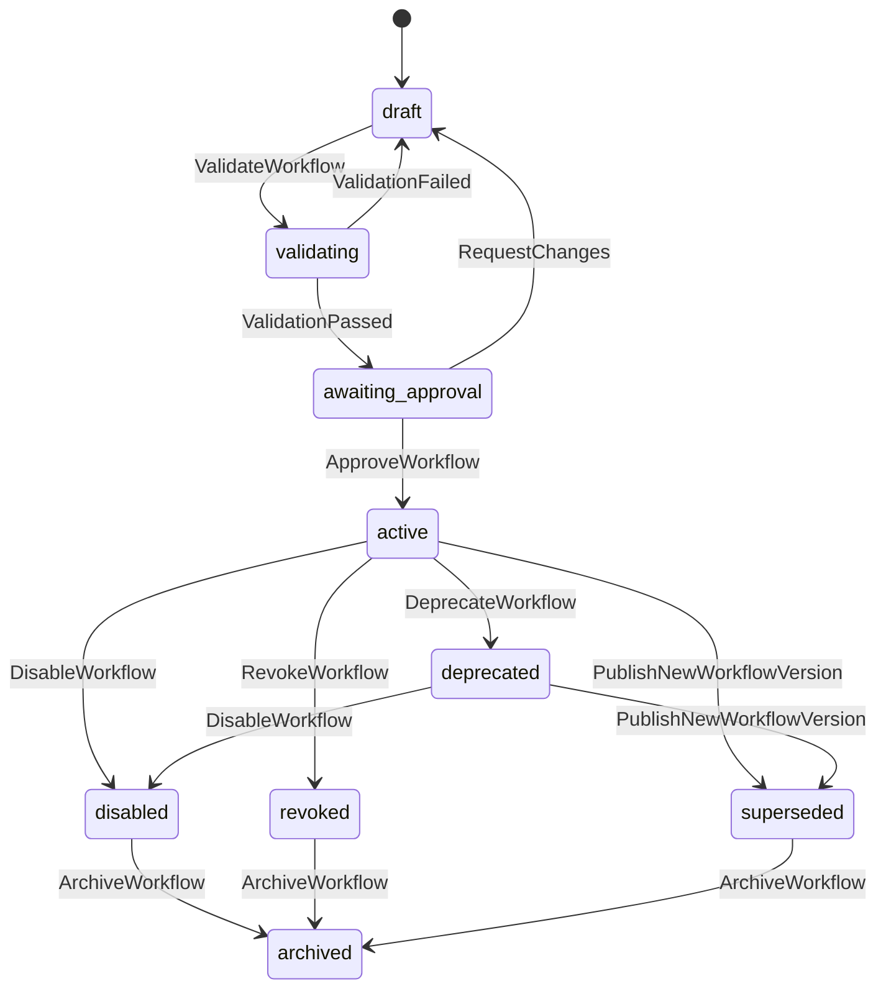
```mermaid
stateDiagram-v2
[*] --> draft
draft --> validating: ValidateWorkflow
validating --> draft: ValidationFailed
validating --> awaiting_approval: ValidationPassed
awaiting_approval --> active: ApproveWorkflow
awaiting_approval --> draft: RequestChanges
active --> deprecated: DeprecateWorkflow
active --> disabled: DisableWorkflow
active --> revoked: RevokeWorkflow
active --> superseded: PublishNewWorkflowVersion
deprecated --> disabled: DisableWorkflow
deprecated --> superseded: PublishNewWorkflowVersion
disabled --> archived: ArchiveWorkflow
revoked --> archived: ArchiveWorkflow
superseded --> archived: ArchiveWorkflow
```

#### Transition chính

| Từ | Event/Command | Điều kiện chính | Đến | Side effect bắt buộc |
|---|---|---|---|---|
| `draft` | `ValidateWorkflow` | Có executable, args schema, workdir scope, timeout, quota | `validating` | Tính hash executable/config |
| `validating` | `ValidationPassed` | Không chứa arbitrary shell và path hợp lệ | `awaiting_approval` | Hiển thị command review |
| `awaiting_approval` | `ApproveWorkflow` | User phê duyệt đúng version/hash | `active` | Tạo permission requirement |
| `active` | `PublishNewWorkflowVersion` | Command/hash/args quan trọng đổi | `superseded` | Routine phụ thuộc chuyển revalidation |
| `active` | `RevokeWorkflow` | Security issue hoặc executable compromised | `revoked` | Dừng execution mới; incident review |
| `active` | `DisableWorkflow` | User/policy | `disabled` | Không chạy task mới |

#### Invariant bắt buộc

- Không lưu shell string tùy ý làm workflow.
- Mỗi execution chạy trong worker riêng với timeout, CPU/RAM quota và directory scope.
- Executable hash hoặc workflow version đổi phải revalidate Trusted Routine.
- Remote terminal workflow luôn ít nhất Risk Level 2.
- Workflow không được tự nâng quyền Administrator/root.

---

### 10.3. Integration Connection Lifecycle

**Entity:** `IntegrationConnection`

**Mục đích:** Quản lý OAuth/API/LAN connection tới messaging, browser service, Home Assistant hoặc dịch vụ bên ngoài.

#### Trạng thái

| Trạng thái | Ý nghĩa |
|---|---|
| `unconfigured` | Chưa có endpoint hoặc authorization. |
| `authorizing` | Đang OAuth/pairing/configuration. |
| `active` | Credential hợp lệ và health đạt yêu cầu. |
| `degraded` | Hoạt động một phần hoặc lỗi tạm thời. |
| `reauth_required` | Credential hết hạn/bị từ chối; cần user xác thực lại. |
| `suspended` | Tạm ngừng do policy, incident hoặc user. |
| `revoked` | Authorization bị thu hồi. |
| `deleted` | Connection metadata đã xóa theo retention. |

#### State diagram

```mermaid
stateDiagram-v2
[*] --> unconfigured
unconfigured --> authorizing: StartAuthorization
authorizing --> active: AuthorizationSucceeded
authorizing --> unconfigured: AuthorizationCancelled
active --> degraded: HealthDegraded
degraded --> active: HealthRecovered
active --> reauth_required: CredentialRejected
degraded --> reauth_required: CredentialRejected
reauth_required --> authorizing: Reauthorize
active --> suspended: SuspendIntegration
degraded --> suspended: SuspendIntegration
reauth_required --> suspended: SuspendIntegration
suspended --> active: RestoreIntegration
active --> revoked: RevokeIntegration
degraded --> revoked: RevokeIntegration
reauth_required --> revoked: RevokeIntegration
suspended --> revoked: RevokeIntegration
revoked --> deleted: DeleteIntegration
deleted --> [*]
```

#### Transition chính

| Từ | Event/Command | Điều kiện chính | Đến | Side effect bắt buộc |
|---|---|---|---|---|
| `unconfigured` | `StartAuthorization` | User chủ động và endpoint hợp lệ | `authorizing` | Tạo OAuth state/challenge |
| `authorizing` | `AuthorizationSucceeded` | Token lưu thành công trong vault | `active` | Không lưu token trong entity |
| `active` | `HealthDegraded` | Timeout/rate limit/partial outage | `degraded` | Router giảm ưu tiên |
| `active` | `CredentialRejected` | 401/invalid grant | `reauth_required` | Chặn write-action |
| `reauth_required` | `Reauthorize` | User bắt đầu lại auth | `authorizing` | Rotate credential generation |
| `active` | `SuspendIntegration` | Private/security/user policy | `suspended` | Cancel queued write-task |
| `active` | `RevokeIntegration` | User revoke hoặc compromise | `revoked` | Revoke secret và dependent permission |

#### Invariant bắt buộc

- `revoked` không tự trở lại active; re-connect tạo authorization generation mới.
- Integration không được tự public expose dịch vụ nội bộ.
- Credential chỉ được tham chiếu qua vault key.
- Health degrade không được tự nới permission hoặc chuyển sang provider bị cấm.

---

## 11. AI runtime, Home Assistant và tài nguyên

### 11.1. AI Provider Configuration Lifecycle

**Entity:** `AiProviderConfiguration`

**Mục đích:** Quản lý cấu hình provider/model và tách riêng lifecycle cấu hình khỏi health runtime.

#### Trạng thái

| Trạng thái | Ý nghĩa |
|---|---|
| `draft` | Cấu hình chưa kiểm tra. |
| `validating` | Đang kiểm tra endpoint, model, policy và credential reference. |
| `active` | Được router xem xét sử dụng. |
| `disabled` | Không được router sử dụng. |
| `revoked` | Credential/provider trust bị thu hồi. |
| `deleted` | Cấu hình đã xóa. |

#### State diagram

```mermaid
stateDiagram-v2
[*] --> draft
draft --> validating: ValidateProviderConfiguration
validating --> active: ValidationPassed
validating --> draft: ValidationFailed
active --> disabled: DisableProvider
disabled --> active: EnableProvider
active --> revoked: RevokeProvider
disabled --> revoked: RevokeProvider
revoked --> deleted: DeleteProviderConfiguration
deleted --> [*]
```

#### Transition chính

| Từ | Event/Command | Điều kiện chính | Đến | Side effect bắt buộc |
|---|---|---|---|---|
| `draft` | `ValidateProviderConfiguration` | Endpoint và secret reference tồn tại | `validating` | Test minimal request không chứa user data nhạy cảm |
| `validating` | `ValidationPassed` | Policy và capability hợp lệ | `active` | Đăng ký router |
| `active` | `DisableProvider` | User/policy | `disabled` | Không nhận task mới |
| `active` | `RevokeProvider` | Credential compromise hoặc trust revoked | `revoked` | Revoke secret, fail queued requests |

#### Invariant bắt buộc

- Health là chiều riêng: `unknown`, `healthy`, `degraded`, `rate_limited`, `unavailable`.
- Private Mode loại cloud provider khỏi routing nhưng không đổi lifecycle config.
- Provider change không thay permission/risk của action.
- Secret thô không được đưa vào model context hoặc log.

---

### 11.2. Local Model Runtime Lifecycle

**Entity:** `LocalModelRuntime`

**Mục đích:** Quản lý lazy load, sử dụng, unload và failure của model local nhằm giữ RAM/CPU nền thấp.

#### Trạng thái

| Trạng thái | Ý nghĩa |
|---|---|
| `unloaded` | Model chưa nằm trong RAM/VRAM. |
| `loading` | Đang nạp model. |
| `ready` | Model sẵn sàng nhận inference. |
| `busy` | Đang xử lý một hoặc nhiều request theo quota. |
| `unloading` | Đang giải phóng tài nguyên. |
| `failed` | Runtime/model load hoặc inference lỗi. |

#### State diagram

```mermaid
stateDiagram-v2
[*] --> unloaded
unloaded --> loading: LoadModel
loading --> ready: ModelLoaded
loading --> failed: LoadFailed
ready --> busy: StartInference
busy --> ready: InferenceCompleted
busy --> failed: RuntimeFailure
ready --> unloading: IdleUnloadTriggered
failed --> unloading: CleanupFailedRuntime
unloading --> unloaded: ModelUnloaded
```

#### Transition chính

| Từ | Event/Command | Điều kiện chính | Đến | Side effect bắt buộc |
|---|---|---|---|---|
| `unloaded` | `LoadModel` | Có request phù hợp và resource budget đủ | `loading` | Reserve RAM/VRAM quota |
| `loading` | `ModelLoaded` | Health check thành công | `ready` | Đăng runtime lease |
| `ready` | `StartInference` | Concurrency quota còn | `busy` | Tạo provider request |
| `busy` | `InferenceCompleted` | Request kết thúc | `ready` | Cập nhật last_used |
| `ready` | `IdleUnloadTriggered` | Hết idle TTL hoặc memory pressure | `unloading` | Ngừng nhận request mới |
| `failed` | `CleanupFailedRuntime` | Worker có thể cleanup | `unloading` | Không giữ model lỗi trong RAM |
| `unloading` | `ModelUnloaded` | Resource đã giải phóng | `unloaded` | Xóa lease |

#### Invariant bắt buộc

- Core agent idle không được tải full local LLM.
- Wake-word listener phải độc lập với model nặng.
- Resource pressure có thể ưu tiên unload model trước khi ảnh hưởng hệ thống.
- Runtime failure không được làm sập core agent.

---

### 11.3. Worker Process Lifecycle

**Entity:** `WorkerProcess`

**Mục đích:** Theo dõi process/worker cô lập dùng để chạy skill, terminal workflow hoặc model runtime.

#### Trạng thái

| Trạng thái | Ý nghĩa |
|---|---|
| `created` | Worker record đã tạo, process chưa chạy. |
| `starting` | Đang spawn và thiết lập sandbox/quota. |
| `running` | Process hoạt động. |
| `stopping` | Đang graceful stop. |
| `stopped` | Đã dừng bình thường. |
| `failed` | Crash hoặc startup failure. |
| `killed` | Bị force kill do timeout, quota, revoke hoặc Emergency Stop. |

#### State diagram

```mermaid
stateDiagram-v2
[*] --> created
created --> starting: StartWorker
starting --> running: WorkerReady
starting --> failed: WorkerStartFailed
running --> stopping: StopWorker
stopping --> stopped: WorkerStopped
running --> failed: WorkerCrashed
created --> killed: EmergencyKill
starting --> killed: EmergencyKill
running --> killed: EmergencyKill
stopping --> killed: EmergencyKill
stopped --> [*]
failed --> [*]
killed --> [*]
```

#### Transition chính

| Từ | Event/Command | Điều kiện chính | Đến | Side effect bắt buộc |
|---|---|---|---|---|
| `created` | `StartWorker` | Task authorized và quota reserved | `starting` | Thiết lập sandbox/network/directory scope |
| `starting` | `WorkerReady` | Handshake thành công | `running` | Bind PID/process tree/task |
| `running` | `StopWorker` | Task hoàn tất hoặc cancel | `stopping` | Gửi graceful stop |
| `stopping` | `WorkerStopped` | Process tree đã dừng | `stopped` | Release quota |
| `running` | `WorkerCrashed` | Process exit bất thường | `failed` | Task fail hoặc unknown tùy side effect |
| `running` | `EmergencyKill` | Emergency Stop/timeout/quota violation | `killed` | Kill process tree và audit |

#### Invariant bắt buộc

- Worker phải gắn `OwnerTaskId`, timeout và resource quota.
- Không có worker ẩn không owner.
- Process tree phải được theo dõi để Emergency Stop dừng cả child process.
- Worker terminal không được reuse; execution mới tạo worker mới.

---

### 11.4. Home Assistant Entity Binding Lifecycle

**Entity:** `HomeAssistantEntityBinding`

**Mục đích:** Quản lý entity được phát hiện, phân loại risk, allowlist và khả năng điều khiển.

#### Trạng thái

| Trạng thái | Ý nghĩa |
|---|---|
| `discovered` | Entity được phát hiện từ Home Assistant. |
| `pending_review` | Chưa có classification/allowlist quyết định. |
| `active` | Đã phân loại và được user allowlist. |
| `disabled` | Không cho Assistant đọc/điều khiển. |
| `removed` | Entity không còn tồn tại hoặc binding đã xóa. |

#### State diagram

```mermaid
stateDiagram-v2
[*] --> discovered
discovered --> pending_review: QueueEntityReview
pending_review --> active: ApproveEntityBinding
pending_review --> disabled: RejectEntityBinding
active --> disabled: DisableEntityBinding
disabled --> active: EnableEntityBinding
active --> removed: EntityRemoved
disabled --> removed: EntityRemoved
removed --> [*]
```

#### Transition chính

| Từ | Event/Command | Điều kiện chính | Đến | Side effect bắt buộc |
|---|---|---|---|---|
| `discovered` | `QueueEntityReview` | Integration active | `pending_review` | Đọc metadata, không auto-control |
| `pending_review` | `ApproveEntityBinding` | Classification không unknown và user allowlist | `active` | Tạo permission requirement |
| `pending_review` | `RejectEntityBinding` | User không cho phép hoặc unsupported | `disabled` | Không cấp write permission |
| `active` | `DisableEntityBinding` | User/policy/security | `disabled` | Dừng routine step mới |
| `active` | `EntityRemoved` | Không còn trong registry sau reconciliation | `removed` | Invalidate routine dependency |

#### Invariant bắt buộc

- `RiskClassification` là chiều riêng: `unknown`, `low`, `medium`, `high`, `unsupported`.
- `AvailabilityStatus` là chiều riêng: `available`, `unavailable`, `stale`.
- Unknown classification không được chuyển `active`.
- High-risk entity cần strong confirmation; life-safety/medical unsupported trong MVP.
- Sau write service call phải đọc lại state hoặc event khi có thể.

---

## 12. Secret, audit và security incident

### 12.1. Credential Secret Lifecycle

**Entity:** `CredentialSecret`

**Mục đích:** Quản lý bí mật trong vault bằng version/reference, không lưu plaintext trong entity, memory hoặc audit.

#### Trạng thái

| Trạng thái | Ý nghĩa |
|---|---|
| `pending_store` | Đang nhận secret và chưa hoàn tất ghi vault. |
| `active` | Secret version đang được phép sử dụng. |
| `rotation_due` | Đến hạn hoặc có lý do phải rotate. |
| `rotating` | Đang tạo/kiểm tra secret version mới. |
| `expired` | Secret hết hạn. |
| `revoked` | Bị thu hồi hoặc nghi ngờ compromise. |
| `deleted` | Payload đã xóa theo vault retention. |

#### State diagram

```mermaid
stateDiagram-v2
[*] --> pending_store
pending_store --> active: StoreSecret
pending_store --> deleted: StoreCancelled
active --> rotation_due: MarkRotationDue
rotation_due --> rotating: StartRotation
rotating --> active: RotationSucceeded
rotating --> revoked: RotationFailedAndRevoke
active --> expired: SecretExpired
rotation_due --> expired: SecretExpired
active --> revoked: RevokeSecret
rotation_due --> revoked: RevokeSecret
expired --> deleted: DeleteSecret
revoked --> deleted: DeleteSecret
deleted --> [*]
```

#### Transition chính

| Từ | Event/Command | Điều kiện chính | Đến | Side effect bắt buộc |
|---|---|---|---|---|
| `pending_store` | `StoreSecret` | Vault write và integrity check thành công | `active` | Chỉ lưu vault reference |
| `active` | `MarkRotationDue` | Policy age hoặc provider request | `rotation_due` | Thông báo owner |
| `rotation_due` | `StartRotation` | Có authorization phù hợp | `rotating` | Tạo secret generation mới |
| `rotating` | `RotationSucceeded` | New secret test thành công | `active` | Revoke generation cũ |
| `active` | `RevokeSecret` | User/provider/security | `revoked` | Fail closed dependent integration |
| `revoked` | `DeleteSecret` | Retention cho phép | `deleted` | Giữ audit metadata không secret |

#### Invariant bắt buộc

- Plaintext secret không được trả qua API thông thường.
- Log, prompt, memory và status reason không được chứa secret.
- Compromise phải tạo `SecurityIncident` và revoke dependent session/integration khi phù hợp.
- Rotation tạo generation mới; không sửa âm thầm value đang active.

---

### 12.2. Security Incident Lifecycle

**Entity:** `SecurityIncident`

**Mục đích:** Theo dõi phát hiện, cô lập, điều tra, khắc phục và phục hồi sự cố bảo mật.

#### Trạng thái

| Trạng thái | Ý nghĩa |
|---|---|
| `detected` | Tín hiệu sự cố vừa được tạo. |
| `triaged` | Đã xác định severity, scope và owner. |
| `contained` | Đã giới hạn khả năng lan rộng. |
| `investigating` | Đang tìm nguyên nhân và ảnh hưởng. |
| `eradicated` | Nguyên nhân trực tiếp đã được loại bỏ. |
| `recovering` | Đang khôi phục service, key và trust. |
| `closed` | Đã hoàn tất review và action items. |
| `reopened` | Có bằng chứng mới hoặc recurrence. |

#### State diagram

```mermaid
stateDiagram-v2
[*] --> detected
detected --> triaged: TriageIncident
triaged --> contained: ContainIncident
contained --> investigating: BeginInvestigation
investigating --> contained: AdditionalContainmentRequired
investigating --> eradicated: RootCauseRemoved
eradicated --> recovering: BeginRecovery
recovering --> closed: CloseIncident
closed --> reopened: ReopenIncident
reopened --> triaged: RetriageIncident
```

#### Transition chính

| Từ | Event/Command | Điều kiện chính | Đến | Side effect bắt buộc |
|---|---|---|---|---|
| `detected` | `TriageIncident` | Có owner và severity | `triaged` | Xác định devices/skills/secrets bị ảnh hưởng |
| `triaged` | `ContainIncident` | Containment plan được chấp thuận | `contained` | Suspend/revoke entity liên quan |
| `contained` | `BeginInvestigation` | Evidence đã được bảo toàn | `investigating` | Không ghi đè audit |
| `investigating` | `RootCauseRemoved` | Fix và verification đạt | `eradicated` | Patch/quarantine/revoke |
| `eradicated` | `BeginRecovery` | Có recovery plan | `recovering` | Rekey, revalidate permission/routine |
| `recovering` | `CloseIncident` | Monitoring ổn định và postmortem hoàn tất | `closed` | Ghi lessons/actions |
| `closed` | `ReopenIncident` | Có recurrence/evidence mới | `reopened` | Không xóa lịch sử cũ |

#### Invariant bắt buộc

- Incident severity cao có thể đưa `AssistantProfile` vào `safe_mode`.
- Đóng incident không tự restore permission/device; mỗi entity phải revalidate.
- `closed` có thể `reopened`, nhưng lịch sử transition phải bất biến.
- Evidence không được chứa secret thô nếu không cần thiết.

---

### 12.3. Audit Record Lifecycle

**Entity:** `AuditRecord`

**Mục đích:** Cung cấp dấu vết append-only cho action, permission, device, memory, routine, secret và security event.

#### Trạng thái

| Trạng thái | Ý nghĩa |
|---|---|
| `created` | Record vừa được tạo trong transaction hoặc outbox. |
| `sealed` | Đã hoàn tất checksum/signature hoặc immutability marker. |
| `archived` | Đã chuyển sang storage retention dài hạn. |
| `purged` | Đã xóa payload theo retention; còn purge evidence tối thiểu. |

#### State diagram

```mermaid
stateDiagram-v2
[*] --> created
created --> sealed: SealAuditRecord
sealed --> archived: ArchiveAuditRecord
sealed --> purged: PurgeAfterRetention
archived --> purged: PurgeAfterRetention
purged --> [*]
```

#### Transition chính

| Từ | Event/Command | Điều kiện chính | Đến | Side effect bắt buộc |
|---|---|---|---|---|
| `created` | `SealAuditRecord` | Đủ correlation, actor, source, target, action, policy result | `sealed` | Tạo integrity marker |
| `sealed` | `ArchiveAuditRecord` | Đến storage tiering policy | `archived` | Giữ khả năng truy vấn theo correlation |
| `sealed` | `PurgeAfterRetention` | Retention và legal hold cho phép | `purged` | Tạo audit purge record riêng |
| `archived` | `PurgeAfterRetention` | Retention và legal hold cho phép | `purged` | Không xóa security hold |

#### Invariant bắt buộc

- AuditRecord là append-only; không có update nội dung sau `sealed`.
- Không lưu password, OTP, token, private key hoặc raw sensitive payload.
- Level 1 write, Level 2, permission change, device trust, memory deletion/sync và security event phải audit.
- Nếu critical audit không thể ghi bền vững, hành động nhạy cảm phải fail closed hoặc ghi vào durable local buffer theo policy.
- `purged` không có nghĩa xóa mọi bằng chứng; phải giữ metadata purge tối thiểu.

---

## 13. Các hiệu ứng dây chuyền giữa entity

Lifecycle của một entity có thể làm thay đổi khả năng sử dụng entity khác. Các cascade dưới đây phải được thực hiện bằng domain event và handler có idempotency, không bằng cập nhật database thủ công rời rạc.

### 13.1. Cascade bắt buộc

| Sự kiện nguồn | Entity bị ảnh hưởng | Hành vi bắt buộc |
|---|---|---|
| `AccountLocked` | DeviceSession | Chuyển session rủi ro sang `reauth_required` hoặc `revoked` theo severity |
| `AccountSuspended` | AssistantProfile | Chuyển `paused` hoặc `safe_mode`; chặn write-action |
| `AccountDeletionRequested` | DeviceSession, DeviceNode, MemorySyncJob | Revoke session mới, chặn sync mới, tạo deletion workflow |
| `DeviceRevoked` | DeviceSession | Tất cả session của device chuyển `revoked` |
| `DeviceRevoked` | PermissionGrant | Grant scoped theo device chuyển `suspended` hoặc `revoked` |
| `DeviceRevoked` | ActionTask | Task `queued`/`waiting_confirmation` cho device bị cancel/fail; running task đánh giá stop |
| `PermissionRevoked` | RoutineDefinition | `TrustStatus` chuyển `revalidation_required` nếu phụ thuộc |
| `PermissionRevoked` | ActionTask | Task chưa chạy bị từ chối; running task xử lý theo risk và revocation policy |
| `SkillQuarantined` | PermissionGrant | Grant của skill chuyển `suspended`/`revalidation_required` |
| `SkillQuarantined` | RoutineDefinition | Routine phụ thuộc chuyển `TrustStatus=revalidation_required` |
| `WorkflowSuperseded` | RoutineDefinition | Routine pin workflow cũ giữ lịch sử nhưng version mới cần approval |
| `IntegrationRevoked` | ActionTask | Cancel/fail queued task; không tự fallback sang integration khác nếu payload/risk khác |
| `SecretRevoked` | IntegrationConnection | Chuyển `reauth_required` hoặc `revoked` |
| `PrivateModeEnabled` | MemorySyncJob | Chuyển job cần cloud sang `blocked_private_mode` |
| `PrivateModeEnabled` | ActionPlan/Task | Plan cần cloud bị reject/fail rõ ràng; không tự tắt Private Mode |
| `MemoryDeleted` | MemorySyncJob | Tạo deletion propagation job ưu tiên cao |
| `RoutineDisabled` | RoutineRun | Không tạo run mới; run đang chạy tiếp tục hay stop theo policy, trừ security disable thì phải stop |
| `EmergencyStopActivated` | ActionTask | Chuyển task có thể dừng sang `cancelled` sau khi stop thực tế |
| `EmergencyStopActivated` | WorkerProcess | Chuyển `stopping` hoặc `killed`; dừng process tree |
| `SecurityIncidentContained` | AssistantProfile | Có thể chuyển `safe_mode` |
| `SecurityIncidentRecovered` | Permission/Device/Routine | Chỉ revalidate; không tự restore toàn bộ |

### 13.2. Thứ tự xử lý cascade bảo mật

```text
1. Chặn request mới.
2. Thu hồi hoặc suspend trust/permission.
3. Dừng task và worker có rủi ro.
4. Cô lập skill/integration/device.
5. Bảo toàn audit và evidence.
6. Rotate/revoke secret hoặc key.
7. Reconcile trạng thái task `unknown`.
8. Khôi phục từng capability sau revalidation.
```

### 13.3. Quy tắc không cascade mù quáng

- Không xóa memory chỉ vì một device bị revoke; chỉ ngừng device đó truy cập.
- Không xóa routine chỉ vì skill tạm degraded; routine chuyển pause/revalidation.
- Không tự gửi lại message khi integration phục hồi nếu lần gửi cũ ở `delivery_unknown`.
- Không tự chạy lại terminal workflow sau crash.
- Không tự restore permission khi incident đóng.
- Không chuyển task `unknown` thành `failed` nếu chưa có nguồn authoritative.

---

## 14. Các luồng lifecycle end-to-end

### 14.1. Voice command có clarification và confirmation

```mermaid
sequenceDiagram
    actor U as Primary User
    participant V as Voice Listener
    participant I as InteractionSession
    participant C as ClarificationRequest
    participant P as ActionPlan
    participant PE as Policy Engine
    participant CF as ConfirmationRequest
    participant T as ActionTask
    participant A as Audit

    U->>V: "Hey Pew Pew, nhắn Nguyễn Văn A..."
    V->>I: Open session + transcript
    I->>I: understanding
    I->>C: Multiple contacts matched
    C->>U: Chọn A trên Zalo hay Messenger?
    U->>C: Messenger
    C->>I: answered
    I->>P: Build plan
    P->>PE: policy_review
    PE->>CF: Level 2 requires confirmation
    CF->>U: Hiển thị recipient + payload + channel
    U->>CF: Approve
    CF->>T: Consume approval
    T->>T: running
    T->>T: verify send result
    T->>A: Write audit
    T-->>I: completed / unknown / failed
    I-->>U: Phản hồi trạng thái thật
```

### 14.2. Pairing thiết bị mới

```mermaid
sequenceDiagram
    actor U as Primary User
    participant N as New Device
    participant D as Device Management
    participant TD as Trusted Device
    participant A as Audit

    N->>D: RequestPairing
    D->>D: pairing_pending + challenge
    D->>TD: Show pairing request
    U->>TD: Approve with strong auth
    TD->>D: Signed approval
    D->>N: Device key + minimum scope
    D->>D: trusted
    D->>A: DevicePaired
```

### 14.3. Học routine từ hành vi lặp lại

```mermaid
sequenceDiagram
    actor U as Primary User
    participant O as Observation Engine
    participant R as RoutineDefinition
    participant PE as Policy Engine
    participant A as Audit

    O->>O: Detect repeated pattern locally
    O->>R: Create draft
    R->>R: validating
    R->>PE: Check steps, risk, loop, permission
    PE-->>R: Validation result
    R->>U: Preview steps and trigger
    U->>R: Approve version
    R->>R: active + trust scope
    R->>A: RoutineApproved
```

### 14.4. Emergency Stop

```mermaid
sequenceDiagram
    actor U as Primary User
    participant E as Emergency Stop Controller
    participant T as ActionTask
    participant W as WorkerProcess
    participant P as Policy Engine
    participant A as Audit

    U->>E: Stop via hotkey/UI/voice
    E->>P: Block new write-actions
    E->>T: Cancel active cancellable tasks
    T->>W: Stop process tree
    W-->>T: stopped/killed
    T->>T: cancelled or unknown
    E->>A: EmergencyStopActivated
    E-->>U: Summary of stopped/uncertain actions
```

### 14.5. Memory deletion đồng bộ

```mermaid
sequenceDiagram
    actor U as Primary User
    participant M as MemoryRecord
    participant S as MemorySyncJob
    participant C as Cloud Memory
    participant D as Other Device
    participant A as Audit

    U->>M: Delete memory
    M->>M: deletion_pending
    M->>S: Create deletion job
    S->>C: Delete/tombstone
    C->>D: Propagate tombstone when online
    D-->>S: Ack deletion
    S->>S: completed
    M->>M: deleted
    M->>A: MemoryDeleted
```

---

## 15. Mô hình lưu trữ và lịch sử chuyển trạng thái

### 15.1. Trường lifecycle tối thiểu cho aggregate

```text
Id
Status
StatusReasonCode
StatusChangedAtUtc
CreatedAtUtc
UpdatedAtUtc
DeletedAtUtc?
Version / RowVersion
CorrelationId?
CreatedByActorType
CreatedByActorId
```

Không phải entity nào cũng có `DeletedAtUtc`. `ActionTask`, `AuditRecord`, `RoutineRun` thường được retention/purge theo bảng riêng thay vì soft delete thông thường.

### 15.2. Bảng `EntityStateTransition`

| Field | Ý nghĩa |
|---|---|
| `TransitionId` | Định danh duy nhất |
| `EntityType` | Loại entity |
| `EntityId` | ID entity |
| `FromStatus` | Trạng thái trước |
| `ToStatus` | Trạng thái sau |
| `EventName` | Domain event/command gây chuyển |
| `ReasonCode` | Mã lý do chuẩn |
| `ActorType` | User, system, policy, worker, integration |
| `ActorId` | Actor cụ thể |
| `SourceDeviceId` | Thiết bị phát sinh |
| `OccurredAtUtc` | Thời điểm |
| `CorrelationId` | Truy vết end-to-end |
| `CausationId` | Event gây ra event hiện tại |
| `EntityVersionBefore` | Version trước |
| `EntityVersionAfter` | Version sau |
| `MetadataJson` | Metadata đã redaction |
| `IntegrityHash` | Tùy chọn cho tamper-evident history |

### 15.3. Transactional outbox

Khi transition thành công:

```text
BEGIN TRANSACTION
  1. Validate from-state + version.
  2. Update aggregate state.
  3. Insert EntityStateTransition.
  4. Insert OutboxMessage(domain event).
  5. Insert AuditRecord nếu bắt buộc.
COMMIT
```

Event handler phải idempotent vì outbox có thể phát lại.

### 15.4. Optimistic concurrency

- API phải gửi `Version` hoặc `ETag` khi cập nhật entity quan trọng.
- Nếu version không khớp, trả conflict thay vì ghi đè.
- Confirmation phải gắn với version/hash của plan.
- Routine approval phải gắn với exact routine version.
- Permission approval phải gắn với exact scope version.
- Device rekey phải gắn với key generation.

### 15.5. Soft delete và tombstone

Dùng tombstone khi cần:

- Đồng bộ deletion tới thiết bị offline.
- Chống replay device/credential generation cũ.
- Giữ referential integrity cho audit.
- Ngăn memory đã xóa quay lại do sync conflict.
- Phân biệt “chưa từng tồn tại” với “đã bị thu hồi/xóa”.

---

## 16. Domain event đề xuất

### 16.1. Identity và device

```text
AccountRegistered
AccountActivated
AccountLocked
AccountUnlocked
AccountSuspended
AccountRestored
AccountDeletionRequested
AccountDeleted
AssistantProvisioned
AssistantPaused
AssistantEnteredSafeMode
AssistantRecovered
DevicePairingRequested
DevicePaired
DeviceSuspended
DeviceRekeyRequired
DeviceRekeyed
DeviceRevoked
DeviceSessionRevoked
VoiceProfileActivated
VoiceConsentRevoked
```

### 16.2. Interaction và action

```text
InteractionStarted
ClarificationRequested
ClarificationAnswered
ActionPlanCreated
ActionPlanSuperseded
ActionPlanRejected
ConfirmationRequested
ConfirmationApproved
ConfirmationDenied
ConfirmationExpired
ConfirmationConsumed
ActionTaskQueued
ActionTaskStarted
ActionTaskCompleted
ActionTaskFailed
ActionTaskCancelled
ActionTaskOutcomeUnknown
ActionTaskReconciled
```

### 16.3. Permission, memory và routine

```text
PermissionRequested
PermissionGranted
PermissionRevalidationRequired
PermissionSuspended
PermissionRevoked
MemoryCandidateCreated
MemoryActivated
MemoryMarkedStale
MemoryScopeRevoked
MemoryDeletionRequested
MemoryDeleted
MemorySyncBlockedByPrivateMode
RoutineDrafted
RoutineValidated
RoutineApproved
RoutinePaused
RoutineTrustRevalidationRequired
RoutineSuperseded
RoutineRunStarted
RoutineRunCompleted
RoutineRunFailed
RoutineRunCancelled
```

### 16.4. Capability, secret và security

```text
SkillVerificationPassed
SkillEnabled
SkillQuarantined
WorkflowApproved
WorkflowSuperseded
WorkflowRevoked
IntegrationAuthorized
IntegrationDegraded
IntegrationReauthenticationRequired
IntegrationRevoked
SecretStored
SecretRotationDue
SecretRotated
SecretRevoked
SecurityIncidentDetected
SecurityIncidentContained
SecurityIncidentRecovered
SecurityIncidentClosed
EmergencyStopActivated
```

---

## 17. Quy tắc triển khai và kiểm thử

### 17.1. Domain implementation

- Mỗi aggregate expose method có ý nghĩa nghiệp vụ, ví dụ `ApproveConfirmation()`, không expose `SetStatus(string)`.
- Transition matrix phải nằm trong domain layer hoặc state machine có test.
- Repository chỉ persist aggregate; không tự quyết định transition.
- Controller/handler không cập nhật trạng thái bằng SQL trực tiếp.
- Policy decision phải lưu input summary, output và reason code.
- External adapter không được quyết định `completed`; adapter trả evidence cho domain service.
- AI output phải được parse/validate thành command DTO trước khi tạo plan.
- Mọi ID từ model phải được resolve lại ở trusted registry.

### 17.2. Test bắt buộc cho mỗi lifecycle

1. Happy-path transition.
2. Tất cả illegal direct transition.
3. Duplicate command/idempotency.
4. Concurrent update/version conflict.
5. Timeout.
6. Cancellation.
7. Permission revoke giữa chừng.
8. Device/session revoke giữa chừng.
9. Crash trước và sau side effect.
10. Audit/outbox failure.
11. Private Mode.
12. Emergency Stop.
13. Recovery/reconciliation cho `unknown`.
14. Retention/deletion/tombstone.
15. Cross-device sync conflict nếu entity được sync.

### 17.3. Property-based invariants đề xuất

- Không transition nào từ terminal state sang non-terminal nếu không được khai báo.
- Không `ActionTask.completed` khi thiếu verification evidence.
- Không `ConfirmationRequest.consumed` quá một lần.
- Không permission active nếu owner/device/skill dependency bị revoke.
- Không memory bị deleted xuất hiện trong retrieval.
- Không routine run dùng version khác version đã pin.
- Không cloud sync chạy khi Private Mode bật.
- Không worker chạy khi owner task đã terminal, trừ cleanup có TTL ngắn.
- Không Home Assistant write với classification `unknown` hoặc `unsupported`.
- Không terminal workflow chạy khi executable hash không khớp version approved.

### 17.4. API response khi transition không hợp lệ

API phải trả lỗi có cấu trúc:

```json
{
  "errorCode": "invalid_state_transition",
  "entityType": "ActionTask",
  "entityId": "task_123",
  "currentState": "completed",
  "requestedTransition": "running",
  "reason": "A completed task cannot be resumed. Create a new retry task.",
  "correlationId": "corr_..."
}
```

Không trả lỗi chung chung như `Something went wrong`.

### 17.5. Monitoring

Theo dõi tối thiểu:

- Số entity mắc kẹt ở temporary state quá TTL.
- Số task `unknown`.
- Confirmation expired/denied rate.
- Permission revalidation backlog.
- Device pairing failure.
- Worker killed vì quota/timeout.
- Memory sync conflict.
- Routine loop guard activation.
- Skill quarantine.
- Security incident theo severity.
- Audit write failure.
- Local model load time và idle unload.
- RAM/CPU của core agent và wake listener.

---

## 18. Definition of Done

Một entity lifecycle chỉ được xem là hoàn thành khi:

- Có danh sách trạng thái canonical.
- Có transition matrix hợp lệ.
- Có guard và invariant.
- Có trạng thái terminal rõ ràng.
- Có timeout và cancellation policy khi cần.
- Có audit requirement.
- Có domain event.
- Có persistence và concurrency strategy.
- Có handling cho crash/retry/idempotency.
- Có test illegal transition.
- Có test permission/security cascade.
- Có UI mapping cho trạng thái người dùng cần biết.
- Có retention/deletion rule.
- Có metrics và alert cho trạng thái bị kẹt.
- Không có đường đi cho AI/model vượt Policy Engine.
- Không có action nhạy cảm báo hoàn tất khi chưa xác minh.

---

## Tuyên bố chốt lifecycle

Lifecycle baseline của Pew Pew Assistant phải tuân theo nguyên tắc:

> **Model đề xuất; Policy Engine quyết định; Domain State Machine kiểm tra; Action Engine thực thi; Verification xác nhận; Audit ghi lại.**

Không thành phần nào được bỏ qua chuỗi kiểm soát này chỉ để giảm số bước hoặc tăng tốc phản hồi.

Tên file đề xuất trong repository:

```text
docs/ENTITY_LIFECYCLES.md
```
