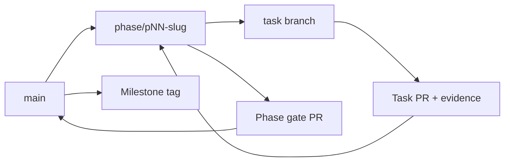

# Git Flow

## 1. Trạng thái và phạm vi

| Thuộc tính | Giá trị |
|---|---|
| Task owner | `P00-T05` |
| Status | `ACCEPTED — Product Owner approved 2026-07-28 (DEC-006)` |
| Áp dụng | P00–P07, source code, test, tooling và documentation |
| Mô hình | Phase integration branch + short-lived task branch |
| Nhánh ổn định | `main` |

Tài liệu này là Git policy chuẩn đã được phê duyệt của repository. Các file `plans/<phase>/GIT_FLOW.md` ánh xạ policy này vào từng phase; task file quy định branch và PR target cụ thể cho từng Task ID.

Repository hiện có local Git metadata trên nhánh `main` nhưng chưa có commit nền. Tài liệu này không tự cho phép tạo commit/remote, push, thay branch protection hoặc mở PR.

## 2. Nguyên tắc

1. Một task branch chỉ phục vụ một Task ID và một outcome chính.
2. Không commit trực tiếp vào `main` hoặc phase branch.
3. Tại một thời điểm chỉ có một phase integration branch đang `ACTIVE`, trừ recovery/hotfix được ghi rõ.
4. Task branch phải ngắn hạn, tạo từ phase branch mới nhất và xóa sau khi merge.
5. Phase chỉ merge về `main` khi phase gate có evidence.
6. Không force-push shared branch, không rewrite commit của người khác và không bỏ quality gate để merge.
7. Secret, production data, raw sensitive payload và generated artifact không cần thiết không được commit.
8. Merge, release và hotfix giữ lịch sử truy vết từ Task ID → PR → evidence → phase gate.

## 3. Branch taxonomy

| Branch | Tạo từ | Merge vào | Tuổi thọ | Mục đích |
|---|---|---|---|---|
| `main` | — | — | Dài hạn | Trạng thái ổn định đã qua phase/release gate |
| `phase/pNN-{slug}` | `main` | `main` | Một phase | Tích hợp các task của phase đang active |
| `feat/pNN-tNN-{slug}` | Phase branch | Phase branch | Một task | Capability hoặc use case mới |
| `fix/pNN-tNN-{slug}` | Phase branch | Phase branch | Một task | Sửa defect có root cause/regression evidence |
| `test/pNN-tNN-{slug}` | Phase branch | Phase branch | Một task | Test, security suite, benchmark hoặc verification |
| `docs/pNN-tNN-{slug}` | Phase branch | Phase branch | Một task | Specification, decision, policy hoặc documentation |
| `chore/pNN-tNN-{slug}` | Phase branch | Phase branch | Một task | Repository, CI, tooling, packaging hoặc dependency hygiene |
| `release/{semver}` | `phase/p07-hardening-release` | `main` | Một release candidate | Ổn định candidate sau scope/version approval |
| `hotfix/{bug-id}-{slug}` | `main` | `main` | Một hotfix | Lỗi production nghiêm trọng sau release |

`develop` không dùng trong roadmap P00–P07 vì phase branch đã là integration line. Nếu sau này cần `develop`, thay đổi phải qua decision record và migration plan cho open PR.

## 4. Flow chuẩn



### 4.1. Mở phase

1. Phase trước đã `COMPLETED`, hoặc P00 có baseline được Product Owner xác nhận.
2. Tạo phase branch từ `main` mới nhất.
3. Ghi base commit trong phase kickoff/session log.
4. Chuyển phase sang `ACTIVE` sau khi entry criteria pass.

### 4.2. Thực hiện task

1. Chỉ chọn task `READY` và dependency đã có evidence.
2. Tạo branch được ghi trong task file từ phase branch.
3. Commit nhỏ, cùng outcome; body hoặc PR phải chứa Task ID.
4. Mở draft PR sớm vào đúng phase branch.
5. Đính kèm acceptance/build/test/security evidence.
6. Chuyển task qua `REVIEW` và `VERIFY`; chỉ merge khi gate áp dụng pass.

### 4.3. Đóng phase

1. Toàn bộ Must task `DONE`; blocker High/Critical liên quan đã đóng.
2. Chạy phase acceptance, quality và security gates từ clean checkout.
3. Mở phase gate PR từ phase branch vào `main`.
4. PR phải liên kết phase contract, task inventory, evidence và handoff.
5. Merge bằng merge commit để giữ boundary của phase; tạo annotated milestone tag khi checklist pass.
6. Xóa phase branch sau khi `main` và handoff đã được kiểm tra.

## 5. Mapping P00–P07

| Phase | Phase branch | Task PR target | Phase gate | Tag sau gate |
|---|---|---|---|---|
| P00 — Governance | `phase/p00-governance` | `phase/p00-governance` | Build/CI/architecture/workflow baseline | `m0-governance` |
| P01 — Security & Domain | `phase/p01-security-domain` | `phase/p01-security-domain` | Domain, policy, permission, confirmation, audit | `m1-security-domain` |
| P02 — Local Assistant | `phase/p02-local-assistant` | `phase/p02-local-assistant` | Offline/private-mode local journey | `m2-local-assistant` |
| P03 — Safe Automation | `phase/p03-safe-automation` | `phase/p03-safe-automation` | Worker/browser/terminal isolation và verification | `m3-safe-automation` |
| P04 — Memory & Routines | `phase/p04-memory-routines` | `phase/p04-memory-routines` | Local memory/delete/routine trust semantics | `m4-memory-routines` |
| P05 — Cloud & Multi-device | `phase/p05-cloud-multidevice` | `phase/p05-cloud-multidevice` | Cloud disclosure, sync, web/mobile, revoke | `m5-cloud-multidevice` |
| P06 — Integrations | `phase/p06-integrations` | `phase/p06-integrations` | Messaging/Home Assistant scoped integration | `m6-integrations` |
| P07 — Hardening & Release | `phase/p07-hardening-release` | Phase branch; release fixes vào approved `release/{semver}` | Full AC/security/recovery/release checklist | `v{approved-semver}` |

Phase branch kế tiếp luôn tạo từ `main` sau khi phase trước được merge, không tạo từ phase branch cũ.

## 6. Contract trong task file

Mỗi `plans/<phase>/tasks/Pxx-Tyy.md` phải có mục `Git workflow` chứa:

- Phase branch.
- Task branch cụ thể.
- Branch point.
- PR target.
- Commit scope gợi ý.
- Required PR evidence.
- Merge policy.

Nếu loại thay đổi thực tế khác prefix được đề xuất, owner được đổi `feat|fix|test|docs|chore` nhưng phải giữ Task ID và ghi lý do trong execution plan. Không đổi PR target ngoài flow nếu chưa có decision.

## 7. Commit convention

```text
feat(module): mô tả outcome
fix(module): mô tả root cause đã sửa
test(module): mô tả behavior/gate được bảo vệ
docs(area): mô tả contract hoặc decision
chore(tooling): mô tả repository/tooling outcome
refactor(module): mô tả behavior được giữ nguyên
```

Commit body tối thiểu:

```text
Task: PNN-TNN
Evidence: <command/report/path hoặc "pending in PR">
```

Quy tắc:

- Subject dùng imperative, không quá rộng hơn task.
- Không dùng commit kiểu `misc`, `update`, `fix stuff`.
- Refactor chỉ dùng khi task có mode/scope refactor rõ; không trộn feature.
- Generated file chỉ commit khi repository cần nó để build, test, release hoặc giữ source of truth.

## 8. Pull request contract

Mỗi task PR phải có:

- Task ID, goal và link task file.
- In scope / out of scope.
- Changed files và lý do.
- Acceptance checklist.
- Commands và PASS/FAIL thực tế.
- Security/architecture impact.
- Risk, rollback và phần chưa hoàn tất.
- Cập nhật task board/session/handoff áp dụng.

Review bắt buộc:

| Thay đổi | Review/gate bổ sung |
|---|---|
| Dependency/module boundary | Architecture tests và dependency review |
| Permission/action/terminal/browser/device | Security review, deny/failure/cancel path |
| Persistence/schema/sync | Migration/recovery, compatibility và idempotency |
| Cloud/integration/secret | Disclosure, scoped permission, revoke và secret scan |
| Installer/update/release | Supply-chain, signature/hash, rollback và smoke evidence |

## 9. Merge policy

- Task PR vào phase branch: **squash merge** mặc định; squash commit chứa Task ID.
- Phase gate PR vào `main`: **merge commit** để giữ phase boundary và evidence.
- Release PR vào `main`: merge commit sau signed/approved checklist.
- Không merge khi required gate đỏ, review còn unresolved hoặc task status chưa đồng bộ.
- Không rebase/force-push phase, release, `main` hoặc branch có nhiều owner.

## 10. P07 release-candidate flow

1. `P07-T01` freeze scope và đề xuất version/channel.
2. Product Owner phê duyệt version trước khi tạo `release/{semver}`.
3. Release branch tạo từ commit P07 đã qua candidate gate.
4. Chỉ nhận bug fix, test, docs, packaging, versioning và release evidence; không nhận capability mới.
5. Mỗi candidate fix có task/bug ID, PR riêng vào release branch và được forward-port về phase branch nếu còn tồn tại.
6. `P07-T17` phê duyệt release hoặc rollback; chỉ sau approval mới merge release branch vào `main` và tạo signed/annotated version tag.

## 11. Hotfix

Hotfix chỉ áp dụng sau khi đã có production release:

1. Tạo `hotfix/{bug-id}-{slug}` từ version đang chạy trên `main`.
2. Tái hiện → regression test → root-cause fix → security/release checks.
3. PR vào `main`; không direct push.
4. Sau merge, forward-port commit vào release branch hoặc active phase branch bằng PR riêng.
5. Tạo patch tag chỉ khi release checklist rút gọn và rollback plan được phê duyệt.

## 12. Recovery khi flow sai

- Branch tạo sai base nhưng chưa chia sẻ: tạo branch đúng từ base, cherry-pick commit thuộc task, kiểm tra diff rồi bỏ branch cũ theo thao tác có thể khôi phục.
- PR target sai: đóng/retarget PR sau khi xác nhận base; không merge để “sửa sau”.
- Commit chứa secret: dừng push/merge, revoke secret, ghi incident và làm sạch history theo security owner; chỉ xóa chuỗi khỏi file là chưa đủ.
- Gate fail: giữ evidence, sửa root cause trên cùng task branch hoặc tạo bug task; không tắt gate.
- Phase branch diverge: ưu tiên merge/rebase có kiểm soát trên task branch; không rewrite shared history.

## 13. Approval và ownership

| Quyết định | Owner |
|---|---|
| Approve Git flow policy | Product Owner |
| Approve phase close | Product Owner / maintainer được ủy quyền |
| Approve security exception | Security owner; phải có decision/ADR |
| Approve release/version/rollback | Product Owner |
| Thực thi branch/PR/merge | Task owner trong quyền đã cấp |

Im lặng, timeout hoặc CI bị bỏ qua không được xem là approval.

## 14. Evidence để chấp nhận P00-T05

- Tài liệu trung tâm này được review.
- Có 8 phase Git flow files và mỗi phase có mapping task branch.
- Mỗi individual task file có Git workflow contract.
- Validator xác nhận Task ID, branch prefix, phase branch, PR target và local Markdown links.
- Product Owner approved the policy in the 2026-07-28 conversation; `DEC-006` is Accepted and P00-T05 may be closed when validators pass.
