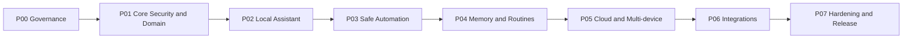

# Pew Pew Assistant — Execution Roadmap

## 1. Mục đích

Thư mục `plans/` chuyển scope baseline thành các phase thực thi có thể giao việc, kiểm chứng và bàn giao. Đây là lớp kế hoạch chi tiết; tài liệu này không thay đổi `PROJECT_VISION.md`, `PROJECT_SCOPE.md`, `BUSINESS_RULES.md`, entity lifecycle hoặc dependency rules.

Mỗi phase phải tạo một lát cắt có thể demo, không chỉ tạo các module rời rạc. Task trong phase có kích thước mục tiêu từ 0.5 đến 2 ngày công hoặc một phiên AI có thể kiểm chứng.

## 2. Cách ánh xạ với scope baseline

`PROJECT_SCOPE.md` mô tả 7 phase sản phẩm từ Phase 0 đến Phase 6. Roadmap thực thi dùng 8 phase từ `P00` đến `P07` để tách phần governance/repository và core domain/security thành hai gate nhỏ hơn.

| Execution phase | Outcome chính | Ánh xạ scope baseline | Milestone |
|---|---|---|---|
| [P00 — Governance and Repository Foundation](phase-00-governance/README.md) | Repository, CI và workflow có thể kiểm chứng | Scope Phase 0 — phần governance/tooling | M0 |
| [P01 — Core Security and Domain Foundation](phase-01-foundation/README.md) | Identity, policy, action và audit primitives | Scope Phase 0 — security baseline; enabler cho Scope Phase 1 | M1 |
| [P02 — Local Windows Assistant](phase-02-local-assistant/README.md) | Trợ lý local/offline thực hiện action rủi ro thấp | Scope Phase 1 | M2 |
| [P03 — Safe Device, Browser and Terminal Automation](phase-03-device-automation/README.md) | Browser/OS/terminal action qua worker và verification | Scope Phase 2 | M3 |
| [P04 — User-controlled Memory and Routines](phase-04-memory-routines/README.md) | Memory local và routine được phê duyệt | Scope Phase 4 — phần local | M4 |
| [P05 — Cloud, Web and Multi-device](phase-05-cloud-multidevice/README.md) | Cloud routing, sync, Web Console và Android Companion | Scope Phase 3; Scope Phase 4 — phần sync | M5 |
| [P06 — Messaging and Home Assistant Integrations](phase-06-integrations/README.md) | Integration có scope, revoke, confirmation và audit | Scope Phase 5 | M6 |
| [P07 — Hardening, Private Beta and Release](phase-07-hardening-release/README.md) | Release candidate có installer, recovery và security evidence | Scope Phase 6 | M7 |

Việc đặt P04 trước P05 là phân rã local-first: semantics của memory, delete/tombstone và routine phải ổn định ở local trước khi thêm cloud sync. Phạm vi sản phẩm không thay đổi.

## 3. Dependency graph



Không được bỏ qua phase gate để triển khai capability có quyền cao sớm hơn:

- Không automation write trước Policy Engine, confirmation, audit và ActionTask state machine.
- Không terminal/browser automation trước worker isolation, timeout, cancellation và verification.
- Không cloud sync trước local ownership, retention, delete/tombstone và Private Mode.
- Không integration trước secret storage, permission scope, revoke và failure isolation.
- Không release trước security, recovery, resource và supply-chain gates.

## 4. Quy tắc trạng thái phase

Áp dụng state machine trong `docs/03-planning/PHASES.md`:

```text
DRAFT → READY → ACTIVE → VERIFYING → COMPLETED
                    ↘ PAUSED / BLOCKED ↗
```

Một phase chỉ chuyển `READY` khi:

- Goal, non-goals, deliverables và owner đã rõ.
- Must task có acceptance criteria và evidence.
- Dependency bắt buộc đã `DONE` hoặc có kế hoạch được phê duyệt.
- Blocker High/Critical đã có quyết định.
- Security review level đã xác định.

Một phase chỉ chuyển `COMPLETED` khi:

- Toàn bộ Must task `DONE`.
- Phase acceptance criteria và demo journey có evidence.
- Build/test/architecture/security gate áp dụng đều pass.
- Không còn blocker High/Critical liên quan.
- Task board, session log, decision, risk, changelog và handoff đã cập nhật.

## 5. Quy tắc task

Mỗi task trong phase phải được chuẩn hóa trước khi chuyển `READY`:

```text
Task ID
Goal
In scope / Out of scope
Business rules
Entity lifecycles
Dependency rules
Acceptance criteria
Expected evidence
Risk level
```

Mỗi phase có:

- `TASKS.md`: backlog chi tiết về size, trạng thái, single outcome, dependency và acceptance/evidence.
- `tasks/Pxx-Tyy.md`: generated specification view cho từng Task ID, gồm scope, rules/lifecycle, preconditions, acceptance, evidence, test, rollback, stop conditions và handoff.
- `tasks/README.md`: index các task file trong phase.
- `GIT_FLOW.md`: phase branch, task branch mapping, PR target, merge gate và close evidence.

Mỗi task specification phải có `Git workflow` liên kết tới [repository Git flow](../docs/07-release/GIT_FLOW.md) và phase flow tương ứng. Branch chuẩn dùng Task ID để giữ traceability; task PR merge vào phase branch, phase gate PR mới merge vào `main`.

Phase `README.md` giữ source of truth về goal, scope, rules và gates; task backlog/specification không được nới rộng phase contract.

Mode, risk, priority, title, dependency và expected evidence được khai báo trực tiếp trong phase `README.md`; size, status và single outcome thuộc `TASKS.md`. Không sửa trực tiếp file có generated marker. Sau khi cập nhật hai source trên và execution state, chạy `scripts/Generate-TaskFiles.ps1 -Force` để tái tạo task/index/Git views. Generator từ chối ghi đè file không có marker nếu không dùng one-time adoption flag rõ ràng.

Nhãn ưu tiên:

- `Must`: bắt buộc để đóng phase hoặc đáp ứng MVP.
- `Should`: cần cho trải nghiệm/độ tin cậy nhưng có thể defer bằng quyết định rõ.
- `Could`: không chặn phase; không được làm trước Must task.

## 6. MVP acceptance coverage

| Scope acceptance criterion | Phase chứng minh chính |
|---|---|
| AC-01 — Kích hoạt và tương tác | P02 |
| AC-02 — Lệnh local ngoại tuyến | P02 |
| AC-03 — Local–cloud routing | P02 (local/private baseline), P05 (cloud/auto/fallback) |
| AC-04 — Browser automation | P03 |
| AC-05 — Terminal workflow | P03 |
| AC-06 — Memory | P04 (local), P05 (sync) |
| AC-07 — Permission | P01, P03 |
| AC-08 — Audit và kiểm soát | P01, P03 |
| AC-09 — Multi-device tối thiểu | P05 |
| AC-10 — Home Assistant | P06 |
| AC-11 — Tài nguyên | P02, P03, P07 |
| AC-12 — Security baseline | P00, P01, P03, P07 |

## 7. Global non-goals

Các nội dung sau không được đưa vào task MVP nếu chưa có Change Request được phê duyệt:

- Arbitrary shell hoặc AI tự thực thi action.
- Level 3 action bằng routine thông thường.
- Full macOS/Linux/iOS agent hoặc full Android UI automation.
- Plugin marketplace, enterprise multi-user hoặc family shared memory.
- Financial/legal automation, life-safety device control hoặc surveillance.
- Bypass CAPTCHA, DRM, paywall, quảng cáo hoặc security control.
- Production paid service, secret thật hoặc production data chưa được phê duyệt.

## 8. Global quality evidence

Tùy task, evidence tối thiểu gồm:

- Specification/traceability review.
- Restore, format/analyzer và build.
- Unit, integration, architecture, security và end-to-end tests.
- Manual demo với failure/cancellation path.
- Resource benchmark trên máy tham chiếu.
- Không có secret/PII trong source, log hoặc artifact.
- Rollback/recovery evidence cho migration, installer và update.
