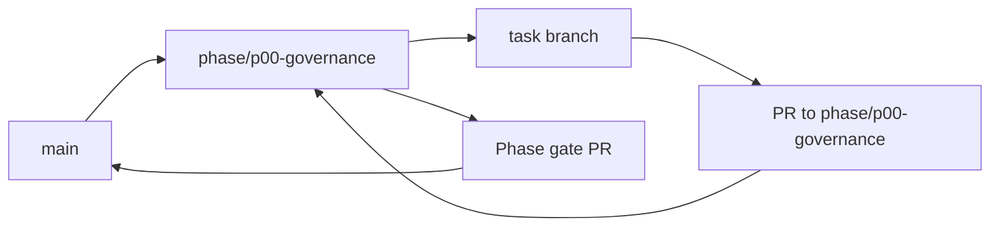

<!-- GENERATED BY scripts/Generate-TaskFiles.ps1; edit phase README/TASKS sources, then regenerate. -->
# P00 — Phase Git Flow

Git workflow thực thi cho P00 — Governance and Repository Foundation. Policy chuẩn thuộc [repository Git flow](../../docs/07-release/GIT_FLOW.md); file này không thay đổi phase scope.

## Phase branch contract

| Thuộc tính | Giá trị |
|---|---|
| Repository policy status | `ACCEPTED` |
| Phase branch | `phase/p00-governance` |
| Tạo từ | `main` sau khi Git repository bootstrap được phê duyệt rõ |
| Task PR target | `phase/p00-governance` |
| Task merge | Squash merge sau review và evidence |
| Phase merge | Merge commit vào `main` sau phase gate |
| Required phase gate | Build/CI/architecture/workflow baseline |
| Tag sau gate | `m0-governance` |

## Branch flow

## Task branch map

| Task | Suggested branch | PR target | Required task evidence |
|---|---|---|---|
| [P00-T01](tasks/P00-T01.md) | `chore/p00-t01-tao-solution-skeleton-va-project-references` | `phase/p00-governance` | Clean Release build PASS (0 warning/error); `dotnet list ... reference` khớp DR matrix |
| [P00-T02](tasks/P00-T02.md) | `test/p00-t02-them-architecture-tests-cho-dr-001-dr-002-dr` | `phase/p00-governance` | Release `dotnet test` PASS (2/2); negative DR-002 fixture bị bắt |
| [P00-T03](tasks/P00-T03.md) | `test/p00-t03-thiet-lap-ci-restore-build-test` | `phase/p00-governance` | Local CI equivalent PASS; simulated failure exit 1; chờ GitHub Actions run sau commit/push được duyệt |
| [P00-T04](tasks/P00-T04.md) | `docs/p00-t04-chot-coding-conventions-analyzer-va-warning` | `phase/p00-governance` | Approved config/doc; analyzer run có evidence |
| [P00-T05](tasks/P00-T05.md) | `docs/p00-t05-chot-phase-aligned-git-release-flow-va-gan-vao` | `phase/p00-governance` | `DEC-006` accepted; central + 8 phase flows; validator pass |
| [P00-T06](tasks/P00-T06.md) | `docs/p00-t06-chuan-hoa-execution-roadmap-va-phase-plans` | `phase/p00-governance` | 9 plan files; link/ID/AC validator pass |
| [P00-T07](tasks/P00-T07.md) | `docs/p00-t07-giai-quyet-target-framework-desktop-ui-va-root` | `phase/p00-governance` | `ADR-008`; BLK-001..003 resolved |
| [P00-T08](tasks/P00-T08.md) | `chore/p00-t08-thiet-lap-configuration-validation-va-secret` | `phase/p00-governance` | Invalid config fail closed; secret scan pass |
| [P00-T09](tasks/P00-T09.md) | `chore/p00-t09-bo-sung-ci-architecture-security-gates` | `phase/p00-governance` | Negative fixtures làm gate fail |
| [P00-T10](tasks/P00-T10.md) | `docs/p00-t10-thuc-hien-spike-wake-word-local-tool-call-co` | `phase/p00-governance` | Timebox, benchmark thô, no production claim |
| [P00-T11](tasks/P00-T11.md) | `docs/p00-t11-chuan-hoa-task-template-definition-of-ready-va` | `phase/p00-governance` | 8 `TASKS.md`; IDs/size/status/dependency/link pass |
| [P00-T12](tasks/P00-T12.md) | `test/p00-t12-verify-phase-va-ban-giao-p01` | `phase/p00-governance` | M0 checklist, session log và handoff pass |
| [P00-T13](tasks/P00-T13.md) | `docs/p00-t13-tao-individual-task-specification-files` | `phase/p00-governance` | 120 task files; schema/ID/link/field validator pass |
| [P00-T14](tasks/P00-T14.md) | `docs/p00-t14-chuan-hoa-engineering-prompt-pack-theo-du-an` | `phase/p00-governance` | 9 prompts + usage guide; structure/token/project-rule validator pass |
| [P00-T15](tasks/P00-T15.md) | `fix/p00-t15-reconcile-governance-readiness-findings-va` | `phase/p00-governance` | State/reference/ADR/task/readiness validators pass |
| [P00-T16](tasks/P00-T16.md) | `docs/p00-t16-phe-duyet-product-scope-business-rules-va` | `phase/p00-governance` | `ADR-009`; baseline/achievement/blocker state synced |

## Execution rules

1. Phase owner tạo `phase/p00-governance` từ `main` sau khi Git repository bootstrap được phê duyệt rõ sau khi entry criteria pass.
2. Task owner chỉ tạo suggested task branch khi task `READY` và dependency có evidence.
3. Draft PR target `phase/p00-governance`; PR ghi Task ID, acceptance, commands, security/architecture impact và rollback.
4. Task PR được squash merge; task file, backlog và task board được đồng bộ trước merge.
5. Phase owner chạy Build/CI/architecture/workflow baseline, mở phase gate PR vào `main` và chỉ merge khi exit criteria pass.
6. Sau merge, tạo annotated tag `m0-governance` nếu checklist/approval áp dụng đã có.

## Phase close evidence

- Must task inventory và unresolved findings.
- Build/test/architecture/security reports áp dụng từ clean checkout.
- Phase acceptance/demo evidence và failure/cancellation path.
- Updated task board, session log, changelog/decision và handoff.
- Rollback/recovery evidence khi phase có persistence, sync, installer hoặc external side effect.

## Recovery

- Sai base/target: dừng merge, tạo hoặc retarget PR đúng và kiểm tra diff.
- Gate fail: sửa root cause hoặc tạo bug task; không tắt gate.
- Secret xuất hiện: dừng push/merge, revoke và xử lý như security incident.
