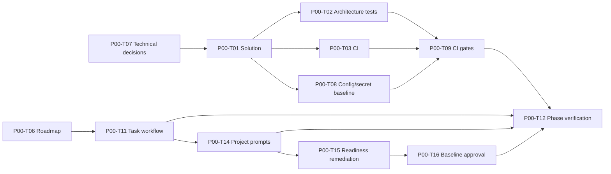

# P00 — Governance and Repository Foundation

## Phase contract

| Thuộc tính | Giá trị |
|---|---|
| Status | `ACTIVE` |
| Outcome | Repository có thể build/test/CI và agent có thể tiếp tục bằng state đã ghi |
| Scope mapping | Scope Phase 0 — governance và engineering foundation |
| Security review | Medium; High cho secret/supply-chain baseline |
| Milestone | M0 — Governance ready |

## Goal

Tạo nền móng nhỏ, có thể review và kiểm chứng để developer/agent triển khai các phase sau mà không phá dependency, mất context hoặc bỏ qua security gate.

## Non-goals

- Không triển khai production wake word, browser automation, cloud sync hoặc Home Assistant.
- Không chọn công nghệ bằng giả định khi blocker còn mở.
- Không tạo service production, dùng secret thật hoặc thêm hạ tầng trả phí.
- Prototype kỹ thuật nếu có chỉ dùng để đánh giá, không được coi là feature hoàn chỉnh.

## Entry criteria

- Vision, scope, business rules, lifecycle và dependency baseline có sẵn.
- Product Owner xác nhận Windows-first, Modular Monolith, Local–Cloud Hybrid và default deny.
- Repository root và document ownership được xác định.

## Deliverables

- Solution/project skeleton và project references đúng dependency matrix.
- Architecture tests bảo vệ các dependency rule chính.
- CI build/test, dependency scan và secret scan baseline.
- Coding, Git/release và AI session workflow.
- Technical decision record cho target framework, desktop UI và namespace.
- Roadmap/phase plans, task tracking và handoff có thể tiếp tục.

## Task breakdown

Chi tiết size, trạng thái và acceptance cho từng task: [Small Task Backlog](TASKS.md).

Branch, PR target và phase merge gate: [Phase Git flow](GIT_FLOW.md).

| ID | Mode | Risk | Priority | Task / outcome | Depends on | Evidence |
|---|---|---|---|---|---|---|
| P00-T01 | IMPLEMENT | Low | Must | Tạo solution skeleton và project references tối thiểu | P00-T07 | `dotnet build` + project graph |
| P00-T02 | IMPLEMENT | Low | Must | Thêm architecture tests cho DR-001, DR-002, DR-005, DR-011 | P00-T01 | Positive tests + một negative fixture chứng minh rule bắt lỗi |
| P00-T03 | IMPLEMENT | Low | Must | Thiết lập CI restore/build/test | P00-T01 | CI run xanh từ clean checkout |
| P00-T04 | PLAN | Low | Should | Chốt coding conventions, analyzer và warning policy | P00-T07 | Approved document/config + analyzer run |
| P00-T05 | PLAN | Low | Should | Chốt phase-aligned Git/release flow và gắn vào task specs | None | Central + 8 phase flows; 123 task Git contracts; Product Owner review |
| P00-T06 | PLAN | Low | Must | Chuẩn hóa execution roadmap và phase plans | None | Plan structure/link/traceability validation |
| P00-T07 | PLAN | Medium | Must | Giải quyết target framework, desktop UI và root namespace | None | `ADR-008`; BLK-001..003 resolved |
| P00-T08 | IMPLEMENT | High | Must | Thiết lập configuration validation và secret-safe development baseline | P00-T01, P00-T07 | Startup/config tests; secret scan |
| P00-T09 | IMPLEMENT | High | Must | Bổ sung CI architecture/security gates | P00-T02, P00-T03, P00-T08 | Failing gate khi dependency/secret fixture vi phạm |
| P00-T10 | PLAN | Medium | Should | Thực hiện spike wake-word/local tool call có timebox để giảm uncertainty | P00-T07 | Spike report, benchmark thô, no production claim |
| P00-T11 | PLAN | Low | Must | Chuẩn hóa task template, Definition of Ready và evidence path | P00-T06 | Một task mẫu có thể thực thi không cần hidden context |
| P00-T12 | REVIEW | Low | Must | Verify phase và bàn giao P01 | P00-T01..P00-T09, P00-T11, P00-T13..P00-T16 | M0 checklist, session log, handoff |
| P00-T13 | PLAN | Low | Must | Tạo individual task specification files | P00-T11 | Một file/task; schema, ID, link và field validation pass |
| P00-T14 | PLAN | Low | Must | Chuẩn hóa engineering prompt pack theo dự án | P00-T11 | 9 operational prompts + usage guide; project-prompt validator pass |
| P00-T15 | IMPLEMENT | Medium | Must | Reconcile governance/readiness findings và Windows validators | P00-T14 | State/reference/ADR/task/readiness validators pass |
| P00-T16 | PLAN | High | Must | Phê duyệt Product Scope, Business Rules và Entity Lifecycle baselines | P00-T15 | Explicit Product Owner decision; baseline/achievement/blocker state synced |

## Dependency path

## Traceability

### Business and security rules

- `BR-GOV-003`–`BR-GOV-010`: default deny, traceability, no silent scope expansion.
- `BR-SEC-001`, `BR-SEC-003`, `BR-SEC-018`, `BR-SEC-019`: secret, update integrity và CI scanning.
- `BR-BAN-001`–`BR-BAN-015`: prohibited capability baseline.

### Dependency rules

- `DR-001`–`DR-011`: layer/project direction và composition.
- `DR-015`–`DR-023`: policy/action/terminal/secret/audit boundaries.
- `DR-025`–`DR-030`: cancellation, timeout, resource và versioning.

### Lifecycle coverage

Phase này chưa implement aggregate. Test fixture chỉ bảo vệ project dependency; lifecycle implementation bắt đầu ở P01.

## Acceptance criteria

- `P00-AC-01`: Solution build được từ clean checkout trên target framework đã chốt.
- `P00-AC-02`: Project graph đúng dependency matrix; architecture test phát hiện ít nhất một dependency bị cấm.
- `P00-AC-03`: CI chạy restore, build, automated tests và security scans baseline.
- `P00-AC-04`: Không có secret thật hoặc production data trong repository/artifact.
- `P00-AC-05`: Task workflow có Task ID, criteria, evidence, state update và handoff.
- `P00-AC-06`: Roadmap ánh xạ đầy đủ Scope AC-01 đến AC-12 và không tạo capability ngoài scope.
- `P00-AC-07`: Blocker bắt buộc đã đóng hoặc phase chuyển `BLOCKED`; không dùng im lặng làm phê duyệt.

## Verification and gates

- Gate 0: decision và task specification review.
- Gate 1: restore/analyzer/build.
- Gate 2: unit + architecture tests.
- Gate 3: secret/dependency scan; safe config defaults.
- Gate 4: clean-checkout rehearsal và agent handoff rehearsal.

Lệnh cụ thể được chốt trong task sau khi solution/tooling tồn tại; không hard-code lệnh giả trước P00-T01.

## Risks and controls

| Risk | Control | Recovery |
|---|---|---|
| Framework/UI chọn sai | P00-T07 có options/trade-off/ADR | Revert decision trước production code |
| Architecture tests chỉ mang tính hình thức | Negative fixture bắt buộc | Bổ sung rule trước P01 |
| CI khác local | Clean checkout và pinned SDK | Fix environment, không tắt gate |
| Scope baseline và execution phases lệch nhau | Mapping trong `plans/README.md` | Update mapping/change request |
| Spike bị dùng như production | Timebox và gắn nhãn disposable | Xóa/archived spike sau decision |

## Exit evidence

- Solution build pass và project graph được lưu.
- Architecture tests pass, có evidence negative fixture.
- CI run xanh với security gates baseline.
- Technical blockers P00 bắt buộc được giải quyết hoặc phase không được đóng.
- Agent mới có thể bắt đầu P01 chỉ từ docs, task board và handoff.

## Handoff to P01

P01 chỉ mở khi composition/dependency foundation ổn định. Không triển khai Action Engine, Permission hoặc persistence aggregate nếu project boundary chưa được test tự động.
