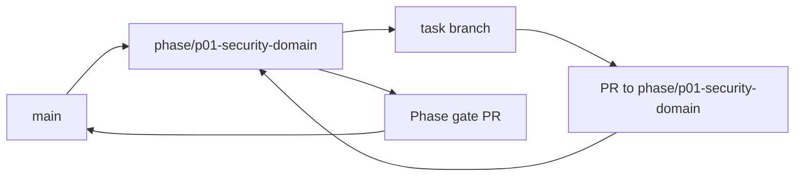

<!-- GENERATED BY scripts/Generate-TaskFiles.ps1; edit phase README/TASKS sources, then regenerate. -->
# P01 — Phase Git Flow

Git workflow thực thi cho P01 — Core Security and Domain Foundation. Policy chuẩn thuộc [repository Git flow](../../docs/07-release/GIT_FLOW.md); file này không thay đổi phase scope.

## Phase branch contract

| Thuộc tính | Giá trị |
|---|---|
| Repository policy status | `ACCEPTED` |
| Phase branch | `phase/p01-security-domain` |
| Tạo từ | `main` tại tag `m0-governance` |
| Task PR target | `phase/p01-security-domain` |
| Task merge | Squash merge sau review và evidence |
| Phase merge | Merge commit vào `main` sau phase gate |
| Required phase gate | Domain, policy, permission, confirmation và audit |
| Tag sau gate | `m1-security-domain` |

## Branch flow

## Task branch map

| Task | Suggested branch | PR target | Required task evidence |
|---|---|---|---|
| [P01-T01](tasks/P01-T01.md) | `docs/p01-t01-viet-feature-specs-cho-core-control-path-va` | `phase/p01-security-domain` | Main/denied/cancel/unknown flows có traceability |
| [P01-T02](tasks/P01-T02.md) | `feat/p01-t02-tao-sharedkernel-toi-thieu-ids-clock-result` | `phase/p01-security-domain` | Unit + architecture tests; không có feature logic |
| [P01-T03](tasks/P01-T03.md) | `feat/p01-t03-implement-useraccount-va-assistantprofile` | `phase/p01-security-domain` | Happy, illegal, terminal, Safe Mode tests |
| [P01-T04](tasks/P01-T04.md) | `feat/p01-t04-implement-devicenode-va-devicesession-trust` | `phase/p01-security-domain` | Pair/revoke/replay/session-expiry tests |
| [P01-T05](tasks/P01-T05.md) | `feat/p01-t05-implement-interactionsession-va` | `phase/p01-security-domain` | Ambiguity, answer, cancel, expire tests |
| [P01-T06](tasks/P01-T06.md) | `feat/p01-t06-define-immutable-structured-action-contracts` | `phase/p01-security-domain` | Valid/invalid schema + version/hash tests |
| [P01-T07](tasks/P01-T07.md) | `feat/p01-t07-implement-actionplan-lifecycle-va-policy` | `phase/p01-security-domain` | Approve/reject/supersede/expire tests |
| [P01-T08](tasks/P01-T08.md) | `feat/p01-t08-implement-actiontask-canonical-state-machine` | `phase/p01-security-domain` | Complete/fail/cancel/unknown/reconcile tests |
| [P01-T09](tasks/P01-T09.md) | `test/p01-t09-implement-permissiongrant-scoped-matching-va` | `phase/p01-security-domain` | Scope/expiry/revoke/wildcard-deny tests |
| [P01-T10](tasks/P01-T10.md) | `feat/p01-t10-implement-confirmationrequest-binding-ttl` | `phase/p01-security-domain` | Replay/expiry/change/revoke tests |
| [P01-T11](tasks/P01-T11.md) | `test/p01-t11-implement-append-only-auditrecord-va-durable` | `phase/p01-security-domain` | Seal/immutability/no-secret tests |
| [P01-T12](tasks/P01-T12.md) | `feat/p01-t12-implement-sqlite-persistence-concurrency-va` | `phase/p01-security-domain` | Migration, version conflict, outbox replay tests |
| [P01-T13](tasks/P01-T13.md) | `feat/p01-t13-implement-policy-domain-action-fake-adapter` | `phase/p01-security-domain` | Denied + confirmed + verified E2E pass |
| [P01-T14](tasks/P01-T14.md) | `feat/p01-t14-implement-safe-mode-emergency-stop-control` | `phase/p01-security-domain` | Block/cancel/no-auto-resume/audit tests |
| [P01-T15](tasks/P01-T15.md) | `test/p01-t15-security-review-va-phase-verification` | `phase/p01-security-domain` | Findings resolved/deferred; phase checklist pass |

## Execution rules

1. Phase owner tạo `phase/p01-security-domain` từ `main` tại tag `m0-governance` sau khi entry criteria pass.
2. Task owner chỉ tạo suggested task branch khi task `READY` và dependency có evidence.
3. Draft PR target `phase/p01-security-domain`; PR ghi Task ID, acceptance, commands, security/architecture impact và rollback.
4. Task PR được squash merge; task file, backlog và task board được đồng bộ trước merge.
5. Phase owner chạy Domain, policy, permission, confirmation và audit, mở phase gate PR vào `main` và chỉ merge khi exit criteria pass.
6. Sau merge, tạo annotated tag `m1-security-domain` nếu checklist/approval áp dụng đã có.

## Phase close evidence

- Must task inventory và unresolved findings.
- Build/test/architecture/security reports áp dụng từ clean checkout.
- Phase acceptance/demo evidence và failure/cancellation path.
- Updated task board, session log, changelog/decision và handoff.
- Rollback/recovery evidence khi phase có persistence, sync, installer hoặc external side effect.

## Recovery

- Sai base/target: dừng merge, tạo hoặc retarget PR đúng và kiểm tra diff.
- Gate fail: sửa root cause hoặc tạo bug task; không tắt gate.
- Secret xuất hiện: dừng push/merge, revoke và xử lý như security incident.
