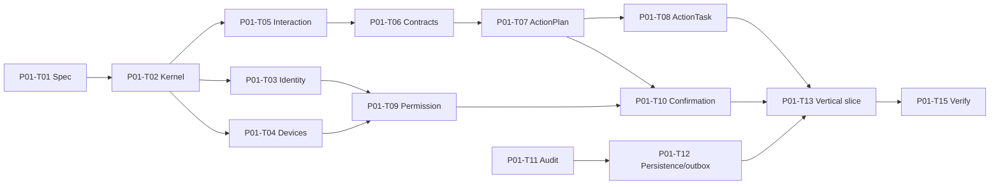

# P01 — Core Security and Domain Foundation

## Phase contract

| Thuộc tính | Giá trị |
|---|---|
| Status | `DRAFT` |
| Outcome | Một vertical slice text request bị deny/approve đúng policy, chạy task giả lập, verify và audit |
| Scope mapping | Scope Phase 0 security baseline; enabler cho Scope Phase 1 |
| Security review | High |
| Milestone | M1 — Core domain foundation |

## Goal

Hiện thực các primitive cốt lõi về identity, device trust, interaction, structured plan, permission, confirmation, action state và audit để mọi capability sau đều đi qua cùng một control path.

## Non-goals

- Không điều khiển OS/browser/terminal thật.
- Không gọi cloud AI, tạo cloud sync hoặc remote device control.
- Không xây UI hoàn chỉnh; chỉ contract/test harness tối thiểu.
- Không triển khai toàn bộ lifecycle P0 trong một aggregate/service khổng lồ.

## Entry criteria

- P00 Must tasks và architecture gates pass.
- Target framework, namespace, persistence baseline và secret approach đã được chốt.
- Threat boundary, default deny và Action Engine boundary không còn blocker High/Critical.

## Deliverables

- Shared error/result/time/id primitives.
- Identity, assistant, device và session domain foundations.
- Interaction/clarification và structured ActionPlan/ActionTask.
- Permission, risk classification và confirmation binding.
- Append-only audit, outbox abstraction và persistence baseline.
- API/application error contract và vertical security slice.

## Task breakdown

Chi tiết size, trạng thái và acceptance cho từng task: [Small Task Backlog](TASKS.md).

Branch, PR target và phase merge gate: [Phase Git flow](GIT_FLOW.md).

| ID | Mode | Risk | Priority | Task / outcome | Depends on | Evidence |
|---|---|---|---|---|---|---|
| P01-T01 | PLAN | High | Must | Viết feature specs cho core control path và threat scenarios | P00 | Approved specs + traceability |
| P01-T02 | IMPLEMENT | High | Must | Tạo SharedKernel tối thiểu: IDs, clock, result/error, domain event | P01-T01 | Unit tests; dependency tests |
| P01-T03 | IMPLEMENT | High | Must | Implement `UserAccount` và `AssistantProfile` lifecycle | P01-T02 | Happy/illegal/terminal transition tests |
| P01-T04 | IMPLEMENT | High | Must | Implement `DeviceNode` và `DeviceSession` trust/session lifecycle | P01-T02, P01-T03 | Pair/revoke/replay/session tests |
| P01-T05 | IMPLEMENT | High | Must | Implement `InteractionSession` và `ClarificationRequest` | P01-T02 | TTL, cancel, ambiguity tests |
| P01-T06 | IMPLEMENT | High | Must | Define immutable structured action contracts và plan hash | P01-T05 | Schema/parser/version tests |
| P01-T07 | IMPLEMENT | High | Must | Implement `ActionPlan` lifecycle và policy-review boundary | P01-T06 | Plan supersede/reject/approve tests |
| P01-T08 | IMPLEMENT | High | Must | Implement `ActionTask` canonical state machine | P01-T07 | Complete/failed/cancelled/unknown tests |
| P01-T09 | IMPLEMENT | High | Must | Implement `PermissionGrant`, scoped matching và default deny | P01-T03, P01-T04 | Scope/expiry/revoke tests |
| P01-T10 | IMPLEMENT | High | Must | Implement `ConfirmationRequest` binding/TTL/single use | P01-T07, P01-T09 | Replay/payload-change/device-revoke tests |
| P01-T11 | IMPLEMENT | High | Must | Implement append-only `AuditRecord` và durable audit interface | P01-T02 | Seal/immutability/redaction tests |
| P01-T12 | IMPLEMENT | High | Must | Implement SQLite persistence, concurrency và outbox baseline | P01-T03..P01-T11 | Migration/repository/outbox integration tests |
| P01-T13 | IMPLEMENT | High | Must | Implement Policy → Domain → Action fake adapter vertical slice | P01-T08..P01-T12 | Denied + approved + verified E2E test |
| P01-T14 | IMPLEMENT | High | Should | Implement Safe Mode/Emergency Stop control-plane state | P01-T03, P01-T08, P01-T11 | Block-new-action/cancel audit tests |
| P01-T15 | SECURITY_REVIEW | High | Must | Security review và phase verification | P01-T13, P01-T14 | Threat findings resolved/deferred; M1 evidence |

## Dependency path

## Traceability

### Business rules

- `BR-GOV-003`–`BR-GOV-010`.
- `BR-ID-001`–`BR-ID-010`.
- `BR-DEV-001`–`BR-DEV-011`.
- `BR-AI-001`–`BR-AI-012`.
- `BR-ACT-001`–`BR-ACT-020`.
- `BR-AUD-001`–`BR-AUD-008`.
- `BR-SEC-010`–`BR-SEC-012`, `BR-SEC-017`, `BR-SEC-021`.

### Lifecycle

`UserAccount`, `AssistantProfile`, `DeviceNode`, `DeviceSession`, `InteractionSession`, `ClarificationRequest`, `ActionPlan`, `ActionTask`, `PermissionGrant`, `ConfirmationRequest`, `AuditRecord`.

### Dependency rules

`DR-001`–`DR-017`, `DR-021`–`DR-027`, `DR-029`, `DR-030`.

## Acceptance criteria

- `P01-AC-01`: Domain tests không cần database/network/OS và chặn mọi illegal transition đã khai báo.
- `P01-AC-02`: Action request thiếu permission bị deny mặc định với reason code.
- `P01-AC-03`: Level 2 fake action chỉ chạy sau confirmation đúng plan hash, payload, user, session và device.
- `P01-AC-04`: Confirmation expired/consumed/invalidated không thể reuse.
- `P01-AC-05`: Action chỉ `completed` khi fake adapter trả verification evidence; uncertainty tạo `unknown`.
- `P01-AC-06`: Device/session/permission revoke chặn action mới và cascade đúng task/routine placeholder.
- `P01-AC-07`: Audit quan trọng được ghi append-only, không chứa secret/raw payload.
- `P01-AC-08`: Persistence xử lý optimistic concurrency và outbox handler idempotent.
- `P01-AC-09`: Presentation/API test không thể bypass Application/Policy boundary.

## Verification and gates

- Gate 0: feature specs, risk matrix và lifecycle mapping review.
- Gate 1: analyzer/build/architecture tests.
- Gate 2: domain, application và persistence integration tests.
- Gate 3: default-deny, confirmation replay, device revoke, audit redaction và prompt/tool schema tests.
- Gate 4: vertical journey `request → policy → confirmation → fake execution → verification → audit`.

## Risks and controls

| Risk | Control | Recovery |
|---|---|---|
| Quá nhiều aggregate trong một task | Mỗi lifecycle/task riêng và test-first | Tách task, không gom service |
| Policy nằm trong prompt/UI | Domain/application policy + tests | Block phase exit |
| Audit/outbox làm transaction phức tạp | Transaction boundary và idempotent handler | Reconcile durable buffer |
| Confirmation bị bait-and-switch | Immutable plan/payload hash | Invalidate và tạo request mới |
| SharedKernel thành “utils” | Chỉ primitive thật sự dùng chung | Chuyển ownership về module |

## Exit evidence

- Core vertical slice chứng minh model/proposal không bypass Policy/Domain/Action.
- Domain, integration, architecture và security tests pass.
- Default deny, revoke, confirmation binding, unknown outcome và audit có evidence.
- Không còn blocker High/Critical cho local Level 0–1 action.

## Handoff to P02

P02 chỉ thêm adapter voice/local và Level 0–1 skills vào control path đã kiểm chứng; không tạo đường thực thi riêng trong Desktop UI hoặc Device Agent.
