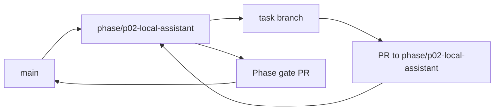

<!-- GENERATED BY scripts/Generate-TaskFiles.ps1; edit phase README/TASKS sources, then regenerate. -->
# P02 — Phase Git Flow

Git workflow thực thi cho P02 — Local Windows Assistant. Policy chuẩn thuộc [repository Git flow](../../docs/07-release/GIT_FLOW.md); file này không thay đổi phase scope.

## Phase branch contract

| Thuộc tính | Giá trị |
|---|---|
| Repository policy status | `ACCEPTED` |
| Phase branch | `phase/p02-local-assistant` |
| Tạo từ | `main` tại tag `m1-security-domain` |
| Task PR target | `phase/p02-local-assistant` |
| Task merge | Squash merge sau review và evidence |
| Phase merge | Merge commit vào `main` sau phase gate |
| Required phase gate | Offline/private-mode local assistant journey |
| Tag sau gate | `m2-local-assistant` |

## Branch flow

## Task branch map

| Task | Suggested branch | PR target | Required task evidence |
|---|---|---|---|
| [P02-T01](tasks/P02-T01.md) | `docs/p02-t01-viet-feature-specs-cho-activation-offline` | `phase/p02-local-assistant` | Voice/text/cancel/failure flows có AC |
| [P02-T02](tasks/P02-T02.md) | `feat/p02-t02-tao-windows-desktop-tray-shell-text-input-va` | `phase/p02-local-assistant` | UI smoke + keyboard/accessibility evidence |
| [P02-T03](tasks/P02-T03.md) | `feat/p02-t03-implement-push-to-talk-audio-session-va` | `phase/p02-local-assistant` | Start/stop/cancel/buffer-cleanup tests |
| [P02-T04](tasks/P02-T04.md) | `feat/p02-t04-implement-voicewakeprofile-lifecycle-va-local` | `phase/p02-local-assistant` | Lifecycle + raw-audio TTL tests |
| [P02-T05](tasks/P02-T05.md) | `feat/p02-t05-integrate-local-wake-word-adapter-sau` | `phase/p02-local-assistant` | Reference-machine detection/false-trigger report |
| [P02-T06](tasks/P02-T06.md) | `feat/p02-t06-integrate-local-stt-adapter-va-low-confidence` | `phase/p02-local-assistant` | Deterministic adapter + low-confidence tests |
| [P02-T07](tasks/P02-T07.md) | `feat/p02-t07-integrate-local-tts-adapter-voi-text-fallback` | `phase/p02-local-assistant` | Interrupt/failure/accessibility tests |
| [P02-T08](tasks/P02-T08.md) | `feat/p02-t08-implement-local-intent-router-va-strict-tool` | `phase/p02-local-assistant` | Invalid/prompt-injected output bị reject |
| [P02-T09](tasks/P02-T09.md) | `feat/p02-t09-implement-localmodelruntime-lazy-load-unload` | `phase/p02-local-assistant` | Lifecycle/memory-pressure/idle tests |
| [P02-T10](tasks/P02-T10.md) | `feat/p02-t10-implement-local-private-mode-baseline-va` | `phase/p02-local-assistant` | Network spy chứng minh không cloud call |
| [P02-T11](tasks/P02-T11.md) | `feat/p02-t11-implement-allowlisted-app-open-media-volume` | `phase/p02-local-assistant` | Permission/verification/cancel tests |
| [P02-T12](tasks/P02-T12.md) | `feat/p02-t12-implement-allowed-folder-open-find-read-only` | `phase/p02-local-assistant` | Canonical path/traversal/symlink tests |
| [P02-T13](tasks/P02-T13.md) | `feat/p02-t13-bind-emergency-stop-to-local-tasks-and-worker` | `phase/p02-local-assistant` | Stop tree/no-resume/audit tests |
| [P02-T14](tasks/P02-T14.md) | `test/p02-t14-measure-idle-listening-action-resource-baseline` | `phase/p02-local-assistant` | RAM/CPU/latency report có máy tham chiếu |
| [P02-T15](tasks/P02-T15.md) | `test/p02-t15-offline-end-to-end-demo-va-phase-security-review` | `phase/p02-local-assistant` | AC-01/02/11 + denied/cancel evidence |

## Execution rules

1. Phase owner tạo `phase/p02-local-assistant` từ `main` tại tag `m1-security-domain` sau khi entry criteria pass.
2. Task owner chỉ tạo suggested task branch khi task `READY` và dependency có evidence.
3. Draft PR target `phase/p02-local-assistant`; PR ghi Task ID, acceptance, commands, security/architecture impact và rollback.
4. Task PR được squash merge; task file, backlog và task board được đồng bộ trước merge.
5. Phase owner chạy Offline/private-mode local assistant journey, mở phase gate PR vào `main` và chỉ merge khi exit criteria pass.
6. Sau merge, tạo annotated tag `m2-local-assistant` nếu checklist/approval áp dụng đã có.

## Phase close evidence

- Must task inventory và unresolved findings.
- Build/test/architecture/security reports áp dụng từ clean checkout.
- Phase acceptance/demo evidence và failure/cancellation path.
- Updated task board, session log, changelog/decision và handoff.
- Rollback/recovery evidence khi phase có persistence, sync, installer hoặc external side effect.

## Recovery

- Sai base/target: dừng merge, tạo hoặc retarget PR đúng và kiểm tra diff.
- Gate fail: sửa root cause hoặc tạo bug task; không tắt gate.
- Secret xuất hiện: dừng push/merge, revoke và xử lý như security incident.
