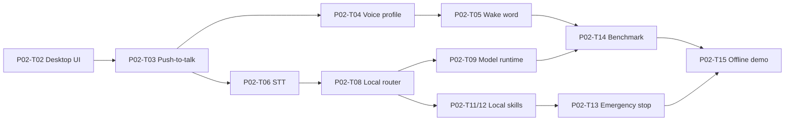

# P02 — Local Windows Assistant

## Phase contract

| Thuộc tính | Giá trị |
|---|---|
| Status | `DRAFT` |
| Outcome | Người dùng gọi trợ lý bằng text/push-to-talk/wake word và chạy Level 0–1 action offline |
| Scope mapping | Scope Phase 1 — Local Desktop Core |
| Security review | High cho microphone, local action và secret boundary |
| Milestone | M2 — Local assistant demo |

## Goal

Tạo vertical slice Windows-first chạy local, nhẹ khi idle, có chỉ báo trạng thái và giữ toàn bộ action trong Policy → Domain → Action → Verification → Audit path từ P01.

## Non-goals

- Không cloud AI, cloud memory hoặc remote control.
- Không browser DOM automation hoặc arbitrary terminal.
- Không dùng voice match làm authentication.
- Không lưu raw audio dài hạn hoặc thu màn hình liên tục.
- Không triển khai persistent personal memory ngoài working context tối thiểu.

## Entry criteria

- P01 core control path và security tests pass.
- Desktop UI framework, wake-word/STT/TTS candidates và máy tham chiếu đã được quyết định.
- Microphone consent, audio retention và resource measurement approach có spec.

## Deliverables

- Windows Desktop/Tray shell, text command và push-to-talk.
- Local wake-word adapter và `VoiceWakeProfile`.
- Local STT/TTS adapter abstraction với fallback text.
- Local intent/tool router có schema.
- Local runtime lifecycle, resource budget và offline modes.
- Allowlisted Level 0–1 Windows/media/app/folder skills.
- Status, cancellation, permission prompt, Emergency Stop và local audit UX.

## Task breakdown

Chi tiết size, trạng thái và acceptance cho từng task: [Small Task Backlog](TASKS.md).

Branch, PR target và phase merge gate: [Phase Git flow](GIT_FLOW.md).

| ID | Mode | Risk | Priority | Task / outcome | Depends on | Evidence |
|---|---|---|---|---|---|---|
| P02-T01 | PLAN | High | Must | Viết feature specs cho activation, offline action và privacy UX | P01 | Approved flows + failure cases |
| P02-T02 | IMPLEMENT | High | Must | Tạo Windows Desktop/Tray shell, text input và status model | P02-T01 | UI smoke test + accessibility check |
| P02-T03 | IMPLEMENT | High | Must | Implement push-to-talk, audio session và consent indicators | P02-T02 | Start/stop/cancel/raw-buffer cleanup tests |
| P02-T04 | IMPLEMENT | High | Must | Implement `VoiceWakeProfile` lifecycle và local storage policy | P02-T03 | Consent/retrain/revoke/delete tests |
| P02-T05 | IMPLEMENT | High | Must | Integrate local wake-word adapter sau interface boundary | P02-T03, P02-T04 | Reference-machine detection/false-trigger report |
| P02-T06 | IMPLEMENT | High | Must | Integrate local STT adapter và low-confidence clarification | P02-T03 | Deterministic adapter tests + manual sample evidence |
| P02-T07 | IMPLEMENT | High | Should | Integrate local TTS adapter với text fallback | P02-T02 | Cancel/interruption/accessibility tests |
| P02-T08 | IMPLEMENT | High | Must | Implement local intent router và strict tool schema | P02-T06, P01 action contracts | Parser/invalid-output/prompt-injection tests |
| P02-T09 | IMPLEMENT | High | Must | Implement `LocalModelRuntime` lazy load/unload lifecycle | P02-T08 | Lifecycle/resource-pressure tests |
| P02-T10 | IMPLEMENT | High | Must | Implement Local/Private mode baseline và visible mode state | P02-T02, P02-T08 | Network-block/no-cloud-call tests |
| P02-T11 | IMPLEMENT | High | Must | Implement allowlisted app-open/media/volume skills | P02-T08, P01 Policy/Action | Permission/verification/cancel tests |
| P02-T12 | IMPLEMENT | High | Must | Implement allowed-folder open/find read-only skill | P02-T08 | Canonical path/traversal/scope tests |
| P02-T13 | IMPLEMENT | High | Must | Bind Emergency Stop to local tasks and worker/process ownership | P02-T11, P02-T12 | Stop/cancel/audit tests |
| P02-T14 | REVIEW | High | Must | Measure idle/listening/action resource baseline | P02-T05, P02-T09, P02-T11 | RAM/CPU/latency report |
| P02-T15 | SECURITY_REVIEW | High | Must | Offline end-to-end demo và phase security review | P02-T01..P02-T14 | AC-01/02/11 evidence |

## Dependency path

## Traceability

### Business rules

- `BR-INT-001`–`BR-INT-015`.
- `BR-MODE-001`, `BR-MODE-004`–`BR-MODE-011`, `BR-MODE-014`.
- `BR-AI-001`–`BR-AI-012`.
- `BR-ACT-001`–`BR-ACT-019`.
- `BR-UI-001`, `BR-UI-005`–`BR-UI-009`.
- `BR-AUD-001`–`BR-AUD-008`.
- `BR-OPS-001`–`BR-OPS-012`.

### Lifecycle

`VoiceWakeProfile`, `InteractionSession`, `ClarificationRequest`, `ActionPlan`, `ActionTask`, `PermissionGrant`, `ConfirmationRequest`, `LocalModelRuntime`, `WorkerProcess`, `AuditRecord`.

### Scope acceptance

- Primary: `AC-01`, `AC-02`, `AC-11`.
- Partial foundation: `AC-03` (Local/Private; cloud/auto hoàn tất ở P05), `AC-07`, `AC-08`, `AC-12`.

### Dependency rules

`DR-003`, `DR-008`, `DR-015`–`DR-022`, `DR-025`–`DR-029`.

## Acceptance criteria

- `P02-AC-01`: Text và push-to-talk luôn dùng được; wake word chỉ mở phiên nghe.
- `P02-AC-02`: Microphone có indicator; raw audio buffer bị xóa sau xử lý mặc định.
- `P02-AC-03`: Transcript/intent confidence thấp tạo clarification, không chạy side effect.
- `P02-AC-04`: Khi offline, app/media/volume/folder action đã cấp quyền chạy và verify được.
- `P02-AC-05`: Private Mode không tạo network/cloud request và không tự fallback.
- `P02-AC-06`: Permission thiếu hoặc target mơ hồ bị deny/clarify; UI không bypass policy.
- `P02-AC-07`: Emergency Stop dừng task/process local và không auto-resume.
- `P02-AC-08`: Core agent không tải full LLM khi idle; RAM/CPU/latency được đo trên máy tham chiếu.
- `P02-AC-09`: Audit phản ánh nguồn voice/text, route, skill, result nhưng không chứa raw audio/secret.

## Verification and gates

- Unit: lifecycle, router, validators, path scope, cancellation.
- Integration: audio adapters, Windows skill adapters, secret/config, local audit.
- Security: media prompt injection, path traversal, permission bypass, hidden microphone state.
- Performance: idle, wake listener, model load/unload, simple local action latency.
- Manual: voice/text/offline/cancel/Emergency Stop journeys.

## Risks and controls

| Risk | Control | Recovery |
|---|---|---|
| Wake word false activation | Local listener, cooldown, confidence, no authority | Push-to-talk/text fallback |
| Audio retention leak | Short TTL, cleanup tests, consent | Purge profile/buffer and incident |
| Agent idle quá nặng | Lazy load, bounded queues, metrics | Unload/disable heavy adapter |
| Windows adapter bypass policy | Adapter chỉ nhận approved task | Block architecture/security gate |
| UI framework limitation | Accessibility smoke test sớm | ADR/change request trước mở rộng |

## Exit evidence

- Offline demo: kích hoạt → hiểu → permission → Level 0–1 action → verify → audit.
- Wake word/push-to-talk/text và cancellation có evidence.
- Private Mode/local-only tests pass.
- Resource report ghi cấu hình máy, RAM, CPU và latency; vượt target phải có blocker/decision.

## Handoff to P03

P03 tái sử dụng ActionTask, WorkerProcess và Emergency Stop; không tạo browser/terminal runner độc lập với control path P01/P02.
