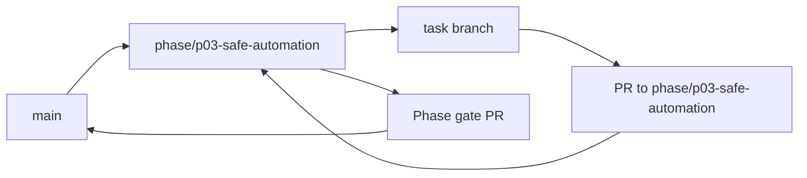

<!-- GENERATED BY scripts/Generate-TaskFiles.ps1; edit phase README/TASKS sources, then regenerate. -->
# P03 — Phase Git Flow

Git workflow thực thi cho P03 — Safe Device, Browser and Terminal Automation. Policy chuẩn thuộc [repository Git flow](../../docs/07-release/GIT_FLOW.md); file này không thay đổi phase scope.

## Phase branch contract

| Thuộc tính | Giá trị |
|---|---|
| Repository policy status | `ACCEPTED` |
| Phase branch | `phase/p03-safe-automation` |
| Tạo từ | `main` tại tag `m2-local-assistant` |
| Task PR target | `phase/p03-safe-automation` |
| Task merge | Squash merge sau review và evidence |
| Phase merge | Merge commit vào `main` sau phase gate |
| Required phase gate | Worker/browser/terminal isolation và verification |
| Tag sau gate | `m3-safe-automation` |

## Branch flow

## Task branch map

| Task | Suggested branch | PR target | Required task evidence |
|---|---|---|---|
| [P03-T01](tasks/P03-T01.md) | `docs/p03-t01-viet-feature-specs-va-threat-model-cho-os` | `phase/p03-safe-automation` | Abuse cases, trust boundaries, AC rõ |
| [P03-T02](tasks/P03-T02.md) | `chore/p03-t02-implement-skillpackage-manifest-verify-enable` | `phase/p03-safe-automation` | Hash/capability/version/quarantine tests |
| [P03-T03](tasks/P03-T03.md) | `feat/p03-t03-implement-worker-sandbox-contract-va` | `phase/p03-safe-automation` | Crash/timeout/quota/process-tree tests |
| [P03-T04](tasks/P03-T04.md) | `feat/p03-t04-implement-action-engine-dispatch-verify` | `phase/p03-safe-automation` | Complete/unknown/cancel tests |
| [P03-T05](tasks/P03-T05.md) | `feat/p03-t05-implement-windows-accessibility-adapter-va` | `phase/p03-safe-automation` | Target/permission/verification tests |
| [P03-T06](tasks/P03-T06.md) | `feat/p03-t06-tao-chromium-extension-voi-minimal-manifest` | `phase/p03-safe-automation` | Manifest review; denied-origin test |
| [P03-T07](tasks/P03-T07.md) | `feat/p03-t07-implement-authenticated-desktop-extension-bridge` | `phase/p03-safe-automation` | Auth/replay/disconnect tests |
| [P03-T08](tasks/P03-T08.md) | `feat/p03-t08-implement-tab-context-redaction-va` | `phase/p03-safe-automation` | Stale/invalidate/secret-field tests |
| [P03-T09](tasks/P03-T09.md) | `feat/p03-t09-implement-tab-switch-video-select-va-playback` | `phase/p03-safe-automation` | Ambiguity + URL/player readback tests |
| [P03-T10](tasks/P03-T10.md) | `docs/p03-t10-implement-scoped-skip-button-monitoring-hop-le` | `phase/p03-safe-automation` | Stop/no-bypass/tab-close tests |
| [P03-T11](tasks/P03-T11.md) | `feat/p03-t11-implement-terminalworkflowdefinition` | `phase/p03-safe-automation` | Executable/path/args/risk tests |
| [P03-T12](tasks/P03-T12.md) | `feat/p03-t12-implement-structured-terminal-worker-runner` | `phase/p03-safe-automation` | Exit/output/cancel/process tests |
| [P03-T13](tasks/P03-T13.md) | `test/p03-t13-harden-path-env-network-process-boundaries` | `phase/p03-safe-automation` | Traversal/injection/secret leak tests |
| [P03-T14](tasks/P03-T14.md) | `feat/p03-t14-wire-emergency-stop-revoke-va-quarantine` | `phase/p03-safe-automation` | Browser/terminal/process stop evidence |
| [P03-T15](tasks/P03-T15.md) | `test/p03-t15-security-e2e-verification-cho-browser-va` | `phase/p03-safe-automation` | AC-04/05/07/08/12 evidence |

## Execution rules

1. Phase owner tạo `phase/p03-safe-automation` từ `main` tại tag `m2-local-assistant` sau khi entry criteria pass.
2. Task owner chỉ tạo suggested task branch khi task `READY` và dependency có evidence.
3. Draft PR target `phase/p03-safe-automation`; PR ghi Task ID, acceptance, commands, security/architecture impact và rollback.
4. Task PR được squash merge; task file, backlog và task board được đồng bộ trước merge.
5. Phase owner chạy Worker/browser/terminal isolation và verification, mở phase gate PR vào `main` và chỉ merge khi exit criteria pass.
6. Sau merge, tạo annotated tag `m3-safe-automation` nếu checklist/approval áp dụng đã có.

## Phase close evidence

- Must task inventory và unresolved findings.
- Build/test/architecture/security reports áp dụng từ clean checkout.
- Phase acceptance/demo evidence và failure/cancellation path.
- Updated task board, session log, changelog/decision và handoff.
- Rollback/recovery evidence khi phase có persistence, sync, installer hoặc external side effect.

## Recovery

- Sai base/target: dừng merge, tạo hoặc retarget PR đúng và kiểm tra diff.
- Gate fail: sửa root cause hoặc tạo bug task; không tắt gate.
- Secret xuất hiện: dừng push/merge, revoke và xử lý như security incident.
