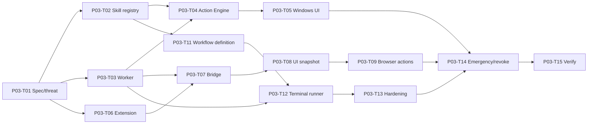

# P03 — Safe Device, Browser and Terminal Automation

## Phase contract

| Thuộc tính | Giá trị |
|---|---|
| Status | `DRAFT` |
| Outcome | Browser, Windows UI và predefined terminal workflows chạy trong scope, có verify/cancel/audit |
| Scope mapping | Scope Phase 2 — Browser và Action Engine |
| Security review | Critical |
| Milestone | M3 — Browser/device automation demo |

## Goal

Mở rộng local assistant thành nền tảng action thực tế mà model không có shell/DOM/OS authority trực tiếp, worker bị giới hạn và mọi write-action có policy, confirmation, verification và Emergency Stop.

## Non-goals

- Không arbitrary shell, admin/root, firewall/registry/security changes.
- Không bypass CAPTCHA, DRM, paywall hoặc quảng cáo.
- Không computer vision mặc định; chỉ xem xét fallback sau DOM/accessibility.
- Không cloud remote execution.
- Không messaging send hoặc Home Assistant; các integration đó ở P06.

## Entry criteria

- P02 local journey, Emergency Stop và resource baseline pass.
- Threat model cho browser bridge, UI automation và terminal worker được review.
- Browser manifest/origin policy, command allowlist và sandbox boundary có spec.

## Deliverables

- Skill registry/manifest và capability declaration.
- Isolated worker/process manager với quota, timeout, cancellation và output redaction.
- Windows accessibility/UI adapter và target verification.
- Chromium extension, authenticated bridge và per-domain/tab permission.
- `UiTargetSnapshot` lifecycle và safe DOM actions.
- `TerminalWorkflowDefinition` lifecycle và structured runner.
- Full Emergency Stop/process-tree handling và security tests.

## Task breakdown

Chi tiết size, trạng thái và acceptance cho từng task: [Small Task Backlog](TASKS.md).

Branch, PR target và phase merge gate: [Phase Git flow](GIT_FLOW.md).

| ID | Mode | Risk | Priority | Task / outcome | Depends on | Evidence |
|---|---|---|---|---|---|---|
| P03-T01 | PLAN | Critical | Must | Viết feature specs và threat model cho OS/browser/terminal journeys | P02 | Approved scenarios + abuse cases |
| P03-T02 | IMPLEMENT | Critical | Must | Implement `SkillPackage` manifest/verify/enable/quarantine lifecycle | P03-T01 | Manifest/hash/capability tests |
| P03-T03 | IMPLEMENT | Critical | Must | Implement worker sandbox contract và `WorkerProcess` manager | P03-T01 | Timeout/quota/crash/process-tree tests |
| P03-T04 | IMPLEMENT | Critical | Must | Implement Action Engine dispatch/verify/reconcile qua worker | P03-T02, P03-T03 | completed/unknown/cancel tests |
| P03-T05 | IMPLEMENT | Critical | Must | Implement Windows accessibility adapter và allowlisted UI actions | P03-T04 | Target/permission/readback tests |
| P03-T06 | IMPLEMENT | Critical | Must | Tạo Chromium extension với minimal manifest/origin permission | P03-T01 | Manifest review + denied-origin tests |
| P03-T07 | IMPLEMENT | Critical | Must | Implement authenticated Desktop–Extension bridge | P03-T03, P03-T06 | Caller auth/replay/disconnect tests |
| P03-T08 | IMPLEMENT | Critical | Must | Implement tab context, redaction và `UiTargetSnapshot` lifecycle | P03-T07 | TTL/stale/invalidated/secret-field tests |
| P03-T09 | IMPLEMENT | Critical | Must | Implement tab switch, video select và playback actions | P03-T08, P03-T04 | Selector ambiguity + post-action verification |
| P03-T10 | IMPLEMENT | Critical | Should | Implement scoped skip-button monitoring hợp lệ | P03-T09 | Tab-scoped TTL/stop/no-bypass tests |
| P03-T11 | IMPLEMENT | Critical | Must | Implement `TerminalWorkflowDefinition` validation/approval/versioning | P03-T01, P03-T02 | Executable/path/args/hash/risk tests |
| P03-T12 | IMPLEMENT | Critical | Must | Implement structured terminal worker runner | P03-T03, P03-T11 | build/test/start/stop, output limit, exit code |
| P03-T13 | SECURITY_REVIEW | Critical | Must | Harden path/env/network/process boundaries | P03-T12 | Traversal/symlink/injection/secret redaction tests |
| P03-T14 | IMPLEMENT | Critical | Must | Wire Emergency Stop, revoke và quarantine cascades | P03-T04, P03-T07, P03-T12 | Browser/worker/process cancellation evidence |
| P03-T15 | SECURITY_REVIEW | Critical | Must | Security/E2E verification cho browser và terminal | P03-T05..P03-T14 | AC-04/05/07/08/12 evidence |

## Dependency path

## Traceability

### Business rules

- `BR-AI-001`–`BR-AI-012`, `BR-ACT-001`–`BR-ACT-020`.
- `BR-UI-001`–`BR-UI-016`.
- `BR-TRM-001`–`BR-TRM-024`.
- `BR-SEC-004`–`BR-SEC-012`, `BR-SEC-015`, `BR-SEC-017`, `BR-SEC-021`.
- `BR-AUD-001`–`BR-AUD-008`, `BR-OPS-001`–`BR-OPS-012`.
- `BR-BAN-001`–`BR-BAN-004`, `BR-BAN-008`, `BR-BAN-010`, `BR-BAN-013`–`BR-BAN-015`.

### Lifecycle

`SkillPackage`, `WorkerProcess`, `ActionPlan`, `ActionTask`, `ConfirmationRequest`, `UiTargetSnapshot`, `TerminalWorkflowDefinition`, `AuditRecord`, `SecurityIncident`.

### Scope acceptance

Primary: `AC-04`, `AC-05`; strengthens `AC-07`, `AC-08`, `AC-11`, `AC-12`.

### Dependency rules

`DR-008`, `DR-015`–`DR-020`, `DR-022`–`DR-030`.

## Acceptance criteria

- `P03-AC-01`: Extension không đọc/action ngoài domain/tab permission; incognito deny mặc định.
- `P03-AC-02`: Password/OTP/secret fields bị redaction và external content không thể gọi tool.
- `P03-AC-03`: Target stale/ambiguous/low-confidence không được click; action chỉ complete sau verification.
- `P03-AC-04`: YouTube/video và skip-button chỉ dùng control hợp lệ, scoped theo tab và tự kết thúc.
- `P03-AC-05`: Terminal chỉ chạy workflow version/hash đã duyệt, executable/args/workdir hợp lệ.
- `P03-AC-06`: Worker có owner, timeout, output/resource limit, cancellation và process-tree cleanup.
- `P03-AC-07`: Level 2 terminal/UI write cần confirmation hoặc exact Trusted Routine scope.
- `P03-AC-08`: Timeout sau side effect không tự retry; task chuyển `unknown` và chờ reconciliation.
- `P03-AC-09`: Emergency Stop/revoke/quarantine ngăn task mới và dừng task hiện có theo policy.
- `P03-AC-10`: Prompt injection, command injection, path escape và caller replay tests bị chặn.

## Verification and gates

- Architecture: no direct shell/DOM/OS call từ model/Application/Domain.
- Unit: lifecycle, schema, selector, path/env/network policy.
- Integration: extension bridge, worker process, terminal workflow, accessibility adapter.
- Security: injection, replay, origin escape, symlink/path traversal, secret/log redaction.
- E2E: browser video journey; predefined project build/test/start/stop journey; Emergency Stop.
- Resource: browser idle overhead, worker quotas và leak check.

## Risks and controls

| Risk | Control | Recovery |
|---|---|---|
| Worker sandbox không đủ mạnh | Least privilege + explicit boundaries + threat tests | Disable/quarantine capability |
| DOM/UI thay đổi | Snapshot generation, verify, fail-safe | Resolve target mới/user overlay |
| Command injection | Structured args, no shell concat, executable allowlist | Revoke workflow/version |
| Side effect không rõ | `unknown`, no auto-retry, reconciliation | User review/new task |
| Extension đọc quá rộng | Minimal manifest, per-domain/tab permission | Revoke bridge/origin grant |

## Exit evidence

- Browser journey và terminal workflow chạy end-to-end với denied/failure/cancel paths.
- Security tests chứng minh không arbitrary shell, không origin/path escape và không prompt-to-tool bypass.
- Emergency Stop dừng browser monitoring, worker và process tree.
- ActionTask/audit phản ánh trạng thái thật, gồm `unknown`.

## Handoff to P04

P04 có thể lưu structured routine reference đến skill/workflow version đã duyệt; không được lưu raw shell string, stale UI snapshot hoặc permission authority trong memory.
