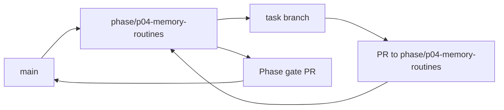

<!-- GENERATED BY scripts/Generate-TaskFiles.ps1; edit phase README/TASKS sources, then regenerate. -->
# P04 — Phase Git Flow

Git workflow thực thi cho P04 — User-controlled Memory and Routines. Policy chuẩn thuộc [repository Git flow](../../docs/07-release/GIT_FLOW.md); file này không thay đổi phase scope.

## Phase branch contract

| Thuộc tính | Giá trị |
|---|---|
| Repository policy status | `ACCEPTED` |
| Phase branch | `phase/p04-memory-routines` |
| Tạo từ | `main` tại tag `m3-safe-automation` |
| Task PR target | `phase/p04-memory-routines` |
| Task merge | Squash merge sau review và evidence |
| Phase merge | Merge commit vào `main` sau phase gate |
| Required phase gate | Local memory/delete/routine trust semantics |
| Tag sau gate | `m4-memory-routines` |

## Branch flow

## Task branch map

| Task | Suggested branch | PR target | Required task evidence |
|---|---|---|---|
| [P04-T01](tasks/P04-T01.md) | `docs/p04-t01-viet-data-memory-va-routine-feature-specs` | `phase/p04-memory-routines` | Data types, retention, risk, flows có AC |
| [P04-T02](tasks/P04-T02.md) | `feat/p04-t02-implement-bounded-working-memory-voi-ttl-va` | `phase/p04-memory-routines` | TTL/isolation/reset/no-authority tests |
| [P04-T03](tasks/P04-T03.md) | `feat/p04-t03-implement-memoryrecord-lifecycle-va-metadata` | `phase/p04-memory-routines` | Candidate/stale/expire/revoke/delete tests |
| [P04-T04](tasks/P04-T04.md) | `feat/p04-t04-implement-encrypted-local-memory-store-quota` | `phase/p04-memory-routines` | At-rest/quota/key-failure tests |
| [P04-T05](tasks/P04-T05.md) | `feat/p04-t05-implement-bounded-index-retrieval-va-source` | `phase/p04-memory-routines` | Budget/stale-filter/no-full-load tests |
| [P04-T06](tasks/P04-T06.md) | `feat/p04-t06-implement-memory-review-edit-pin-export-delete` | `phase/p04-memory-routines` | CRUD/ownership/accessibility tests |
| [P04-T07](tasks/P04-T07.md) | `feat/p04-t07-implement-retention-cleanup-va-local-tombstone` | `phase/p04-memory-routines` | Expiry/pinned/delete/resurrection tests |
| [P04-T08](tasks/P04-T08.md) | `feat/p04-t08-implement-routinedefinition-validation-version` | `phase/p04-memory-routines` | Hash/trust/supersede tests |
| [P04-T09](tasks/P04-T09.md) | `docs/p04-t09-implement-routine-editor-preview-va-permission` | `phase/p04-memory-routines` | Edit/approve/failure-policy UX tests |
| [P04-T10](tasks/P04-T10.md) | `feat/p04-t10-implement-routinerun-step-state-va-execution` | `phase/p04-memory-routines` | Complete/fail/cancel/unknown tests |
| [P04-T11](tasks/P04-T11.md) | `feat/p04-t11-implement-trigger-loop-guard-rate-limit-va` | `phase/p04-memory-routines` | Storm/duplicate/single-instance tests |
| [P04-T12](tasks/P04-T12.md) | `chore/p04-t12-implement-runtime-dependency-permission` | `phase/p04-memory-routines` | Revoke/change/disabled dependency tests |
| [P04-T13](tasks/P04-T13.md) | `feat/p04-t13-implement-local-pattern-detection-tao-routine` | `phase/p04-memory-routines` | No-auto-activate/consent tests |
| [P04-T14](tasks/P04-T14.md) | `test/p04-t14-wire-memory-routine-audit-emergency-stop-va` | `phase/p04-memory-routines` | Redaction/pause/delete/Emergency Stop tests |
| [P04-T15](tasks/P04-T15.md) | `test/p04-t15-security-e2e-verification-memory-va-routine` | `phase/p04-memory-routines` | AC-06/07/08 evidence |

## Execution rules

1. Phase owner tạo `phase/p04-memory-routines` từ `main` tại tag `m3-safe-automation` sau khi entry criteria pass.
2. Task owner chỉ tạo suggested task branch khi task `READY` và dependency có evidence.
3. Draft PR target `phase/p04-memory-routines`; PR ghi Task ID, acceptance, commands, security/architecture impact và rollback.
4. Task PR được squash merge; task file, backlog và task board được đồng bộ trước merge.
5. Phase owner chạy Local memory/delete/routine trust semantics, mở phase gate PR vào `main` và chỉ merge khi exit criteria pass.
6. Sau merge, tạo annotated tag `m4-memory-routines` nếu checklist/approval áp dụng đã có.

## Phase close evidence

- Must task inventory và unresolved findings.
- Build/test/architecture/security reports áp dụng từ clean checkout.
- Phase acceptance/demo evidence và failure/cancellation path.
- Updated task board, session log, changelog/decision và handoff.
- Rollback/recovery evidence khi phase có persistence, sync, installer hoặc external side effect.

## Recovery

- Sai base/target: dừng merge, tạo hoặc retarget PR đúng và kiểm tra diff.
- Gate fail: sửa root cause hoặc tạo bug task; không tắt gate.
- Secret xuất hiện: dừng push/merge, revoke và xử lý như security incident.
