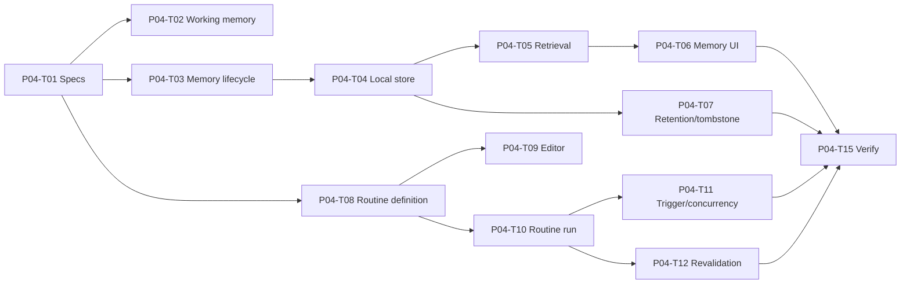

# P04 — User-controlled Memory and Routines

## Phase contract

| Thuộc tính | Giá trị |
|---|---|
| Status | `DRAFT` |
| Outcome | Người dùng quản lý local memory và phê duyệt/chạy routine có version, scope và audit |
| Scope mapping | Scope Phase 4 — phần local memory/routine |
| Security review | High |
| Milestone | M4 — Memory and routine demo |

## Goal

Cung cấp memory làm context chứ không phải authority, cùng routine structured có preview, approval, runtime revalidation, failure policy và khả năng pause/revoke/delete.

## Non-goals

- Không cloud sync hoặc cross-device memory; P05 phụ trách.
- Không lưu mọi hội thoại, raw audio, screenshot kéo dài hoặc secret.
- Không tự biến observation thành routine active.
- Không auto-modify routine đã duyệt.
- Không đưa Level 3 action hoặc arbitrary shell vào routine.

## Entry criteria

- P03 skill/workflow versioning, ActionTask, worker, audit và Emergency Stop pass.
- Memory classification, sensitivity, retention và encryption approach có spec.
- Routine schema, trust semantics, trigger/rate/concurrency policy có spec.

## Deliverables

- Working memory TTL và context ownership.
- `MemoryRecord` lifecycle, encrypted local store, quota/index/retrieval.
- Memory review/edit/pin/export/delete UX.
- `RoutineDefinition` và `RoutineRun` lifecycle, editor và history.
- Runtime permission/dependency revalidation, loop/rate/concurrency/failure controls.
- Local routine suggestion ở trạng thái draft/awaiting approval.

## Task breakdown

Chi tiết size, trạng thái và acceptance cho từng task: [Small Task Backlog](TASKS.md).

Branch, PR target và phase merge gate: [Phase Git flow](GIT_FLOW.md).

| ID | Mode | Risk | Priority | Task / outcome | Depends on | Evidence |
|---|---|---|---|---|---|---|
| P04-T01 | PLAN | High | Must | Viết data/memory và routine feature specs | P03 | Approved classification/schema/flows |
| P04-T02 | IMPLEMENT | High | Must | Implement bounded Working Memory với TTL và topic/session reset | P04-T01 | TTL/isolation/no-authority tests |
| P04-T03 | IMPLEMENT | High | Must | Implement `MemoryRecord` lifecycle và metadata/invariants | P04-T01 | Candidate/stale/expire/revoke/delete tests |
| P04-T04 | IMPLEMENT | High | Must | Implement encrypted local memory store, quota và key abstraction | P04-T03 | At-rest/quota/key-failure integration tests |
| P04-T05 | IMPLEMENT | High | Must | Implement bounded index/retrieval và source explanation | P04-T04 | Relevance/budget/stale-filter/load tests |
| P04-T06 | IMPLEMENT | High | Must | Implement memory review/edit/pin/export/delete UI/use cases | P04-T04, P04-T05 | CRUD/ownership/accessibility tests |
| P04-T07 | IMPLEMENT | High | Must | Implement retention, cleanup và local tombstone semantics | P04-T03, P04-T04 | Expiry/pinned/delete/no-resurrection tests |
| P04-T08 | IMPLEMENT | High | Must | Implement `RoutineDefinition` validation/version/approval lifecycle | P04-T01, P03 skill/workflow | Version hash/trust/revalidation tests |
| P04-T09 | IMPLEMENT | High | Must | Implement routine editor/preview và permission scope review | P04-T08 | Step/target/risk/failure policy UX tests |
| P04-T10 | IMPLEMENT | High | Must | Implement `RoutineRun`, step state và execution orchestration | P04-T08, P03 Action Engine | Complete/fail/cancel/unknown tests |
| P04-T11 | IMPLEMENT | High | Must | Implement trigger, loop guard, rate limit và concurrency policy | P04-T10 | Storm/duplicate/single-instance tests |
| P04-T12 | IMPLEMENT | High | Must | Implement runtime dependency/permission revalidation | P04-T08, P04-T10 | Revoke/version/integration-disabled tests |
| P04-T13 | IMPLEMENT | High | Should | Implement local pattern detection tạo routine draft | P04-T02, P04-T08 | No-auto-activate/consent tests |
| P04-T14 | IMPLEMENT | High | Must | Wire memory/routine audit, Emergency Stop và user controls | P04-T06, P04-T10 | Audit/redaction/stop/pause/delete tests |
| P04-T15 | SECURITY_REVIEW | High | Must | Security/E2E verification memory và routine | P04-T02..P04-T14 | AC-06/07/08 evidence |

## Dependency path

## Traceability

### Business rules

- `BR-MEM-001`–`BR-MEM-026`.
- `BR-RTN-001`–`BR-RTN-020`.
- `BR-ACT-013`–`BR-ACT-020`.
- `BR-TRM-021`, `BR-TRM-023`.
- `BR-MODE-004`, `BR-MODE-013`, `BR-MODE-014`.
- `BR-AUD-001`–`BR-AUD-008`, `BR-OPS-002`, `BR-OPS-006`–`BR-OPS-012`.

### Lifecycle

`MemoryRecord`, `RoutineDefinition`, `RoutineRun`, `PermissionGrant`, `ActionTask`, `TerminalWorkflowDefinition`, `SkillPackage`, `AuditRecord`.

### Scope acceptance

Primary: `AC-06`; strengthens `AC-02`, `AC-05`, `AC-07`, `AC-08`, `AC-11`.

### Dependency rules

`DR-013`, `DR-021`, `DR-023`–`DR-030`.

## Acceptance criteria

- `P04-AC-01`: Working memory có TTL, tách user/session và không cấp permission.
- `P04-AC-02`: Memory record có owner/type/source/device/time/sensitivity/scope/retention.
- `P04-AC-03`: User xem, sửa, pin, export và xóa được memory; stale/expired/revoked/deleted không retrieval.
- `P04-AC-04`: Secret/raw audio/screenshot dài hạn bị từ chối khỏi normal memory.
- `P04-AC-05`: Store mã hóa, quota hữu hạn và retrieval không tải toàn database vào RAM.
- `P04-AC-06`: Delete tạo tombstone local; pinned memory không bị cleanup tự động.
- `P04-AC-07`: Routine version chỉ active sau validate + user approval từng step.
- `P04-AC-08`: Mỗi run pin exact version và revalidate permission/skill/workflow/device trước chạy.
- `P04-AC-09`: Routine xử lý timeout/failure/unknown/cancel, có loop/rate/concurrency guard.
- `P04-AC-10`: Pattern detection chỉ tạo đề xuất; không tự sửa/activate routine.

## Verification and gates

- Unit/property: lifecycle, permission-is-not-memory, terminal states, pinned/expiry/delete invariants.
- Integration: encrypted store, quota, index, cleanup, routine execution/history.
- Security: cross-user access, secret rejection, malicious memory/prompt, revoked permission.
- Performance: bounded retrieval, index/storage size, idle cleanup.
- E2E: memory CRUD/delete; routine draft → approve → run → verify → audit → pause/revoke.

## Risks and controls

| Risk | Control | Recovery |
|---|---|---|
| Memory trở thành authority | Policy ignores memory for grant/confirmation | Disable retrieval, incident review |
| Dữ liệu đã xóa sống lại | Tombstone và version semantics | Reconcile ưu tiên deletion |
| Routine scope tăng âm thầm | Immutable version + reapproval | Supersede/revoke version |
| Automation storm | Loop guard/rate/concurrency | Pause routine + Emergency Stop |
| Local store quá lớn | Quota/TTL/pagination/bounded retrieval | Cleanup không xóa pinned |

## Exit evidence

- Memory CRUD/pin/expiry/delete và no-authority tests pass.
- Routine approval/version/revalidation/failure/stop journey có evidence.
- Không có raw shell/secret/Level 3 action trong routine.
- Local deletion/tombstone semantics đủ rõ để mở cloud sync P05.

## Handoff to P05

P05 đồng bộ `MemoryRecord` và tombstone hiện có; không thay đổi local deletion semantics để thuận tiện cho cloud. Conflict resolution phải ưu tiên user edit và deletion.
