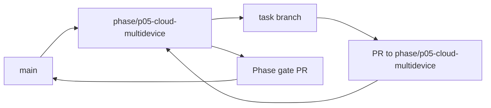

<!-- GENERATED BY scripts/Generate-TaskFiles.ps1; edit phase README/TASKS sources, then regenerate. -->
# P05 — Phase Git Flow

Git workflow thực thi cho P05 — Cloud, Web and Multi-device. Policy chuẩn thuộc [repository Git flow](../../docs/07-release/GIT_FLOW.md); file này không thay đổi phase scope.

## Phase branch contract

| Thuộc tính | Giá trị |
|---|---|
| Repository policy status | `ACCEPTED` |
| Phase branch | `phase/p05-cloud-multidevice` |
| Tạo từ | `main` tại tag `m4-memory-routines` |
| Task PR target | `phase/p05-cloud-multidevice` |
| Task merge | Squash merge sau review và evidence |
| Phase merge | Merge commit vào `main` sau phase gate |
| Required phase gate | Cloud disclosure, sync, web/mobile và revoke |
| Tag sau gate | `m5-cloud-multidevice` |

## Branch flow

## Task branch map

| Task | Suggested branch | PR target | Required task evidence |
|---|---|---|---|
| [P05-T01](tasks/P05-T01.md) | `docs/p05-t01-viet-cloud-multi-device-specs-threat-model-va` | `phase/p05-cloud-multidevice` | Trust/data diagram + egress inventory |
| [P05-T02](tasks/P05-T02.md) | `feat/p05-t02-implement-api-auth-boundary-error-contract-va` | `phase/p05-cloud-multidevice` | Auth/expiry/revoke/abuse tests |
| [P05-T03](tasks/P05-T03.md) | `feat/p05-t03-implement-cloud-persistence-migrations-va` | `phase/p05-cloud-multidevice` | Forward/rollback/replay integration tests |
| [P05-T04](tasks/P05-T04.md) | `feat/p05-t04-implement-pairing-challenge-device-key-va-anti` | `phase/p05-cloud-multidevice` | Pair/expire/replay/rekey tests |
| [P05-T05](tasks/P05-T05.md) | `feat/p05-t05-implement-signed-device-command-va-target` | `phase/p05-cloud-multidevice` | Wrong-device/offline/stale/replay tests |
| [P05-T06](tasks/P05-T06.md) | `feat/p05-t06-implement-device-status-revoke-va-security` | `phase/p05-cloud-multidevice` | Immediate revoke/race tests |
| [P05-T07](tasks/P05-T07.md) | `chore/p05-t07-implement-aiproviderconfiguration-va-cloud` | `phase/p05-cloud-multidevice` | Config/timeout/rate/no-secret tests |
| [P05-T08](tasks/P05-T08.md) | `feat/p05-t08-implement-connected-auto-routing-va-cloud` | `phase/p05-cloud-multidevice` | Sensitive/redaction/private/fallback tests |
| [P05-T09](tasks/P05-T09.md) | `feat/p05-t09-implement-memorysyncjob-opt-in-categories-va` | `phase/p05-cloud-multidevice` | Private/offline/retry/duplicate tests |
| [P05-T10](tasks/P05-T10.md) | `chore/p05-t10-implement-tombstone-propagation-va-conflict` | `phase/p05-cloud-multidevice` | Out-of-order/resurrection/conflict tests |
| [P05-T11](tasks/P05-T11.md) | `feat/p05-t11-implement-cross-device-interaction-context` | `phase/p05-cloud-multidevice` | Stale-device/no-local-only-leak tests |
| [P05-T12](tasks/P05-T12.md) | `test/p05-t12-implement-web-console-device-privacy` | `phase/p05-cloud-multidevice` | Authorization/accessibility tests |
| [P05-T13](tasks/P05-T13.md) | `feat/p05-t13-implement-memory-routine-management-views-on` | `phase/p05-cloud-multidevice` | CRUD/version/conflict tests |
| [P05-T14](tasks/P05-T14.md) | `feat/p05-t14-implement-android-command-status-confirmation` | `phase/p05-cloud-multidevice` | Trusted-session/remote-confirm/stop tests |
| [P05-T15](tasks/P05-T15.md) | `test/p05-t15-cross-device-security-e2e-verification` | `phase/p05-cloud-multidevice` | AC-03/06/09/12 evidence |

## Execution rules

1. Phase owner tạo `phase/p05-cloud-multidevice` từ `main` tại tag `m4-memory-routines` sau khi entry criteria pass.
2. Task owner chỉ tạo suggested task branch khi task `READY` và dependency có evidence.
3. Draft PR target `phase/p05-cloud-multidevice`; PR ghi Task ID, acceptance, commands, security/architecture impact và rollback.
4. Task PR được squash merge; task file, backlog và task board được đồng bộ trước merge.
5. Phase owner chạy Cloud disclosure, sync, web/mobile và revoke, mở phase gate PR vào `main` và chỉ merge khi exit criteria pass.
6. Sau merge, tạo annotated tag `m5-cloud-multidevice` nếu checklist/approval áp dụng đã có.

## Phase close evidence

- Must task inventory và unresolved findings.
- Build/test/architecture/security reports áp dụng từ clean checkout.
- Phase acceptance/demo evidence và failure/cancellation path.
- Updated task board, session log, changelog/decision và handoff.
- Rollback/recovery evidence khi phase có persistence, sync, installer hoặc external side effect.

## Recovery

- Sai base/target: dừng merge, tạo hoặc retarget PR đúng và kiểm tra diff.
- Gate fail: sửa root cause hoặc tạo bug task; không tắt gate.
- Secret xuất hiện: dừng push/merge, revoke và xử lý như security incident.
