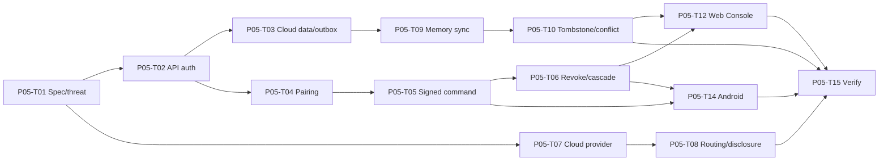

# P05 — Cloud, Web and Multi-device

## Phase contract

| Thuộc tính | Giá trị |
|---|---|
| Status | `DRAFT` |
| Outcome | Cloud routing/sync và cross-device command hoạt động với pairing, revoke, Private Mode và minh bạch data egress |
| Scope mapping | Scope Phase 3; Scope Phase 4 — phần cloud sync/context handoff |
| Security review | Critical |
| Milestone | M5 — Multi-device sync demo |

## Goal

Bổ sung backend/API, cloud provider, Web Console và Android Companion giới hạn mà không cấp cloud quyền điều khiển máy trực tiếp và không phá Local/Private Mode.

## Non-goals

- Không production paid deployment nếu chưa được phê duyệt.
- Không full Android UI automation hoặc luôn-listening trên mobile.
- Không multi-user/family/enterprise.
- Không để cloud có shell/OS access; Device Agent phải verify signed command.
- Không sync toàn bộ memory hoặc secret mặc định.

## Entry criteria

- P04 local memory/tombstone/routine semantics pass.
- Authentication, device command signing, anti-replay, sync encryption và retention specs được review.
- Hosting/provider/identity choices có decision; secret thật và production data không cần cho development.

## Deliverables

- ASP.NET Core API boundary và cloud persistence/outbox.
- Account authentication, device pairing, session và revoke flow.
- Cloud AI provider abstraction, Auto/Connected routing và data-disclosure policy.
- Encrypted opt-in memory sync, tombstone/conflict handling.
- Web Console quản lý device/permission/memory/routine/audit/privacy.
- Android Companion giới hạn cho command/status/confirmation/stop.
- Signed device command, cross-device state và remote confirmation.

## Task breakdown

Chi tiết size, trạng thái và acceptance cho từng task: [Small Task Backlog](TASKS.md).

Branch, PR target và phase merge gate: [Phase Git flow](GIT_FLOW.md).

| ID | Mode | Risk | Priority | Task / outcome | Depends on | Evidence |
|---|---|---|---|---|---|---|
| P05-T01 | PLAN | Critical | Must | Viết cloud/multi-device specs, threat model và data-flow inventory | P04 | Approved trust/data diagrams |
| P05-T02 | IMPLEMENT | Critical | Must | Implement API auth boundary, error contract và rate limit | P05-T01, P01 identity | Auth/expiry/revoke/abuse tests |
| P05-T03 | IMPLEMENT | Critical | Must | Implement cloud persistence, migrations và transactional outbox | P05-T02 | Migration/rollback/outbox tests |
| P05-T04 | IMPLEMENT | Critical | Must | Implement pairing challenge, device key và anti-replay protocol | P05-T02, P01 DeviceNode | Pair/expire/replay/rekey tests |
| P05-T05 | IMPLEMENT | Critical | Must | Implement signed device command và target capability validation | P05-T04, P03 Action Engine | Wrong-device/stale/offline/replay tests |
| P05-T06 | IMPLEMENT | Critical | Must | Implement device status, revoke và security cascades | P05-T04, P05-T05 | Session/grant/queued-task/sync revoke tests |
| P05-T07 | IMPLEMENT | Critical | Must | Implement `AiProviderConfiguration` và cloud adapter boundary | P05-T01 | Config/secret/timeout/rate tests |
| P05-T08 | IMPLEMENT | Critical | Must | Implement Connected/Auto routing và cloud disclosure review | P05-T07, P02 mode baseline | Sensitive-data/redaction/fallback tests |
| P05-T09 | IMPLEMENT | Critical | Must | Implement `MemorySyncJob`, opt-in categories và encryption | P05-T03, P04 memory | Private/offline/retry/duplicate tests |
| P05-T10 | IMPLEMENT | Critical | Must | Implement tombstone propagation và conflict resolution | P05-T09 | Delete/user-edit/out-of-order tests |
| P05-T11 | IMPLEMENT | Critical | Should | Implement cross-device interaction/context handoff tối thiểu | P05-T05, P05-T09 | TTL/scope/stale-device tests |
| P05-T12 | IMPLEMENT | Critical | Must | Implement Web Console device/privacy/permission/audit views | P05-T02, P05-T06, P05-T09 | Authorization/accessibility tests |
| P05-T13 | IMPLEMENT | Critical | Should | Implement memory/routine management views on Web Console | P05-T10, P05-T12 | CRUD/version/ownership tests |
| P05-T14 | IMPLEMENT | Critical | Must | Implement Android command/status/confirmation/stop companion | P05-T05, P05-T06 | Trusted-session/remote-confirm/stop tests |
| P05-T15 | SECURITY_REVIEW | Critical | Must | Cross-device security/E2E verification | P05-T02..P05-T14 | AC-03/06/09/12 evidence |

## Dependency path

## Traceability

### Business rules

- `BR-ID-001`–`BR-ID-010`, `BR-DEV-001`–`BR-DEV-014`.
- `BR-MODE-001`–`BR-MODE-014`.
- `BR-ACT-006`, `BR-ACT-009`–`BR-ACT-019`.
- `BR-MEM-005`, `BR-MEM-012`–`BR-MEM-026`.
- `BR-SEC-001`–`BR-SEC-022`.
- `BR-AUD-001`–`BR-AUD-008`, `BR-OPS-002`, `BR-OPS-007`–`BR-OPS-010`.

### Lifecycle

`UserAccount`, `DeviceNode`, `DeviceSession`, `PermissionGrant`, `ConfirmationRequest`, `ActionTask`, `MemoryRecord`, `MemorySyncJob`, `AiProviderConfiguration`, `CredentialSecret`, `AuditRecord`, `SecurityIncident`.

### Scope acceptance

Primary: `AC-03`, `AC-09`; completes sync portion of `AC-06`; strengthens `AC-07`, `AC-08`, `AC-12`.

### Dependency rules

`DR-006`, `DR-008`, `DR-012`–`DR-030`.

## Acceptance criteria

- `P05-AC-01`: Device chưa pair/revoked/rekey-required không gửi command, sync hoặc confirmation.
- `P05-AC-02`: Cloud chỉ gửi signed command; Device Agent re-authorize target/capability/policy.
- `P05-AC-03`: Remote Level 2 action gắn exact user/session/device/plan/payload và confirmation.
- `P05-AC-04`: Local/Connected/Auto/Private state hiển thị rõ; Private Mode chặn cloud AI/sync/upload.
- `P05-AC-05`: Cloud context được minimize/redact; secret không vào model request/log.
- `P05-AC-06`: Sync là opt-in theo category, chịu duplicate/out-of-order/offline.
- `P05-AC-07`: Delete/tombstone đến thiết bị offline khi online; user edit ưu tiên inference.
- `P05-AC-08`: Web Console không giả action completed khi desktop offline/chưa verify.
- `P05-AC-09`: Android chỉ command/status/confirm/stop trong scope; không full device automation.
- `P05-AC-10`: Provider/backend failure không crash local agent hoặc auto-retry non-idempotent action.

## Verification and gates

- Unit/property: routing, scope match, anti-replay, sync merge/tombstone.
- Integration: API auth, database/outbox, cloud adapter fake, device bridge, Web/Android clients.
- Contract: versioned device command, WebSocket/event và sync payload.
- Security: auth bypass, replay, revoke race, SSRF, token/log leak, Private Mode egress.
- E2E: Android command → remote confirmation → desktop execute/verify → status; offline delete sync.

## Risks and controls

| Risk | Control | Recovery |
|---|---|---|
| Remote control bị lạm dụng | Pairing, signed command, anti-replay, device policy | Revoke/rekey/Safe Mode |
| Sync rò rỉ hoặc hồi sinh dữ liệu | Opt-in/encryption/tombstone/version | Stop sync, reconcile deletion |
| Cloud fallback phá privacy | Router policy + egress tests | Fail/degraded, không đổi mode |
| Web Console vượt quyền | Server authorization + no direct device/db action | Revoke session, audit incident |
| Provider/hosting tạo chi phí | Fake/local test + explicit budget approval | Disable provider |

## Exit evidence

- Cross-device command/confirmation/status và device revoke journeys pass.
- Private Mode network-egress tests pass.
- Memory sync conflict/tombstone/offline tests pass.
- Web Console/Android authorization và accessibility checks có evidence.
- Không có cloud-to-shell hoặc untrusted-device action path.

## Handoff to P06

P06 dùng `IntegrationConnection` và `CredentialSecret` qua adapter; mỗi integration phải khai báo capability/data egress và không được tái sử dụng cloud permission chung.
