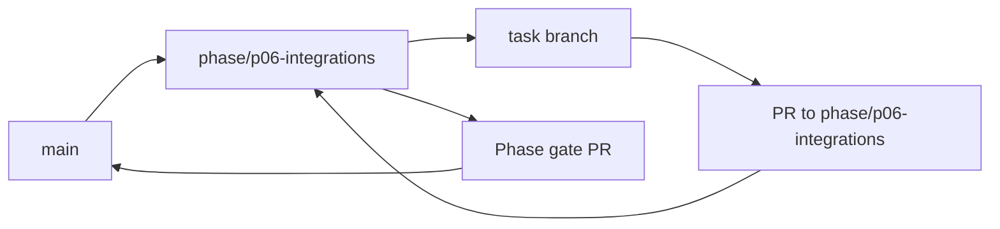

<!-- GENERATED BY scripts/Generate-TaskFiles.ps1; edit phase README/TASKS sources, then regenerate. -->
# P06 — Phase Git Flow

Git workflow thực thi cho P06 — Messaging and Home Assistant Integrations. Policy chuẩn thuộc [repository Git flow](../../docs/07-release/GIT_FLOW.md); file này không thay đổi phase scope.

## Phase branch contract

| Thuộc tính | Giá trị |
|---|---|
| Repository policy status | `ACCEPTED` |
| Phase branch | `phase/p06-integrations` |
| Tạo từ | `main` tại tag `m5-cloud-multidevice` |
| Task PR target | `phase/p06-integrations` |
| Task merge | Squash merge sau review và evidence |
| Phase merge | Merge commit vào `main` sau phase gate |
| Required phase gate | Messaging/Home Assistant scoped integration |
| Tag sau gate | `m6-integrations` |

## Branch flow

## Task branch map

| Task | Suggested branch | PR target | Required task evidence |
|---|---|---|---|
| [P06-T01](tasks/P06-T01.md) | `docs/p06-t01-viet-integration-specs-provider-selection-va` | `phase/p06-integrations` | Capability/egress/risk matrix |
| [P06-T02](tasks/P06-T02.md) | `feat/p06-t02-implement-credentialsecret-vault-reference` | `phase/p06-integrations` | No-plaintext/rotation/fail-closed tests |
| [P06-T03](tasks/P06-T03.md) | `feat/p06-t03-implement-integrationconnection-authorize` | `phase/p06-integrations` | OAuth-state/timeout/revoke tests |
| [P06-T04](tasks/P06-T04.md) | `feat/p06-t04-implement-integration-capability-data-egress` | `phase/p06-integrations` | Unknown/escalated scope bị deny |
| [P06-T05](tasks/P06-T05.md) | `chore/p06-t05-implement-outboundmessage-draft-va-recipient` | `phase/p06-integrations` | Ambiguity/alias/no-authority tests |
| [P06-T06](tasks/P06-T06.md) | `feat/p06-t06-implement-message-preview-exact-confirmation` | `phase/p06-integrations` | Payload-change/replay/double-send tests |
| [P06-T07](tasks/P06-T07.md) | `test/p06-t07-implement-delivery-verification-unknown` | `phase/p06-integrations` | Receipt/timeout/no-success-guess tests |
| [P06-T08](tasks/P06-T08.md) | `feat/p06-t08-implement-home-assistant-connection-qua-lan` | `phase/p06-integrations` | TLS/timeout/no-token-log tests |
| [P06-T09](tasks/P06-T09.md) | `feat/p06-t09-implement-homeassistantentitybinding-review` | `phase/p06-integrations` | Unknown/high/unsupported tests |
| [P06-T10](tasks/P06-T10.md) | `test/p06-t10-implement-ha-read-state-va-low-risk-write` | `phase/p06-integrations` | Service/unavailable/stale tests |
| [P06-T11](tasks/P06-T11.md) | `feat/p06-t11-implement-medium-high-risk-confirmation-va` | `phase/p06-integrations` | Strong-confirm/voice-only deny tests |
| [P06-T12](tasks/P06-T12.md) | `feat/p06-t12-implement-messaging-ha-routine-steps-voi` | `phase/p06-integrations` | Revoke/version/private-mode tests |
| [P06-T13](tasks/P06-T13.md) | `feat/p06-t13-implement-mot-calendar-email-adapter-read` | `phase/p06-integrations` | Contract/scope/no-send tests |
| [P06-T14](tasks/P06-T14.md) | `docs/p06-t14-chot-internal-plugin-skill-contract-va` | `phase/p06-integrations` | Manifest/hash/capability tests |
| [P06-T15](tasks/P06-T15.md) | `test/p06-t15-integration-security-e2e-verification` | `phase/p06-integrations` | Message + AC-10 + security evidence |

## Execution rules

1. Phase owner tạo `phase/p06-integrations` từ `main` tại tag `m5-cloud-multidevice` sau khi entry criteria pass.
2. Task owner chỉ tạo suggested task branch khi task `READY` và dependency có evidence.
3. Draft PR target `phase/p06-integrations`; PR ghi Task ID, acceptance, commands, security/architecture impact và rollback.
4. Task PR được squash merge; task file, backlog và task board được đồng bộ trước merge.
5. Phase owner chạy Messaging/Home Assistant scoped integration, mở phase gate PR vào `main` và chỉ merge khi exit criteria pass.
6. Sau merge, tạo annotated tag `m6-integrations` nếu checklist/approval áp dụng đã có.

## Phase close evidence

- Must task inventory và unresolved findings.
- Build/test/architecture/security reports áp dụng từ clean checkout.
- Phase acceptance/demo evidence và failure/cancellation path.
- Updated task board, session log, changelog/decision và handoff.
- Rollback/recovery evidence khi phase có persistence, sync, installer hoặc external side effect.

## Recovery

- Sai base/target: dừng merge, tạo hoặc retarget PR đúng và kiểm tra diff.
- Gate fail: sửa root cause hoặc tạo bug task; không tắt gate.
- Secret xuất hiện: dừng push/merge, revoke và xử lý như security incident.
