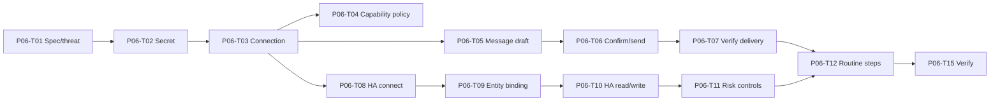

# P06 — Messaging and Home Assistant Integrations

## Phase contract

| Thuộc tính | Giá trị |
|---|---|
| Status | `DRAFT` |
| Outcome | Messaging và Home Assistant hoạt động qua adapter có least privilege, revoke, confirmation, verification và audit |
| Scope mapping | Scope Phase 5 — Home Assistant and Integration |
| Security review | Critical |
| Milestone | M6 — Home Assistant integration |

## Goal

Chứng minh integration framework an toàn bằng một messaging journey và một Home Assistant journey, giữ external content ở trust level thấp và credential trong vault.

## Non-goals

- Không gửi hàng loạt, auto-reply toàn bộ, impersonation hoặc gọi điện tự động.
- Không mở khóa cửa từ xa chỉ bằng voice hoặc routine thường.
- Không điều khiển life-safety/medical device.
- Không plugin marketplace hoặc tự cài code/plugin.
- Calendar/email/provider bổ sung là `Should/Could`, không chặn MVP nếu messaging/HA Must path đã đạt.

## Entry criteria

- P05 account/device/session/revoke, cloud disclosure và secret boundary pass.
- Mỗi integration được chọn có API/terms hợp lệ, test account/sandbox và capability scope được phê duyệt.
- Home Assistant instance/test entities và risk classification strategy có sẵn; không dùng production secret trong test.

## Deliverables

- `IntegrationConnection` và `CredentialSecret` lifecycle/use cases.
- Provider capability/data-egress declaration, OAuth/API/LAN authorization và health/revoke.
- `OutboundMessage` draft/ambiguity/confirmation/send/unknown lifecycle.
- Home Assistant connection, allowlisted entity binding/classification và state verification.
- Routine steps cho integration có runtime revalidation.
- Failure isolation, rate limit, audit/redaction và contract tests.

## Task breakdown

Chi tiết size, trạng thái và acceptance cho từng task: [Small Task Backlog](TASKS.md).

Branch, PR target và phase merge gate: [Phase Git flow](GIT_FLOW.md).

| ID | Mode | Risk | Priority | Task / outcome | Depends on | Evidence |
|---|---|---|---|---|---|---|
| P06-T01 | PLAN | Critical | Must | Viết integration specs, provider selection và threat/data-flow review | P05 | Approved scope/terms/capability matrix |
| P06-T02 | IMPLEMENT | Critical | Must | Implement `CredentialSecret` vault reference/rotate/revoke lifecycle | P06-T01 | No-plaintext/rotation/revoke tests |
| P06-T03 | IMPLEMENT | Critical | Must | Implement `IntegrationConnection` authorize/health/reauth/revoke | P06-T02 | OAuth/state/timeout/revoke tests |
| P06-T04 | IMPLEMENT | Critical | Must | Implement integration capability/data-egress manifest và policy | P06-T03 | Least-scope/unknown-capability deny tests |
| P06-T05 | IMPLEMENT | Critical | Must | Implement `OutboundMessage` draft và recipient/channel resolution | P06-T03 | Ambiguity/alias/no-authority tests |
| P06-T06 | IMPLEMENT | Critical | Must | Implement message preview, exact confirmation và idempotent send | P06-T05, P06-T04 | Payload-change/replay/double-send tests |
| P06-T07 | IMPLEMENT | Critical | Must | Implement delivery verification/unknown/failure handling | P06-T06 | Receipt/timeout/no-auto-resend tests |
| P06-T08 | IMPLEMENT | Critical | Must | Implement Home Assistant connection qua LAN/API và safe secret use | P06-T03 | Connect/timeout/TLS/no-token-log tests |
| P06-T09 | IMPLEMENT | Critical | Must | Implement `HomeAssistantEntityBinding` review/classification/allowlist | P06-T08 | Unknown/high/unsupported policy tests |
| P06-T10 | IMPLEMENT | Critical | Must | Implement HA read state và low-risk write + readback verification | P06-T09, P06-T04 | Service/readback/unavailable tests |
| P06-T11 | IMPLEMENT | Critical | Must | Implement medium/high-risk confirmation và blocked actions | P06-T09, P06-T10 | Strong-confirm/voice-only deny tests |
| P06-T12 | IMPLEMENT | Critical | Must | Implement messaging/HA routine steps với runtime revalidation | P06-T07, P06-T11, P04 routine | Revoke/version/private-mode tests |
| P06-T13 | IMPLEMENT | Critical | Should | Implement một calendar/email adapter read/draft-only | P06-T04 | Contract/scope/no-send-by-default tests |
| P06-T14 | PLAN | Critical | Should | Chốt internal plugin/skill contract và restricted loading policy | P06-T04, P03 SkillPackage | Manifest/signature/capability review |
| P06-T15 | SECURITY_REVIEW | Critical | Must | Integration security/E2E verification | P06-T02..P06-T12 | Messaging + AC-10 + security evidence |

## Dependency path

## Traceability

### Business rules

- `BR-COM-001`–`BR-COM-012`.
- `BR-HA-001`–`BR-HA-014`.
- `BR-SEC-001`–`BR-SEC-022`.
- `BR-ACT-004`, `BR-ACT-009`–`BR-ACT-020`.
- `BR-RTN-005`–`BR-RTN-020`.
- `BR-AUD-001`–`BR-AUD-008`, `BR-OPS-002`, `BR-OPS-007`–`BR-OPS-010`.
- `BR-BAN-005`–`BR-BAN-012`, `BR-BAN-014`, `BR-BAN-015`.

### Lifecycle

`IntegrationConnection`, `CredentialSecret`, `OutboundMessage`, `HomeAssistantEntityBinding`, `PermissionGrant`, `ConfirmationRequest`, `ActionTask`, `RoutineDefinition`, `RoutineRun`, `AuditRecord`, `SecurityIncident`.

### Scope acceptance

Primary: `AC-10`; messaging journey from MVP functional scope; strengthens `AC-02`, `AC-07`, `AC-08`, `AC-12`.

### Dependency rules

`DR-003`, `DR-008`, `DR-012`, `DR-015`–`DR-027`, `DR-030`.

## Acceptance criteria

- `P06-AC-01`: Credential plaintext không xuất hiện trong entity/database thường/log/model context.
- `P06-AC-02`: Integration chỉ dùng capability/scope/data egress đã khai báo và có revoke.
- `P06-AC-03`: Recipient trùng tên tạo clarification; alias/memory không tự cấp quyền gửi.
- `P06-AC-04`: Message send hiển thị exact recipient/channel/payload/attachment và dùng one-time confirmation.
- `P06-AC-05`: Delivery unknown không tự resend hoặc báo success.
- `P06-AC-06`: Chỉ HA entity allowlisted/classified mới được đọc/write.
- `P06-AC-07`: Low-risk action có permission chạy và readback; medium/high theo confirmation policy.
- `P06-AC-08`: Unknown/unsupported/life-safety bị deny; mở khóa từ xa chỉ bằng voice bị chặn.
- `P06-AC-09`: Integration/routine revalidate permission, connection, secret và entity mỗi lần chạy.
- `P06-AC-10`: Provider content/event được gắn untrusted và không trực tiếp gọi tool.

## Verification and gates

- Unit: lifecycle, recipient resolution, risk classification, confirmation binding.
- Integration/contract: vault fake, provider sandbox/fake, Home Assistant test instance.
- Security: OAuth state/replay, scope escalation, secret/log leak, malicious message/entity content.
- Reliability: rate limit, timeout, degraded/reauth/revoke, uncertain send, stale HA state.
- E2E: draft → clarify → confirm → send → verify/audit; HA connect → bind → low-risk action → readback/audit.

## Risks and controls

| Risk | Control | Recovery |
|---|---|---|
| Provider API/terms thay đổi | Adapter + contract tests + explicit selection | Disable/degraded integration |
| Message gửi trùng | Idempotency + no retry on unknown | User reconciliation |
| HA ảnh hưởng an toàn vật lý | Classification + allowlist + strong deny | Revoke binding/connection |
| OAuth scope quá rộng | Least-scope review | Reauthorize với scope nhỏ hơn |
| Plugin mở rộng quyền | Manifest/version/revalidation; no marketplace | Quarantine/uninstall |

## Exit evidence

- Messaging send và HA low-risk write journeys có verification/audit.
- Secret, prompt injection, confirmation replay, revoke và unknown-result tests pass.
- Unsupported/high-risk action bị chặn đúng policy.
- Optional calendar/email/plugin work không được dùng thay thế Must evidence.

## Handoff to P07

P07 kiểm tra toàn bộ integration dưới fault injection, redaction, installer/update và recovery. Không thêm provider mới trong hardening nếu không sửa lỗi release-critical.
