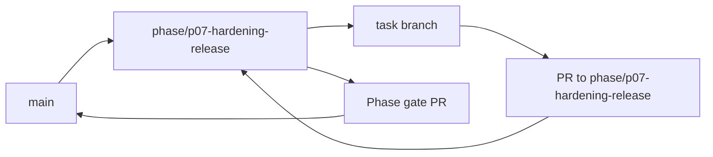

<!-- GENERATED BY scripts/Generate-TaskFiles.ps1; edit phase README/TASKS sources, then regenerate. -->
# P07 — Phase Git Flow

Git workflow thực thi cho P07 — Hardening, Private Beta and Release. Policy chuẩn thuộc [repository Git flow](../../docs/07-release/GIT_FLOW.md); file này không thay đổi phase scope.

## Phase branch contract

| Thuộc tính | Giá trị |
|---|---|
| Repository policy status | `ACCEPTED` |
| Phase branch | `phase/p07-hardening-release` |
| Tạo từ | `main` tại tag `m6-integrations` |
| Task PR target | `phase/p07-hardening-release` |
| Task merge | Squash merge sau review và evidence |
| Phase merge | Merge commit vào `main` sau phase gate |
| Required phase gate | Full AC/security/recovery/release checklist |
| Tag sau gate | `v{approved-semver}` |

## Branch flow

## Task branch map

| Task | Suggested branch | PR target | Required task evidence |
|---|---|---|---|
| [P07-T01](tasks/P07-T01.md) | `docs/p07-t01-freeze-scope-release-matrix-va-must-acceptance` | `phase/p07-hardening-release` | Approved baseline + deferred list |
| [P07-T02](tasks/P07-T02.md) | `docs/p07-t02-cap-nhat-system-threat-model-va-abuse-case` | `phase/p07-hardening-release` | Reviewed threat/control mapping |
| [P07-T03](tasks/P07-T03.md) | `test/p07-t03-mo-rong-permission-replay-prompt-tool` | `phase/p07-hardening-release` | Security suite report |
| [P07-T04](tasks/P07-T04.md) | `test/p07-t04-kiem-thu-terminal-browser-path-worker-escape` | `phase/p07-hardening-release` | Escape/exhaustion/path report |
| [P07-T05](tasks/P07-T05.md) | `test/p07-t05-kiem-thu-auth-device-revoke-sync-secret` | `phase/p07-hardening-release` | Cross-boundary security report |
| [P07-T06](tasks/P07-T06.md) | `test/p07-t06-fault-injection-cho-provider-network-database` | `phase/p07-hardening-release` | Network/db/provider/worker evidence |
| [P07-T07](tasks/P07-T07.md) | `feat/p07-t07-hoan-thien-safe-mode-crash-recovery-va-startup` | `phase/p07-hardening-release` | No-auto-replay/recovery tests |
| [P07-T08](tasks/P07-T08.md) | `feat/p07-t08-implement-observability-redaction-va-support` | `phase/p07-hardening-release` | Metadata-only/no-content tests |
| [P07-T09](tasks/P07-T09.md) | `test/p07-t09-benchmark-idle-voice-action-sync-browser-va` | `phase/p07-hardening-release` | Reference-machine report |
| [P07-T10](tasks/P07-T10.md) | `test/p07-t10-accessibility-compatibility-va-offline` | `phase/p07-hardening-release` | Matrix + closure evidence |
| [P07-T11](tasks/P07-T11.md) | `chore/p07-t11-tao-installer-package-va-clean-install-uninstall` | `phase/p07-hardening-release` | Clean VM smoke evidence |
| [P07-T12](tasks/P07-T12.md) | `chore/p07-t12-implement-verified-update-rollback-va-channel` | `phase/p07-hardening-release` | Signature/hash/rollback tests |
| [P07-T13](tasks/P07-T13.md) | `chore/p07-t13-generate-dependency-inventory-sbom-va-run` | `phase/p07-hardening-release` | Inventory + scan results |
| [P07-T14](tasks/P07-T14.md) | `docs/p07-t14-hoan-thien-onboarding-user-privacy-deployment` | `phase/p07-hardening-release` | Doc/usability review |
| [P07-T15](tasks/P07-T15.md) | `test/p07-t15-chay-full-ac-01-ac-12-release-candidate-suite` | `phase/p07-hardening-release` | MVP acceptance report |
| [P07-T16](tasks/P07-T16.md) | `fix/p07-t16-private-beta-triage-release-critical-findings` | `phase/p07-hardening-release` | Resolved/deferred finding list |
| [P07-T17](tasks/P07-T17.md) | `docs/p07-t17-final-release-review-changelog-release-notes` | `phase/p07-hardening-release` | Signed checklist, notes, rollback window |

## Execution rules

1. Phase owner tạo `phase/p07-hardening-release` từ `main` tại tag `m6-integrations` sau khi entry criteria pass.
2. Task owner chỉ tạo suggested task branch khi task `READY` và dependency có evidence.
3. Draft PR target `phase/p07-hardening-release`; PR ghi Task ID, acceptance, commands, security/architecture impact và rollback.
4. Task PR được squash merge; task file, backlog và task board được đồng bộ trước merge.
5. Phase owner chạy Full AC/security/recovery/release checklist, mở phase gate PR vào `main` và chỉ merge khi exit criteria pass.
6. Sau merge, tạo annotated tag `v{approved-semver}` nếu checklist/approval áp dụng đã có.

## Phase close evidence

- Must task inventory và unresolved findings.
- Build/test/architecture/security reports áp dụng từ clean checkout.
- Phase acceptance/demo evidence và failure/cancellation path.
- Updated task board, session log, changelog/decision và handoff.
- Rollback/recovery evidence khi phase có persistence, sync, installer hoặc external side effect.

## Release candidate

- P07-T01 phải freeze scope và nhận approval cho version/channel trước khi tạo `release/{approved-semver}`.
- Release branch chỉ nhận fix, test, docs, packaging và evidence; không nhận capability mới.
- P07-T17 phải có signed release/rollback decision trước merge vào `main` và tạo version tag.

## Recovery

- Sai base/target: dừng merge, tạo hoặc retarget PR đúng và kiểm tra diff.
- Gate fail: sửa root cause hoặc tạo bug task; không tắt gate.
- Secret xuất hiện: dừng push/merge, revoke và xử lý như security incident.
