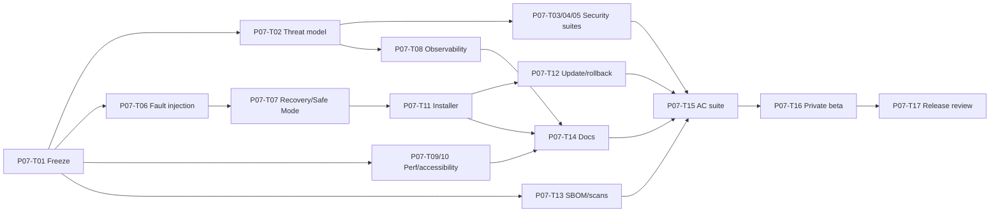

# P07 — Hardening, Private Beta and Release

## Phase contract

| Thuộc tính | Giá trị |
|---|---|
| Status | `DRAFT` |
| Outcome | MVP release candidate cài đặt/cập nhật/phục hồi được và có evidence cho toàn bộ AC-01..AC-12 |
| Scope mapping | Scope Phase 6 — Hardening and Private Beta |
| Security review | Critical |
| Milestone | M7 — MVP release candidate |

## Goal

Đóng băng capability, kiểm thử đối kháng và failure/recovery, đo resource, hoàn thiện installer/update/observability/privacy UX và phát hành chỉ khi release gates có evidence.

## Non-goals

- Không thêm platform, provider hoặc feature lớn trong hardening.
- Không tắt test, validation, TLS, confirmation hoặc security gate để đạt deadline.
- Không phát hành khi còn blocker High/Critical liên quan.
- Không dùng secret/production data thật trong test nếu chưa có approval và handling plan.
- Không tự tạo code-signing certificate, production hosting hoặc telemetry service trả phí.

## Entry criteria

- P00–P06 Must tasks và milestone evidence đã pass.
- Scope phiên bản được đóng băng; known issues và deferred Should/Could được liệt kê.
- Reference hardware/OS/browser/Android/Home Assistant matrix được chốt.
- Release owner, security owner, signing/release channel và rollback authority được xác nhận.

## Deliverables

- Threat model cập nhật và security acceptance report.
- Full automated test suites, fault injection và recovery evidence.
- Resource/performance/accessibility/compatibility benchmark.
- Redacted observability, health, crash/support bundle và Safe Mode.
- Installer/package, signed update/rollback path và dependency inventory/SBOM.
- Onboarding, privacy/memory/permission controls và user docs.
- Private beta report, known issues, changelog, release notes và MVP acceptance report.

## Task breakdown

Chi tiết size, trạng thái và acceptance cho từng task: [Small Task Backlog](TASKS.md).

Branch, PR target và phase merge gate: [Phase Git flow](GIT_FLOW.md).

| ID | Mode | Risk | Priority | Task / outcome | Depends on | Evidence |
|---|---|---|---|---|---|---|
| P07-T01 | PLAN | Critical | Must | Freeze scope, release matrix và Must acceptance inventory | P06 | Approved release baseline |
| P07-T02 | SECURITY_REVIEW | Critical | Must | Cập nhật system threat model và abuse-case coverage | P07-T01 | Reviewed threats/control mapping |
| P07-T03 | SECURITY_REVIEW | Critical | Must | Mở rộng permission/replay/prompt/tool injection security suite | P07-T02 | Security test report |
| P07-T04 | SECURITY_REVIEW | Critical | Must | Kiểm thử terminal/browser/path/worker escape và resource exhaustion | P07-T02 | Adversarial sandbox report |
| P07-T05 | SECURITY_REVIEW | Critical | Must | Kiểm thử auth/device/revoke/sync/secret/integration security | P07-T02 | Cross-boundary security report |
| P07-T06 | IMPLEMENT | Critical | Must | Fault injection cho provider/network/database/worker/power interruption | P07-T01 | Recovery/unknown/idempotency evidence |
| P07-T07 | IMPLEMENT | Critical | Must | Hoàn thiện Safe Mode, crash recovery và startup integrity checks | P07-T06 | Safe recovery/no-auto-replay tests |
| P07-T08 | IMPLEMENT | Critical | Must | Implement observability, redaction và support bundle opt-in | P07-T02 | No-content-by-default/redaction tests |
| P07-T09 | IMPLEMENT | Critical | Must | Benchmark idle/voice/action/sync/browser và enforce budgets | P07-T01 | Reference-machine report |
| P07-T10 | REVIEW | Critical | Must | Accessibility, compatibility và offline/degraded UX audit | P07-T01 | Matrix + findings closure |
| P07-T11 | IMPLEMENT | Critical | Must | Tạo installer/package và clean install/uninstall | P07-T07 | Clean VM install/smoke/uninstall |
| P07-T12 | IMPLEMENT | Critical | Must | Implement verified update, rollback và channel controls | P07-T11 | Signature/hash/rollback/failure tests |
| P07-T13 | SECURITY_REVIEW | Critical | Must | Generate dependency inventory/SBOM và run supply-chain scans | P07-T01 | Scan/SBOM/license report |
| P07-T14 | PLAN | Critical | Must | Hoàn thiện onboarding, user/privacy/deployment/recovery docs | P07-T08, P07-T10, P07-T11 | Doc review + onboarding usability |
| P07-T15 | REVIEW | Critical | Must | Chạy full AC-01..AC-12 release-candidate suite | P07-T03..P07-T14 | MVP acceptance report |
| P07-T16 | DEBUG | Critical | Must | Private beta, triage release-critical findings và retest | P07-T15 | Beta report + resolved/deferred list |
| P07-T17 | RELEASE | Critical | Must | Final release review, changelog, release notes và rollback window | P07-T16 | Signed checklist/approval |

## Dependency path

## Traceability

### Business rules

Toàn bộ `BR-*`, ưu tiên:

- `BR-GOV-*`, `BR-ACT-*`, `BR-SEC-*`, `BR-AUD-*`, `BR-OPS-*`, `BR-BAN-*`.
- Capability-specific `BR-INT-*`, `BR-MODE-*`, `BR-UI-*`, `BR-TRM-*`, `BR-MEM-*`, `BR-RTN-*`, `BR-COM-*`, `BR-HA-*`.

### Lifecycle

Toàn bộ P0/P1 lifecycle, đặc biệt terminal state, revoke cascade, `unknown`, tombstone, Safe Mode, `SecurityIncident`, `AuditRecord`, `CredentialSecret`, `WorkerProcess`.

### Scope acceptance

Full regression và release evidence cho `AC-01` đến `AC-12`.

### Dependency rules

Toàn bộ `DR-001` đến `DR-030`.

## Acceptance criteria

- `P07-AC-01`: Full build/test/architecture/security suites pass từ clean checkout.
- `P07-AC-02`: Threat High/Critical được fix hoặc release bị chặn; không “accept” bằng im lặng.
- `P07-AC-03`: Prompt injection/external content không thể cấp quyền, đọc secret hoặc gọi tool trái intent.
- `P07-AC-04`: Level 3/arbitrary shell/admin/default wildcard vẫn bị chặn.
- `P07-AC-05`: Fault injection không gây duplicate Level 2 side effect hoặc auto-resume sau Emergency Stop.
- `P07-AC-06`: Safe Mode cho phép read/revoke/recovery nhưng chặn write/terminal/remote/integration.
- `P07-AC-07`: Resource targets được đo; regression vượt budget có decision hoặc blocker.
- `P07-AC-08`: Installer/update xác minh integrity, rollback được và không làm mất user data ngoài policy.
- `P07-AC-09`: Log/telemetry/support bundle không chứa secret/raw private content mặc định.
- `P07-AC-10`: Accessibility/offline/degraded flows và reference compatibility matrix đạt.
- `P07-AC-11`: Release checklist, known issues, changelog, user/privacy/recovery docs hoàn chỉnh.
- `P07-AC-12`: Product Owner/Security/Release owner phê duyệt dựa trên evidence.

## Verification and gates

- Gate 0: frozen scope và release acceptance inventory.
- Gate 1: format/analyzer/build/architecture.
- Gate 2: full unit/integration/contract/E2E suites.
- Gate 3: security suites, scans, SBOM/license, threat review.
- Gate 4: manual acceptance, accessibility, performance, offline/fault/recovery.
- Gate 5: installer/update/rollback, clean VM smoke, release approval.

Không phát hành nếu bất kỳ gate Must nào fail.

## Risks and controls

| Risk | Control | Recovery |
|---|---|---|
| Scope creep trong hardening | Freeze + Change Request + Must-first | Defer khỏi release |
| Signing/hosting chưa sẵn sàng | Early owner/dependency check | Block release, không dùng unsigned workaround |
| Test môi trường không đại diện | Reference matrix + clean VM/device | Công bố limitation/adjust support |
| Telemetry làm lộ content | Opt-in, metadata-only, redaction tests | Disable collection + incident response |
| Beta phát hiện data/security issue | Triage severity + Safe Mode/revoke | Rollback, no release |

## Exit evidence

- `RELEASE_CHECKLIST.md` pass và có owner/approval.
- MVP acceptance report truy vết AC-01..AC-12 tới test/demo artifact.
- Installer/update/rollback và clean-environment smoke pass.
- Known issues/risk/debt được công bố; không còn High/Critical blocker.
- Changelog, release notes, user/privacy/deployment/recovery docs đã review.

## Post-release handoff

Theo dõi smoke/metrics trong rollback window, không tự mở rộng capability. Mọi feature tiếp theo quay lại flow Vision/Scope → Change Request → phase/task plan.
